# Low Level Design: BridgeNow Finance Product Configuration

**JIRA Issue:** VRVTEMP-389  
**Epic:** E1 — BridgeNow Finance Product Configuration  
**Document Version:** 1.0  
**Date:** 2026-04-16

---

## 1. Objective

This Low Level Design document provides the technical implementation blueprint for the BridgeNow Finance Product Configuration system. The system establishes foundational configuration for BridgeNow Finance, ensuring all product parameters, eligibility, and pricing rules are strictly enforced and compliant with regulatory standards. The implementation focuses on four core features: fixed tenure enforcement (24 months), loan amount calculation and enforcement (1x income, capped at SAR 30,000, minimum SAR 4,000), fixed pricing enforcement (2.25% per month), and early closure processing with zero penalty. This design ensures 100% compliance with responsible lending norms while providing a simplified, transparent customer experience.

---

## 2. C-Sharp Backend Details

### 2.1 Controller Layer

#### 2.1.1 REST API Endpoints

| Operation | Method | URL | Request Body | Response Body |
|-----------|--------|-----|--------------|---------------|
| Create Loan Application | POST | `/api/v1/loans/applications` | `LoanApplicationRequest` | `LoanApplicationResponse` |
| Get Loan Application | GET | `/api/v1/loans/applications/{applicationId}` | N/A | `LoanApplicationResponse` |
| Calculate Eligible Amount | POST | `/api/v1/loans/calculate-eligibility` | `EligibilityRequest` | `EligibilityResponse` |
| Get Pricing Details | GET | `/api/v1/loans/pricing/{applicationId}` | N/A | `PricingResponse` |
| Request Early Closure | POST | `/api/v1/loans/{loanId}/early-closure` | `EarlyClosureRequest` | `EarlyClosureResponse` |
| Get Early Closure Details | GET | `/api/v1/loans/{loanId}/early-closure/details` | N/A | `EarlyClosureDetailsResponse` |
| Validate Tenure | GET | `/api/v1/loans/validate-tenure/{applicationId}` | N/A | `TenureValidationResponse` |

#### 2.1.2 Controller Classes

| Class Name | Responsibility | Methods |
|------------|----------------|----------|
| `LoanApplicationController` | Handles loan application creation and retrieval | `CreateApplication()`, `GetApplication()`, `ValidateTenure()` |
| `LoanEligibilityController` | Manages loan eligibility calculations | `CalculateEligibility()`, `ValidateAmount()` |
| `LoanPricingController` | Handles pricing calculations and retrieval | `GetPricing()`, `CalculateMonthlyPayment()` |
| `EarlyClosureController` | Manages early closure requests and calculations | `RequestEarlyClosure()`, `GetClosureDetails()`, `ProcessClosure()` |

#### 2.1.3 Controller Implementation

```csharp
using Microsoft.AspNetCore.Mvc;
using BridgeNowFinance.Services;
using BridgeNowFinance.Models;
using System.Threading.Tasks;

namespace BridgeNowFinance.Controllers
{
    [ApiController]
    [Route("api/v1/loans")]
    public class LoanApplicationController : ControllerBase
    {
        private readonly ILoanApplicationService _loanApplicationService;
        private readonly ILogger<LoanApplicationController> _logger;

        public LoanApplicationController(
            ILoanApplicationService loanApplicationService,
            ILogger<LoanApplicationController> logger)
        {
            _loanApplicationService = loanApplicationService;
            _logger = logger;
        }

        [HttpPost("applications")]
        [ProducesResponseType(typeof(LoanApplicationResponse), StatusCodes.Status201Created)]
        [ProducesResponseType(typeof(ErrorResponse), StatusCodes.Status400BadRequest)]
        public async Task<IActionResult> CreateApplication([FromBody] LoanApplicationRequest request)
        {
            _logger.LogInformation("Creating loan application for customer: {CustomerId}", request.CustomerId);
            
            var response = await _loanApplicationService.CreateApplicationAsync(request);
            return CreatedAtAction(nameof(GetApplication), new { applicationId = response.ApplicationId }, response);
        }

        [HttpGet("applications/{applicationId}")]
        [ProducesResponseType(typeof(LoanApplicationResponse), StatusCodes.Status200OK)]
        [ProducesResponseType(typeof(ErrorResponse), StatusCodes.Status404NotFound)]
        public async Task<IActionResult> GetApplication(string applicationId)
        {
            _logger.LogInformation("Retrieving loan application: {ApplicationId}", applicationId);
            
            var response = await _loanApplicationService.GetApplicationAsync(applicationId);
            return Ok(response);
        }

        [HttpGet("validate-tenure/{applicationId}")]
        [ProducesResponseType(typeof(TenureValidationResponse), StatusCodes.Status200OK)]
        public async Task<IActionResult> ValidateTenure(string applicationId)
        {
            _logger.LogInformation("Validating tenure for application: {ApplicationId}", applicationId);
            
            var response = await _loanApplicationService.ValidateTenureAsync(applicationId);
            return Ok(response);
        }
    }

    [ApiController]
    [Route("api/v1/loans")]
    public class LoanEligibilityController : ControllerBase
    {
        private readonly ILoanEligibilityService _eligibilityService;
        private readonly ILogger<LoanEligibilityController> _logger;

        public LoanEligibilityController(
            ILoanEligibilityService eligibilityService,
            ILogger<LoanEligibilityController> logger)
        {
            _eligibilityService = eligibilityService;
            _logger = logger;
        }

        [HttpPost("calculate-eligibility")]
        [ProducesResponseType(typeof(EligibilityResponse), StatusCodes.Status200OK)]
        [ProducesResponseType(typeof(ErrorResponse), StatusCodes.Status400BadRequest)]
        public async Task<IActionResult> CalculateEligibility([FromBody] EligibilityRequest request)
        {
            _logger.LogInformation("Calculating eligibility for customer: {CustomerId}", request.CustomerId);
            
            var response = await _eligibilityService.CalculateEligibilityAsync(request);
            return Ok(response);
        }
    }

    [ApiController]
    [Route("api/v1/loans")]
    public class LoanPricingController : ControllerBase
    {
        private readonly ILoanPricingService _pricingService;
        private readonly ILogger<LoanPricingController> _logger;

        public LoanPricingController(
            ILoanPricingService pricingService,
            ILogger<LoanPricingController> logger)
        {
            _pricingService = pricingService;
            _logger = logger;
        }

        [HttpGet("pricing/{applicationId}")]
        [ProducesResponseType(typeof(PricingResponse), StatusCodes.Status200OK)]
        [ProducesResponseType(typeof(ErrorResponse), StatusCodes.Status404NotFound)]
        public async Task<IActionResult> GetPricing(string applicationId)
        {
            _logger.LogInformation("Retrieving pricing for application: {ApplicationId}", applicationId);
            
            var response = await _pricingService.GetPricingAsync(applicationId);
            return Ok(response);
        }
    }

    [ApiController]
    [Route("api/v1/loans")]
    public class EarlyClosureController : ControllerBase
    {
        private readonly IEarlyClosureService _earlyClosureService;
        private readonly ILogger<EarlyClosureController> _logger;

        public EarlyClosureController(
            IEarlyClosureService earlyClosureService,
            ILogger<EarlyClosureController> logger)
        {
            _earlyClosureService = earlyClosureService;
            _logger = logger;
        }

        [HttpPost("{loanId}/early-closure")]
        [ProducesResponseType(typeof(EarlyClosureResponse), StatusCodes.Status200OK)]
        [ProducesResponseType(typeof(ErrorResponse), StatusCodes.Status400BadRequest)]
        public async Task<IActionResult> RequestEarlyClosure(string loanId, [FromBody] EarlyClosureRequest request)
        {
            _logger.LogInformation("Processing early closure request for loan: {LoanId}", loanId);
            
            var response = await _earlyClosureService.ProcessEarlyClosureAsync(loanId, request);
            return Ok(response);
        }

        [HttpGet("{loanId}/early-closure/details")]
        [ProducesResponseType(typeof(EarlyClosureDetailsResponse), StatusCodes.Status200OK)]
        [ProducesResponseType(typeof(ErrorResponse), StatusCodes.Status404NotFound)]
        public async Task<IActionResult> GetClosureDetails(string loanId)
        {
            _logger.LogInformation("Retrieving early closure details for loan: {LoanId}", loanId);
            
            var response = await _earlyClosureService.GetClosureDetailsAsync(loanId);
            return Ok(response);
        }
    }
}
```

#### 2.1.4 Exception Handlers

```csharp
using Microsoft.AspNetCore.Mvc;
using Microsoft.AspNetCore.Mvc.Filters;
using BridgeNowFinance.Exceptions;

namespace BridgeNowFinance.Filters
{
    public class GlobalExceptionFilter : IExceptionFilter
    {
        private readonly ILogger<GlobalExceptionFilter> _logger;

        public GlobalExceptionFilter(ILogger<GlobalExceptionFilter> logger)
        {
            _logger = logger;
        }

        public void OnException(ExceptionContext context)
        {
            var exception = context.Exception;
            _logger.LogError(exception, "An error occurred: {Message}", exception.Message);

            var errorResponse = new ErrorResponse
            {
                Timestamp = DateTime.UtcNow,
                Path = context.HttpContext.Request.Path
            };

            switch (exception)
            {
                case ValidationException validationEx:
                    errorResponse.Status = StatusCodes.Status400BadRequest;
                    errorResponse.Error = "Validation Error";
                    errorResponse.Message = validationEx.Message;
                    errorResponse.Errors = validationEx.Errors;
                    context.Result = new BadRequestObjectResult(errorResponse);
                    break;

                case NotFoundException notFoundEx:
                    errorResponse.Status = StatusCodes.Status404NotFound;
                    errorResponse.Error = "Not Found";
                    errorResponse.Message = notFoundEx.Message;
                    context.Result = new NotFoundObjectResult(errorResponse);
                    break;

                case BusinessRuleException businessEx:
                    errorResponse.Status = StatusCodes.Status422UnprocessableEntity;
                    errorResponse.Error = "Business Rule Violation";
                    errorResponse.Message = businessEx.Message;
                    context.Result = new UnprocessableEntityObjectResult(errorResponse);
                    break;

                case UnauthorizedAccessException:
                    errorResponse.Status = StatusCodes.Status401Unauthorized;
                    errorResponse.Error = "Unauthorized";
                    errorResponse.Message = "Access denied";
                    context.Result = new UnauthorizedObjectResult(errorResponse);
                    break;

                default:
                    errorResponse.Status = StatusCodes.Status500InternalServerError;
                    errorResponse.Error = "Internal Server Error";
                    errorResponse.Message = "An unexpected error occurred";
                    context.Result = new ObjectResult(errorResponse)
                    {
                        StatusCode = StatusCodes.Status500InternalServerError
                    };
                    break;
            }

            context.ExceptionHandled = true;
        }
    }
}
```

### 2.2 Service Layer

#### 2.2.1 Business Logic Implementation

```csharp
using BridgeNowFinance.Models;
using BridgeNowFinance.Repositories;
using BridgeNowFinance.Exceptions;
using System.Threading.Tasks;

namespace BridgeNowFinance.Services
{
    public interface ILoanApplicationService
    {
        Task<LoanApplicationResponse> CreateApplicationAsync(LoanApplicationRequest request);
        Task<LoanApplicationResponse> GetApplicationAsync(string applicationId);
        Task<TenureValidationResponse> ValidateTenureAsync(string applicationId);
    }

    public class LoanApplicationService : ILoanApplicationService
    {
        private readonly ILoanApplicationRepository _applicationRepository;
        private readonly ILoanEligibilityService _eligibilityService;
        private readonly ILoanPricingService _pricingService;
        private readonly IProductConfigurationService _configService;
        private readonly ILogger<LoanApplicationService> _logger;

        private const int FIXED_TENURE_MONTHS = 24;

        public LoanApplicationService(
            ILoanApplicationRepository applicationRepository,
            ILoanEligibilityService eligibilityService,
            ILoanPricingService pricingService,
            IProductConfigurationService configService,
            ILogger<LoanApplicationService> logger)
        {
            _applicationRepository = applicationRepository;
            _eligibilityService = eligibilityService;
            _pricingService = pricingService;
            _configService = configService;
            _logger = logger;
        }

        public async Task<LoanApplicationResponse> CreateApplicationAsync(LoanApplicationRequest request)
        {
            _logger.LogInformation("Creating loan application for customer: {CustomerId}", request.CustomerId);

            // Validate customer
            if (string.IsNullOrWhiteSpace(request.CustomerId))
            {
                throw new ValidationException("Customer ID is required");
            }

            // Calculate eligibility
            var eligibility = await _eligibilityService.CalculateEligibilityAsync(new EligibilityRequest
            {
                CustomerId = request.CustomerId,
                AssessedIncome = request.AssessedIncome
            });

            if (!eligibility.IsEligible)
            {
                throw new BusinessRuleException(eligibility.RejectionReason);
            }

            // Create application entity
            var application = new LoanApplication
            {
                ApplicationId = Guid.NewGuid().ToString(),
                CustomerId = request.CustomerId,
                AssessedIncome = request.AssessedIncome,
                LoanAmount = eligibility.EligibleAmount,
                TenureMonths = FIXED_TENURE_MONTHS, // Fixed tenure enforcement
                Status = ApplicationStatus.Pending,
                CreatedAt = DateTime.UtcNow,
                UpdatedAt = DateTime.UtcNow
            };

            // Calculate pricing
            var pricing = await _pricingService.CalculatePricingAsync(application.LoanAmount, application.TenureMonths);
            application.MonthlyInterestRate = pricing.MonthlyRate;
            application.AnnualInterestRate = pricing.AnnualRate;
            application.MonthlyPayment = pricing.MonthlyPayment;
            application.TotalPayable = pricing.TotalPayable;

            // Save application
            await _applicationRepository.CreateAsync(application);

            _logger.LogInformation("Loan application created successfully: {ApplicationId}", application.ApplicationId);

            return MapToResponse(application);
        }

        public async Task<LoanApplicationResponse> GetApplicationAsync(string applicationId)
        {
            var application = await _applicationRepository.GetByIdAsync(applicationId);
            
            if (application == null)
            {
                throw new NotFoundException($"Loan application not found: {applicationId}");
            }

            return MapToResponse(application);
        }

        public async Task<TenureValidationResponse> ValidateTenureAsync(string applicationId)
        {
            var application = await _applicationRepository.GetByIdAsync(applicationId);
            
            if (application == null)
            {
                throw new NotFoundException($"Loan application not found: {applicationId}");
            }

            var isValid = application.TenureMonths == FIXED_TENURE_MONTHS;

            return new TenureValidationResponse
            {
                ApplicationId = applicationId,
                IsValid = isValid,
                CurrentTenure = application.TenureMonths,
                RequiredTenure = FIXED_TENURE_MONTHS,
                Message = isValid ? "Tenure is valid" : $"Tenure must be {FIXED_TENURE_MONTHS} months"
            };
        }

        private LoanApplicationResponse MapToResponse(LoanApplication application)
        {
            return new LoanApplicationResponse
            {
                ApplicationId = application.ApplicationId,
                CustomerId = application.CustomerId,
                LoanAmount = application.LoanAmount,
                TenureMonths = application.TenureMonths,
                MonthlyInterestRate = application.MonthlyInterestRate,
                AnnualInterestRate = application.AnnualInterestRate,
                MonthlyPayment = application.MonthlyPayment,
                TotalPayable = application.TotalPayable,
                Status = application.Status.ToString(),
                CreatedAt = application.CreatedAt,
                UpdatedAt = application.UpdatedAt
            };
        }
    }

    public interface ILoanEligibilityService
    {
        Task<EligibilityResponse> CalculateEligibilityAsync(EligibilityRequest request);
    }

    public class LoanEligibilityService : ILoanEligibilityService
    {
        private readonly IProductConfigurationService _configService;
        private readonly ILogger<LoanEligibilityService> _logger;

        private const decimal INCOME_MULTIPLIER = 1.0m;
        private const decimal MINIMUM_LOAN_AMOUNT = 4000m;
        private const decimal MAXIMUM_LOAN_AMOUNT = 30000m;

        public LoanEligibilityService(
            IProductConfigurationService configService,
            ILogger<LoanEligibilityService> logger)
        {
            _configService = configService;
            _logger = logger;
        }

        public async Task<EligibilityResponse> CalculateEligibilityAsync(EligibilityRequest request)
        {
            _logger.LogInformation("Calculating eligibility for customer: {CustomerId}", request.CustomerId);

            if (request.AssessedIncome <= 0)
            {
                throw new ValidationException("Assessed income must be greater than zero");
            }

            // Calculate loan amount as 1x of assessed income
            var calculatedAmount = request.AssessedIncome * INCOME_MULTIPLIER;

            // Apply minimum cap
            if (calculatedAmount < MINIMUM_LOAN_AMOUNT)
            {
                return new EligibilityResponse
                {
                    IsEligible = false,
                    EligibleAmount = 0,
                    CalculatedAmount = calculatedAmount,
                    RejectionReason = $"Calculated loan amount (SAR {calculatedAmount:N2}) is below minimum threshold of SAR {MINIMUM_LOAN_AMOUNT:N2}"
                };
            }

            // Apply maximum cap
            var eligibleAmount = Math.Min(calculatedAmount, MAXIMUM_LOAN_AMOUNT);

            _logger.LogInformation("Eligibility calculated - Amount: {Amount}, Eligible: {IsEligible}", 
                eligibleAmount, true);

            return new EligibilityResponse
            {
                IsEligible = true,
                EligibleAmount = eligibleAmount,
                CalculatedAmount = calculatedAmount,
                MinimumAmount = MINIMUM_LOAN_AMOUNT,
                MaximumAmount = MAXIMUM_LOAN_AMOUNT,
                Message = calculatedAmount > MAXIMUM_LOAN_AMOUNT 
                    ? $"Loan amount capped at maximum of SAR {MAXIMUM_LOAN_AMOUNT:N2}" 
                    : "Eligible for full calculated amount"
            };
        }
    }

    public interface ILoanPricingService
    {
        Task<PricingResponse> GetPricingAsync(string applicationId);
        Task<PricingDetails> CalculatePricingAsync(decimal loanAmount, int tenureMonths);
    }

    public class LoanPricingService : ILoanPricingService
    {
        private readonly ILoanApplicationRepository _applicationRepository;
        private readonly ILogger<LoanPricingService> _logger;

        private const decimal FIXED_MONTHLY_RATE = 0.0225m; // 2.25% per month
        private const decimal FIXED_ANNUAL_RATE = 0.27m;    // 27% per annum

        public LoanPricingService(
            ILoanApplicationRepository applicationRepository,
            ILogger<LoanPricingService> logger)
        {
            _applicationRepository = applicationRepository;
            _logger = logger;
        }

        public async Task<PricingResponse> GetPricingAsync(string applicationId)
        {
            var application = await _applicationRepository.GetByIdAsync(applicationId);
            
            if (application == null)
            {
                throw new NotFoundException($"Loan application not found: {applicationId}");
            }

            var pricing = await CalculatePricingAsync(application.LoanAmount, application.TenureMonths);

            return new PricingResponse
            {
                ApplicationId = applicationId,
                LoanAmount = application.LoanAmount,
                TenureMonths = application.TenureMonths,
                MonthlyRate = pricing.MonthlyRate,
                AnnualRate = pricing.AnnualRate,
                MonthlyPayment = pricing.MonthlyPayment,
                TotalInterest = pricing.TotalInterest,
                TotalPayable = pricing.TotalPayable
            };
        }

        public async Task<PricingDetails> CalculatePricingAsync(decimal loanAmount, int tenureMonths)
        {
            _logger.LogInformation("Calculating pricing for amount: {Amount}, tenure: {Tenure}", 
                loanAmount, tenureMonths);

            // Fixed pricing - no risk grade consideration
            var monthlyInterest = loanAmount * FIXED_MONTHLY_RATE;
            var totalInterest = monthlyInterest * tenureMonths;
            var totalPayable = loanAmount + totalInterest;
            var monthlyPayment = totalPayable / tenureMonths;

            return await Task.FromResult(new PricingDetails
            {
                MonthlyRate = FIXED_MONTHLY_RATE,
                AnnualRate = FIXED_ANNUAL_RATE,
                MonthlyPayment = Math.Round(monthlyPayment, 2),
                TotalInterest = Math.Round(totalInterest, 2),
                TotalPayable = Math.Round(totalPayable, 2)
            });
        }
    }

    public interface IEarlyClosureService
    {
        Task<EarlyClosureResponse> ProcessEarlyClosureAsync(string loanId, EarlyClosureRequest request);
        Task<EarlyClosureDetailsResponse> GetClosureDetailsAsync(string loanId);
    }

    public class EarlyClosureService : IEarlyClosureService
    {
        private readonly ILoanRepository _loanRepository;
        private readonly IPaymentService _paymentService;
        private readonly INotificationService _notificationService;
        private readonly ILogger<EarlyClosureService> _logger;

        private const decimal EARLY_CLOSURE_FEE = 0m; // Zero penalty

        public EarlyClosureService(
            ILoanRepository loanRepository,
            IPaymentService paymentService,
            INotificationService notificationService,
            ILogger<EarlyClosureService> logger)
        {
            _loanRepository = loanRepository;
            _paymentService = paymentService;
            _notificationService = notificationService;
            _logger = logger;
        }

        public async Task<EarlyClosureResponse> ProcessEarlyClosureAsync(string loanId, EarlyClosureRequest request)
        {
            _logger.LogInformation("Processing early closure for loan: {LoanId}", loanId);

            var loan = await _loanRepository.GetByIdAsync(loanId);
            
            if (loan == null)
            {
                throw new NotFoundException($"Loan not found: {loanId}");
            }

            if (loan.Status != LoanStatus.Active)
            {
                throw new BusinessRuleException($"Loan is not active. Current status: {loan.Status}");
            }

            // Calculate outstanding balance
            var outstandingBalance = await CalculateOutstandingBalanceAsync(loan);

            // Process closure
            loan.Status = LoanStatus.Closed;
            loan.ClosureDate = DateTime.UtcNow;
            loan.ClosureType = ClosureType.EarlyClosure;
            loan.ClosureFee = EARLY_CLOSURE_FEE;
            loan.FinalPaymentAmount = outstandingBalance;
            loan.UpdatedAt = DateTime.UtcNow;

            await _loanRepository.UpdateAsync(loan);

            // Send confirmation
            await _notificationService.SendClosureConfirmationAsync(loan.CustomerId, loanId, outstandingBalance);

            _logger.LogInformation("Early closure processed successfully for loan: {LoanId}", loanId);

            return new EarlyClosureResponse
            {
                LoanId = loanId,
                ClosureDate = loan.ClosureDate.Value,
                OutstandingBalance = outstandingBalance,
                ClosureFee = EARLY_CLOSURE_FEE,
                TotalAmountDue = outstandingBalance,
                Status = "Closed",
                Message = "Loan closed successfully with zero early closure fee"
            };
        }

        public async Task<EarlyClosureDetailsResponse> GetClosureDetailsAsync(string loanId)
        {
            var loan = await _loanRepository.GetByIdAsync(loanId);
            
            if (loan == null)
            {
                throw new NotFoundException($"Loan not found: {loanId}");
            }

            var outstandingBalance = await CalculateOutstandingBalanceAsync(loan);

            return new EarlyClosureDetailsResponse
            {
                LoanId = loanId,
                CurrentStatus = loan.Status.ToString(),
                OutstandingPrincipal = loan.OutstandingPrincipal,
                OutstandingInterest = loan.OutstandingInterest,
                TotalOutstanding = outstandingBalance,
                EarlyClosureFee = EARLY_CLOSURE_FEE,
                TotalAmountDue = outstandingBalance,
                Message = "No early closure fee applicable"
            };
        }

        private async Task<decimal> CalculateOutstandingBalanceAsync(Loan loan)
        {
            var payments = await _paymentService.GetPaymentHistoryAsync(loan.LoanId);
            var totalPaid = payments.Sum(p => p.Amount);
            var outstandingBalance = loan.TotalPayable - totalPaid;

            return Math.Max(outstandingBalance, 0);
        }
    }

    public interface IProductConfigurationService
    {
        Task<ProductConfiguration> GetConfigurationAsync();
    }

    public class ProductConfigurationService : IProductConfigurationService
    {
        private readonly IProductConfigurationRepository _configRepository;
        private readonly ILogger<ProductConfigurationService> _logger;

        public ProductConfigurationService(
            IProductConfigurationRepository configRepository,
            ILogger<ProductConfigurationService> logger)
        {
            _configRepository = configRepository;
            _logger = logger;
        }

        public async Task<ProductConfiguration> GetConfigurationAsync()
        {
            return await _configRepository.GetActiveConfigurationAsync();
        }
    }
}
```

#### 2.2.2 Service Layer Architecture

The service layer follows a clean architecture pattern with clear separation of concerns:

- **Application Services**: Orchestrate business workflows
- **Domain Services**: Implement core business logic
- **Infrastructure Services**: Handle external integrations

#### 2.2.3 Dependency Injection Configuration

```csharp
using Microsoft.Extensions.DependencyInjection;
using BridgeNowFinance.Services;
using BridgeNowFinance.Repositories;

namespace BridgeNowFinance.Configuration
{
    public static class ServiceCollectionExtensions
    {
        public static IServiceCollection AddBridgeNowServices(this IServiceCollection services)
        {
            // Services
            services.AddScoped<ILoanApplicationService, LoanApplicationService>();
            services.AddScoped<ILoanEligibilityService, LoanEligibilityService>();
            services.AddScoped<ILoanPricingService, LoanPricingService>();
            services.AddScoped<IEarlyClosureService, EarlyClosureService>();
            services.AddScoped<IProductConfigurationService, ProductConfigurationService>();
            services.AddScoped<IPaymentService, PaymentService>();
            services.AddScoped<INotificationService, NotificationService>();

            // Repositories
            services.AddScoped<ILoanApplicationRepository, LoanApplicationRepository>();
            services.AddScoped<ILoanRepository, LoanRepository>();
            services.AddScoped<IProductConfigurationRepository, ProductConfigurationRepository>();
            services.AddScoped<IPaymentRepository, PaymentRepository>();

            return services;
        }
    }
}
```

#### 2.2.4 Validation Rules

| Field Name | Validation | Error Message | Annotation |
|------------|------------|---------------|------------|
| CustomerId | Required, Not Empty | "Customer ID is required" | `[Required]` |
| AssessedIncome | Required, > 0 | "Assessed income must be greater than zero" | `[Required]`, `[Range(0.01, double.MaxValue)]` |
| LoanAmount | >= 4000, <= 30000 | "Loan amount must be between SAR 4,000 and SAR 30,000" | `[Range(4000, 30000)]` |
| TenureMonths | == 24 | "Tenure must be 24 months" | `[Range(24, 24)]` |
| ApplicationId | Required, Valid GUID | "Invalid application ID" | `[Required]`, `[RegularExpression(@"^[{]?[0-9a-fA-F]{8}-([0-9a-fA-F]{4}-){3}[0-9a-fA-F]{12}[}]?$")]` |
| LoanId | Required, Valid GUID | "Invalid loan ID" | `[Required]`, `[RegularExpression(@"^[{]?[0-9a-fA-F]{8}-([0-9a-fA-F]{4}-){3}[0-9a-fA-F]{12}[}]?$")]` |

```csharp
using System.ComponentModel.DataAnnotations;

namespace BridgeNowFinance.Models
{
    public class LoanApplicationRequest
    {
        [Required(ErrorMessage = "Customer ID is required")]
        public string CustomerId { get; set; }

        [Required(ErrorMessage = "Assessed income is required")]
        [Range(0.01, double.MaxValue, ErrorMessage = "Assessed income must be greater than zero")]
        public decimal AssessedIncome { get; set; }
    }

    public class EligibilityRequest
    {
        [Required(ErrorMessage = "Customer ID is required")]
        public string CustomerId { get; set; }

        [Required(ErrorMessage = "Assessed income is required")]
        [Range(0.01, double.MaxValue, ErrorMessage = "Assessed income must be greater than zero")]
        public decimal AssessedIncome { get; set; }
    }

    public class EarlyClosureRequest
    {
        [Required(ErrorMessage = "Customer ID is required")]
        public string CustomerId { get; set; }

        public string Reason { get; set; }
    }
}
```

### 2.3 Repository / Data Access Layer

#### 2.3.1 Entity Models

| Entity | Fields | Constraints |
|--------|--------|-------------|
| LoanApplication | ApplicationId (PK), CustomerId, AssessedIncome, LoanAmount, TenureMonths, MonthlyInterestRate, AnnualInterestRate, MonthlyPayment, TotalPayable, Status, CreatedAt, UpdatedAt | ApplicationId: GUID, TenureMonths: Fixed at 24, LoanAmount: 4000-30000 |
| Loan | LoanId (PK), ApplicationId (FK), CustomerId, LoanAmount, TenureMonths, MonthlyInterestRate, MonthlyPayment, TotalPayable, OutstandingPrincipal, OutstandingInterest, Status, DisbursementDate, ClosureDate, ClosureType, ClosureFee, FinalPaymentAmount, CreatedAt, UpdatedAt | LoanId: GUID, Status: Enum |
| ProductConfiguration | ConfigId (PK), ProductName, FixedTenureMonths, MinLoanAmount, MaxLoanAmount, IncomeMultiplier, MonthlyInterestRate, AnnualInterestRate, EarlyClosureFee, IsActive, EffectiveFrom, EffectiveTo, CreatedAt, UpdatedAt | ConfigId: GUID, IsActive: Boolean |
| Payment | PaymentId (PK), LoanId (FK), Amount, PaymentDate, PaymentType, Status, CreatedAt | PaymentId: GUID |

```csharp
using System;
using System.ComponentModel.DataAnnotations;
using System.ComponentModel.DataAnnotations.Schema;

namespace BridgeNowFinance.Entities
{
    [Table("LoanApplications")]
    public class LoanApplication
    {
        [Key]
        [DatabaseGenerated(DatabaseGeneratedOption.None)]
        public string ApplicationId { get; set; }

        [Required]
        [MaxLength(50)]
        public string CustomerId { get; set; }

        [Required]
        [Column(TypeName = "decimal(18,2)")]
        public decimal AssessedIncome { get; set; }

        [Required]
        [Column(TypeName = "decimal(18,2)")]
        [Range(4000, 30000)]
        public decimal LoanAmount { get; set; }

        [Required]
        [Range(24, 24)]
        public int TenureMonths { get; set; }

        [Required]
        [Column(TypeName = "decimal(5,4)")]
        public decimal MonthlyInterestRate { get; set; }

        [Required]
        [Column(TypeName = "decimal(5,4)")]
        public decimal AnnualInterestRate { get; set; }

        [Required]
        [Column(TypeName = "decimal(18,2)")]
        public decimal MonthlyPayment { get; set; }

        [Required]
        [Column(TypeName = "decimal(18,2)")]
        public decimal TotalPayable { get; set; }

        [Required]
        public ApplicationStatus Status { get; set; }

        [Required]
        public DateTime CreatedAt { get; set; }

        [Required]
        public DateTime UpdatedAt { get; set; }
    }

    [Table("Loans")]
    public class Loan
    {
        [Key]
        [DatabaseGenerated(DatabaseGeneratedOption.None)]
        public string LoanId { get; set; }

        [Required]
        [MaxLength(50)]
        public string ApplicationId { get; set; }

        [Required]
        [MaxLength(50)]
        public string CustomerId { get; set; }

        [Required]
        [Column(TypeName = "decimal(18,2)")]
        public decimal LoanAmount { get; set; }

        [Required]
        public int TenureMonths { get; set; }

        [Required]
        [Column(TypeName = "decimal(5,4)")]
        public decimal MonthlyInterestRate { get; set; }

        [Required]
        [Column(TypeName = "decimal(18,2)")]
        public decimal MonthlyPayment { get; set; }

        [Required]
        [Column(TypeName = "decimal(18,2)")]
        public decimal TotalPayable { get; set; }

        [Required]
        [Column(TypeName = "decimal(18,2)")]
        public decimal OutstandingPrincipal { get; set; }

        [Required]
        [Column(TypeName = "decimal(18,2)")]
        public decimal OutstandingInterest { get; set; }

        [Required]
        public LoanStatus Status { get; set; }

        public DateTime? DisbursementDate { get; set; }

        public DateTime? ClosureDate { get; set; }

        public ClosureType? ClosureType { get; set; }

        [Column(TypeName = "decimal(18,2)")]
        public decimal? ClosureFee { get; set; }

        [Column(TypeName = "decimal(18,2)")]
        public decimal? FinalPaymentAmount { get; set; }

        [Required]
        public DateTime CreatedAt { get; set; }

        [Required]
        public DateTime UpdatedAt { get; set; }

        [ForeignKey("ApplicationId")]
        public virtual LoanApplication Application { get; set; }
    }

    [Table("ProductConfigurations")]
    public class ProductConfiguration
    {
        [Key]
        [DatabaseGenerated(DatabaseGeneratedOption.None)]
        public string ConfigId { get; set; }

        [Required]
        [MaxLength(100)]
        public string ProductName { get; set; }

        [Required]
        public int FixedTenureMonths { get; set; }

        [Required]
        [Column(TypeName = "decimal(18,2)")]
        public decimal MinLoanAmount { get; set; }

        [Required]
        [Column(TypeName = "decimal(18,2)")]
        public decimal MaxLoanAmount { get; set; }

        [Required]
        [Column(TypeName = "decimal(5,2)")]
        public decimal IncomeMultiplier { get; set; }

        [Required]
        [Column(TypeName = "decimal(5,4)")]
        public decimal MonthlyInterestRate { get; set; }

        [Required]
        [Column(TypeName = "decimal(5,4)")]
        public decimal AnnualInterestRate { get; set; }

        [Required]
        [Column(TypeName = "decimal(18,2)")]
        public decimal EarlyClosureFee { get; set; }

        [Required]
        public bool IsActive { get; set; }

        [Required]
        public DateTime EffectiveFrom { get; set; }

        public DateTime? EffectiveTo { get; set; }

        [Required]
        public DateTime CreatedAt { get; set; }

        [Required]
        public DateTime UpdatedAt { get; set; }
    }

    [Table("Payments")]
    public class Payment
    {
        [Key]
        [DatabaseGenerated(DatabaseGeneratedOption.None)]
        public string PaymentId { get; set; }

        [Required]
        [MaxLength(50)]
        public string LoanId { get; set; }

        [Required]
        [Column(TypeName = "decimal(18,2)")]
        public decimal Amount { get; set; }

        [Required]
        public DateTime PaymentDate { get; set; }

        [Required]
        [MaxLength(50)]
        public string PaymentType { get; set; }

        [Required]
        public PaymentStatus Status { get; set; }

        [Required]
        public DateTime CreatedAt { get; set; }

        [ForeignKey("LoanId")]
        public virtual Loan Loan { get; set; }
    }

    public enum ApplicationStatus
    {
        Pending,
        Approved,
        Rejected,
        Cancelled
    }

    public enum LoanStatus
    {
        Active,
        Closed,
        Defaulted
    }

    public enum ClosureType
    {
        EarlyClosure,
        NormalClosure
    }

    public enum PaymentStatus
    {
        Pending,
        Completed,
        Failed
    }
}
```

#### 2.3.2 Repository Interfaces

```csharp
using BridgeNowFinance.Entities;
using System.Collections.Generic;
using System.Threading.Tasks;

namespace BridgeNowFinance.Repositories
{
    public interface ILoanApplicationRepository
    {
        Task<LoanApplication> CreateAsync(LoanApplication application);
        Task<LoanApplication> GetByIdAsync(string applicationId);
        Task<LoanApplication> UpdateAsync(LoanApplication application);
        Task<IEnumerable<LoanApplication>> GetByCustomerIdAsync(string customerId);
    }

    public interface ILoanRepository
    {
        Task<Loan> CreateAsync(Loan loan);
        Task<Loan> GetByIdAsync(string loanId);
        Task<Loan> UpdateAsync(Loan loan);
        Task<IEnumerable<Loan>> GetByCustomerIdAsync(string customerId);
        Task<IEnumerable<Loan>> GetActiveLoansAsync();
    }

    public interface IProductConfigurationRepository
    {
        Task<ProductConfiguration> GetActiveConfigurationAsync();
        Task<ProductConfiguration> GetByIdAsync(string configId);
        Task<ProductConfiguration> CreateAsync(ProductConfiguration config);
        Task<ProductConfiguration> UpdateAsync(ProductConfiguration config);
    }

    public interface IPaymentRepository
    {
        Task<Payment> CreateAsync(Payment payment);
        Task<Payment> GetByIdAsync(string paymentId);
        Task<IEnumerable<Payment>> GetByLoanIdAsync(string loanId);
    }
}
```

#### 2.3.3 Repository Implementation

```csharp
using BridgeNowFinance.Entities;
using BridgeNowFinance.Data;
using Microsoft.EntityFrameworkCore;
using System.Collections.Generic;
using System.Linq;
using System.Threading.Tasks;

namespace BridgeNowFinance.Repositories
{
    public class LoanApplicationRepository : ILoanApplicationRepository
    {
        private readonly BridgeNowDbContext _context;

        public LoanApplicationRepository(BridgeNowDbContext context)
        {
            _context = context;
        }

        public async Task<LoanApplication> CreateAsync(LoanApplication application)
        {
            _context.LoanApplications.Add(application);
            await _context.SaveChangesAsync();
            return application;
        }

        public async Task<LoanApplication> GetByIdAsync(string applicationId)
        {
            return await _context.LoanApplications
                .FirstOrDefaultAsync(a => a.ApplicationId == applicationId);
        }

        public async Task<LoanApplication> UpdateAsync(LoanApplication application)
        {
            _context.LoanApplications.Update(application);
            await _context.SaveChangesAsync();
            return application;
        }

        public async Task<IEnumerable<LoanApplication>> GetByCustomerIdAsync(string customerId)
        {
            return await _context.LoanApplications
                .Where(a => a.CustomerId == customerId)
                .OrderByDescending(a => a.CreatedAt)
                .ToListAsync();
        }
    }

    public class LoanRepository : ILoanRepository
    {
        private readonly BridgeNowDbContext _context;

        public LoanRepository(BridgeNowDbContext context)
        {
            _context = context;
        }

        public async Task<Loan> CreateAsync(Loan loan)
        {
            _context.Loans.Add(loan);
            await _context.SaveChangesAsync();
            return loan;
        }

        public async Task<Loan> GetByIdAsync(string loanId)
        {
            return await _context.Loans
                .Include(l => l.Application)
                .FirstOrDefaultAsync(l => l.LoanId == loanId);
        }

        public async Task<Loan> UpdateAsync(Loan loan)
        {
            _context.Loans.Update(loan);
            await _context.SaveChangesAsync();
            return loan;
        }

        public async Task<IEnumerable<Loan>> GetByCustomerIdAsync(string customerId)
        {
            return await _context.Loans
                .Where(l => l.CustomerId == customerId)
                .OrderByDescending(l => l.CreatedAt)
                .ToListAsync();
        }

        public async Task<IEnumerable<Loan>> GetActiveLoansAsync()
        {
            return await _context.Loans
                .Where(l => l.Status == LoanStatus.Active)
                .ToListAsync();
        }
    }

    public class ProductConfigurationRepository : IProductConfigurationRepository
    {
        private readonly BridgeNowDbContext _context;

        public ProductConfigurationRepository(BridgeNowDbContext context)
        {
            _context = context;
        }

        public async Task<ProductConfiguration> GetActiveConfigurationAsync()
        {
            return await _context.ProductConfigurations
                .Where(c => c.IsActive && c.EffectiveFrom <= DateTime.UtcNow && 
                           (c.EffectiveTo == null || c.EffectiveTo >= DateTime.UtcNow))
                .FirstOrDefaultAsync();
        }

        public async Task<ProductConfiguration> GetByIdAsync(string configId)
        {
            return await _context.ProductConfigurations
                .FirstOrDefaultAsync(c => c.ConfigId == configId);
        }

        public async Task<ProductConfiguration> CreateAsync(ProductConfiguration config)
        {
            _context.ProductConfigurations.Add(config);
            await _context.SaveChangesAsync();
            return config;
        }

        public async Task<ProductConfiguration> UpdateAsync(ProductConfiguration config)
        {
            _context.ProductConfigurations.Update(config);
            await _context.SaveChangesAsync();
            return config;
        }
    }

    public class PaymentRepository : IPaymentRepository
    {
        private readonly BridgeNowDbContext _context;

        public PaymentRepository(BridgeNowDbContext context)
        {
            _context = context;
        }

        public async Task<Payment> CreateAsync(Payment payment)
        {
            _context.Payments.Add(payment);
            await _context.SaveChangesAsync();
            return payment;
        }

        public async Task<Payment> GetByIdAsync(string paymentId)
        {
            return await _context.Payments
                .FirstOrDefaultAsync(p => p.PaymentId == paymentId);
        }

        public async Task<IEnumerable<Payment>> GetByLoanIdAsync(string loanId)
        {
            return await _context.Payments
                .Where(p => p.LoanId == loanId)
                .OrderBy(p => p.PaymentDate)
                .ToListAsync();
        }
    }
}
```

#### 2.3.4 Custom Queries

```csharp
using BridgeNowFinance.Entities;
using BridgeNowFinance.Data;
using Microsoft.EntityFrameworkCore;
using System.Collections.Generic;
using System.Linq;
using System.Threading.Tasks;

namespace BridgeNowFinance.Repositories
{
    public static class CustomQueries
    {
        // Get applications pending approval
        public static async Task<IEnumerable<LoanApplication>> GetPendingApplicationsAsync(
            this BridgeNowDbContext context)
        {
            return await context.LoanApplications
                .Where(a => a.Status == ApplicationStatus.Pending)
                .OrderBy(a => a.CreatedAt)
                .ToListAsync();
        }

        // Get loans eligible for early closure
        public static async Task<IEnumerable<Loan>> GetLoansEligibleForEarlyClosureAsync(
            this BridgeNowDbContext context)
        {
            return await context.Loans
                .Where(l => l.Status == LoanStatus.Active)
                .ToListAsync();
        }

        // Get total outstanding amount for a customer
        public static async Task<decimal> GetCustomerTotalOutstandingAsync(
            this BridgeNowDbContext context, string customerId)
        {
            return await context.Loans
                .Where(l => l.CustomerId == customerId && l.Status == LoanStatus.Active)
                .SumAsync(l => l.OutstandingPrincipal + l.OutstandingInterest);
        }

        // Get payment history for a loan
        public static async Task<IEnumerable<Payment>> GetPaymentHistoryAsync(
            this BridgeNowDbContext context, string loanId)
        {
            return await context.Payments
                .Where(p => p.LoanId == loanId)
                .OrderByDescending(p => p.PaymentDate)
                .ToListAsync();
        }
    }
}
```

### 2.4 Configuration

#### 2.4.1 Application Properties (appsettings.json)

```json
{
  "Logging": {
    "LogLevel": {
      "Default": "Information",
      "Microsoft.AspNetCore": "Warning",
      "BridgeNowFinance": "Debug"
    }
  },
  "AllowedHosts": "*",
  "ConnectionStrings": {
    "DefaultConnection": "Server=localhost;Database=BridgeNowFinance;User Id=sa;Password=YourPassword;TrustServerCertificate=True;"
  },
  "BridgeNowConfiguration": {
    "ProductName": "BridgeNow Finance",
    "FixedTenureMonths": 24,
    "MinLoanAmount": 4000,
    "MaxLoanAmount": 30000,
    "IncomeMultiplier": 1.0,
    "MonthlyInterestRate": 0.0225,
    "AnnualInterestRate": 0.27,
    "EarlyClosureFee": 0.0
  },
  "Jwt": {
    "Key": "YourSecretKeyHere_MinimumLength32Characters",
    "Issuer": "BridgeNowFinance",
    "Audience": "BridgeNowFinanceAPI",
    "ExpiryMinutes": 60
  },
  "Swagger": {
    "Title": "BridgeNow Finance API",
    "Version": "v1",
    "Description": "API for BridgeNow Finance Product Configuration"
  }
}
```

#### 2.4.2 C-Sharp Configuration Classes

```csharp
namespace BridgeNowFinance.Configuration
{
    public class BridgeNowConfiguration
    {
        public string ProductName { get; set; }
        public int FixedTenureMonths { get; set; }
        public decimal MinLoanAmount { get; set; }
        public decimal MaxLoanAmount { get; set; }
        public decimal IncomeMultiplier { get; set; }
        public decimal MonthlyInterestRate { get; set; }
        public decimal AnnualInterestRate { get; set; }
        public decimal EarlyClosureFee { get; set; }
    }

    public class JwtConfiguration
    {
        public string Key { get; set; }
        public string Issuer { get; set; }
        public string Audience { get; set; }
        public int ExpiryMinutes { get; set; }
    }
}
```

#### 2.4.3 Database Context

```csharp
using Microsoft.EntityFrameworkCore;
using BridgeNowFinance.Entities;

namespace BridgeNowFinance.Data
{
    public class BridgeNowDbContext : DbContext
    {
        public BridgeNowDbContext(DbContextOptions<BridgeNowDbContext> options)
            : base(options)
        {
        }

        public DbSet<LoanApplication> LoanApplications { get; set; }
        public DbSet<Loan> Loans { get; set; }
        public DbSet<ProductConfiguration> ProductConfigurations { get; set; }
        public DbSet<Payment> Payments { get; set; }

        protected override void OnModelCreating(ModelBuilder modelBuilder)
        {
            base.OnModelCreating(modelBuilder);

            // LoanApplication configuration
            modelBuilder.Entity<LoanApplication>(entity =>
            {
                entity.HasKey(e => e.ApplicationId);
                entity.HasIndex(e => e.CustomerId);
                entity.HasIndex(e => e.Status);
                entity.HasIndex(e => e.CreatedAt);
            });

            // Loan configuration
            modelBuilder.Entity<Loan>(entity =>
            {
                entity.HasKey(e => e.LoanId);
                entity.HasIndex(e => e.CustomerId);
                entity.HasIndex(e => e.Status);
                entity.HasIndex(e => e.ApplicationId);
                
                entity.HasOne(e => e.Application)
                    .WithMany()
                    .HasForeignKey(e => e.ApplicationId)
                    .OnDelete(DeleteBehavior.Restrict);
            });

            // ProductConfiguration configuration
            modelBuilder.Entity<ProductConfiguration>(entity =>
            {
                entity.HasKey(e => e.ConfigId);
                entity.HasIndex(e => e.IsActive);
                entity.HasIndex(e => new { e.EffectiveFrom, e.EffectiveTo });
            });

            // Payment configuration
            modelBuilder.Entity<Payment>(entity =>
            {
                entity.HasKey(e => e.PaymentId);
                entity.HasIndex(e => e.LoanId);
                entity.HasIndex(e => e.PaymentDate);
                
                entity.HasOne(e => e.Loan)
                    .WithMany()
                    .HasForeignKey(e => e.LoanId)
                    .OnDelete(DeleteBehavior.Restrict);
            });

            // Seed initial product configuration
            modelBuilder.Entity<ProductConfiguration>().HasData(
                new ProductConfiguration
                {
                    ConfigId = Guid.NewGuid().ToString(),
                    ProductName = "BridgeNow Finance",
                    FixedTenureMonths = 24,
                    MinLoanAmount = 4000m,
                    MaxLoanAmount = 30000m,
                    IncomeMultiplier = 1.0m,
                    MonthlyInterestRate = 0.0225m,
                    AnnualInterestRate = 0.27m,
                    EarlyClosureFee = 0m,
                    IsActive = true,
                    EffectiveFrom = DateTime.UtcNow,
                    EffectiveTo = null,
                    CreatedAt = DateTime.UtcNow,
                    UpdatedAt = DateTime.UtcNow
                }
            );
        }
    }
}
```

#### 2.4.4 Startup Configuration

```csharp
using Microsoft.AspNetCore.Builder;
using Microsoft.AspNetCore.Hosting;
using Microsoft.Extensions.Configuration;
using Microsoft.Extensions.DependencyInjection;
using Microsoft.Extensions.Hosting;
using Microsoft.EntityFrameworkCore;
using Microsoft.OpenApi.Models;
using BridgeNowFinance.Data;
using BridgeNowFinance.Configuration;
using BridgeNowFinance.Filters;

namespace BridgeNowFinance
{
    public class Startup
    {
        public Startup(IConfiguration configuration)
        {
            Configuration = configuration;
        }

        public IConfiguration Configuration { get; }

        public void ConfigureServices(IServiceCollection services)
        {
            // Database
            services.AddDbContext<BridgeNowDbContext>(options =>
                options.UseSqlServer(Configuration.GetConnectionString("DefaultConnection")));

            // Configuration
            services.Configure<BridgeNowConfiguration>(
                Configuration.GetSection("BridgeNowConfiguration"));
            services.Configure<JwtConfiguration>(
                Configuration.GetSection("Jwt"));

            // Services
            services.AddBridgeNowServices();

            // Controllers
            services.AddControllers(options =>
            {
                options.Filters.Add<GlobalExceptionFilter>();
            });

            // Swagger
            services.AddSwaggerGen(c =>
            {
                c.SwaggerDoc("v1", new OpenApiInfo
                {
                    Title = Configuration["Swagger:Title"],
                    Version = Configuration["Swagger:Version"],
                    Description = Configuration["Swagger:Description"]
                });
            });

            // CORS
            services.AddCors(options =>
            {
                options.AddPolicy("AllowAll",
                    builder => builder
                        .AllowAnyOrigin()
                        .AllowAnyMethod()
                        .AllowAnyHeader());
            });
        }

        public void Configure(IApplicationBuilder app, IWebHostEnvironment env)
        {
            if (env.IsDevelopment())
            {
                app.UseDeveloperExceptionPage();
                app.UseSwagger();
                app.UseSwaggerUI(c => c.SwaggerEndpoint("/swagger/v1/swagger.json", 
                    Configuration["Swagger:Title"]));
            }

            app.UseHttpsRedirection();
            app.UseRouting();
            app.UseCors("AllowAll");
            app.UseAuthorization();

            app.UseEndpoints(endpoints =>
            {
                endpoints.MapControllers();
            });
        }
    }
}
```

### 2.5 Security

#### 2.5.1 Authentication Mechanism

The system uses JWT (JSON Web Token) based authentication:

```csharp
using Microsoft.AspNetCore.Authentication.JwtBearer;
using Microsoft.IdentityModel.Tokens;
using System.Text;

public void ConfigureServices(IServiceCollection services)
{
    var jwtConfig = Configuration.GetSection("Jwt").Get<JwtConfiguration>();
    var key = Encoding.ASCII.GetBytes(jwtConfig.Key);

    services.AddAuthentication(x =>
    {
        x.DefaultAuthenticateScheme = JwtBearerDefaults.AuthenticationScheme;
        x.DefaultChallengeScheme = JwtBearerDefaults.AuthenticationScheme;
    })
    .AddJwtBearer(x =>
    {
        x.RequireHttpsMetadata = true;
        x.SaveToken = true;
        x.TokenValidationParameters = new TokenValidationParameters
        {
            ValidateIssuerSigningKey = true,
            IssuerSigningKey = new SymmetricSecurityKey(key),
            ValidateIssuer = true,
            ValidIssuer = jwtConfig.Issuer,
            ValidateAudience = true,
            ValidAudience = jwtConfig.Audience,
            ValidateLifetime = true,
            ClockSkew = TimeSpan.Zero
        };
    });
}
```

#### 2.5.2 Authorization Rules

```csharp
using Microsoft.AspNetCore.Authorization;
using Microsoft.AspNetCore.Mvc;

namespace BridgeNowFinance.Controllers
{
    [Authorize]
    [ApiController]
    [Route("api/v1/loans")]
    public class LoanApplicationController : ControllerBase
    {
        [Authorize(Roles = "Customer,Admin")]
        [HttpPost("applications")]
        public async Task<IActionResult> CreateApplication([FromBody] LoanApplicationRequest request)
        {
            // Implementation
        }

        [Authorize(Roles = "Customer,Admin,Operator")]
        [HttpGet("applications/{applicationId}")]
        public async Task<IActionResult> GetApplication(string applicationId)
        {
            // Implementation
        }

        [Authorize(Roles = "Admin")]
        [HttpGet("validate-tenure/{applicationId}")]
        public async Task<IActionResult> ValidateTenure(string applicationId)
        {
            // Implementation
        }
    }
}
```

#### 2.5.3 JWT Token Handling

```csharp
using System;
using System.IdentityModel.Tokens.Jwt;
using System.Security.Claims;
using System.Text;
using Microsoft.Extensions.Options;
using Microsoft.IdentityModel.Tokens;
using BridgeNowFinance.Configuration;

namespace BridgeNowFinance.Services
{
    public interface ITokenService
    {
        string GenerateToken(string userId, string role);
        ClaimsPrincipal ValidateToken(string token);
    }

    public class TokenService : ITokenService
    {
        private readonly JwtConfiguration _jwtConfig;

        public TokenService(IOptions<JwtConfiguration> jwtConfig)
        {
            _jwtConfig = jwtConfig.Value;
        }

        public string GenerateToken(string userId, string role)
        {
            var tokenHandler = new JwtSecurityTokenHandler();
            var key = Encoding.ASCII.GetBytes(_jwtConfig.Key);
            
            var tokenDescriptor = new SecurityTokenDescriptor
            {
                Subject = new ClaimsIdentity(new[]
                {
                    new Claim(ClaimTypes.NameIdentifier, userId),
                    new Claim(ClaimTypes.Role, role)
                }),
                Expires = DateTime.UtcNow.AddMinutes(_jwtConfig.ExpiryMinutes),
                Issuer = _jwtConfig.Issuer,
                Audience = _jwtConfig.Audience,
                SigningCredentials = new SigningCredentials(
                    new SymmetricSecurityKey(key), 
                    SecurityAlgorithms.HmacSha256Signature)
            };

            var token = tokenHandler.CreateToken(tokenDescriptor);
            return tokenHandler.WriteToken(token);
        }

        public ClaimsPrincipal ValidateToken(string token)
        {
            var tokenHandler = new JwtSecurityTokenHandler();
            var key = Encoding.ASCII.GetBytes(_jwtConfig.Key);

            var validationParameters = new TokenValidationParameters
            {
                ValidateIssuerSigningKey = true,
                IssuerSigningKey = new SymmetricSecurityKey(key),
                ValidateIssuer = true,
                ValidIssuer = _jwtConfig.Issuer,
                ValidateAudience = true,
                ValidAudience = _jwtConfig.Audience,
                ValidateLifetime = true,
                ClockSkew = TimeSpan.Zero
            };

            return tokenHandler.ValidateToken(token, validationParameters, out _);
        }
    }
}
```

### 2.6 Error Handling

#### 2.6.1 Global Exception Handler

Implemented in Section 2.1.4

#### 2.6.2 Custom Exceptions

```csharp
using System;
using System.Collections.Generic;

namespace BridgeNowFinance.Exceptions
{
    public class ValidationException : Exception
    {
        public Dictionary<string, string[]> Errors { get; }

        public ValidationException(string message) : base(message)
        {
            Errors = new Dictionary<string, string[]>();
        }

        public ValidationException(string message, Dictionary<string, string[]> errors) 
            : base(message)
        {
            Errors = errors;
        }
    }

    public class NotFoundException : Exception
    {
        public NotFoundException(string message) : base(message)
        {
        }
    }

    public class BusinessRuleException : Exception
    {
        public BusinessRuleException(string message) : base(message)
        {
        }
    }

    public class ConfigurationException : Exception
    {
        public ConfigurationException(string message) : base(message)
        {
        }
    }
}
```

#### 2.6.3 HTTP Status Mapping

| Exception Type | HTTP Status Code | Description |
|----------------|------------------|-------------|
| ValidationException | 400 Bad Request | Input validation failures |
| NotFoundException | 404 Not Found | Resource not found |
| BusinessRuleException | 422 Unprocessable Entity | Business rule violations |
| UnauthorizedAccessException | 401 Unauthorized | Authentication failures |
| Exception (Generic) | 500 Internal Server Error | Unexpected errors |

#### 2.6.4 Error Response Model

```csharp
using System;
using System.Collections.Generic;

namespace BridgeNowFinance.Models
{
    public class ErrorResponse
    {
        public int Status { get; set; }
        public string Error { get; set; }
        public string Message { get; set; }
        public Dictionary<string, string[]> Errors { get; set; }
        public DateTime Timestamp { get; set; }
        public string Path { get; set; }
    }
}
```

---

## 3. Database Design

### 3.1 ER Model (Mermaid)

```mermaid
erDiagram
    LOAN_APPLICATION ||--o{ LOAN : "generates"
    LOAN ||--o{ PAYMENT : "has"
    PRODUCT_CONFIGURATION ||--o{ LOAN_APPLICATION : "governs"
    
    LOAN_APPLICATION {
        string ApplicationId PK
        string CustomerId
        decimal AssessedIncome
        decimal LoanAmount
        int TenureMonths
        decimal MonthlyInterestRate
        decimal AnnualInterestRate
        decimal MonthlyPayment
        decimal TotalPayable
        enum Status
        datetime CreatedAt
        datetime UpdatedAt
    }
    
    LOAN {
        string LoanId PK
        string ApplicationId FK
        string CustomerId
        decimal LoanAmount
        int TenureMonths
        decimal MonthlyInterestRate
        decimal MonthlyPayment
        decimal TotalPayable
        decimal OutstandingPrincipal
        decimal OutstandingInterest
        enum Status
        datetime DisbursementDate
        datetime ClosureDate
        enum ClosureType
        decimal ClosureFee
        decimal FinalPaymentAmount
        datetime CreatedAt
        datetime UpdatedAt
    }
    
    PRODUCT_CONFIGURATION {
        string ConfigId PK
        string ProductName
        int FixedTenureMonths
        decimal MinLoanAmount
        decimal MaxLoanAmount
        decimal IncomeMultiplier
        decimal MonthlyInterestRate
        decimal AnnualInterestRate
        decimal EarlyClosureFee
        bool IsActive
        datetime EffectiveFrom
        datetime EffectiveTo
        datetime CreatedAt
        datetime UpdatedAt
    }
    
    PAYMENT {
        string PaymentId PK
        string LoanId FK
        decimal Amount
        datetime PaymentDate
        string PaymentType
        enum Status
        datetime CreatedAt
    }
```



### 3.2 Table Schema

#### 3.2.1 LoanApplications Table

| Column | Data Type | Constraints | Description |
|--------|-----------|-------------|-------------|
| ApplicationId | VARCHAR(50) | PRIMARY KEY | Unique application identifier |
| CustomerId | VARCHAR(50) | NOT NULL, INDEX | Customer identifier |
| AssessedIncome | DECIMAL(18,2) | NOT NULL | Customer's assessed income |
| LoanAmount | DECIMAL(18,2) | NOT NULL, CHECK (>= 4000 AND <= 30000) | Calculated loan amount |
| TenureMonths | INT | NOT NULL, CHECK (= 24) | Fixed tenure of 24 months |
| MonthlyInterestRate | DECIMAL(5,4) | NOT NULL | Monthly interest rate (0.0225) |
| AnnualInterestRate | DECIMAL(5,4) | NOT NULL | Annual interest rate (0.27) |
| MonthlyPayment | DECIMAL(18,2) | NOT NULL | Calculated monthly payment |
| TotalPayable | DECIMAL(18,2) | NOT NULL | Total amount payable |
| Status | VARCHAR(20) | NOT NULL, INDEX | Application status |
| CreatedAt | DATETIME | NOT NULL, INDEX | Creation timestamp |
| UpdatedAt | DATETIME | NOT NULL | Last update timestamp |

#### 3.2.2 Loans Table

| Column | Data Type | Constraints | Description |
|--------|-----------|-------------|-------------|
| LoanId | VARCHAR(50) | PRIMARY KEY | Unique loan identifier |
| ApplicationId | VARCHAR(50) | FOREIGN KEY, INDEX | Reference to application |
| CustomerId | VARCHAR(50) | NOT NULL, INDEX | Customer identifier |
| LoanAmount | DECIMAL(18,2) | NOT NULL | Disbursed loan amount |
| TenureMonths | INT | NOT NULL | Loan tenure |
| MonthlyInterestRate | DECIMAL(5,4) | NOT NULL | Monthly interest rate |
| MonthlyPayment | DECIMAL(18,2) | NOT NULL | Monthly payment amount |
| TotalPayable | DECIMAL(18,2) | NOT NULL | Total amount payable |
| OutstandingPrincipal | DECIMAL(18,2) | NOT NULL | Outstanding principal |
| OutstandingInterest | DECIMAL(18,2) | NOT NULL | Outstanding interest |
| Status | VARCHAR(20) | NOT NULL, INDEX | Loan status |
| DisbursementDate | DATETIME | NULL | Disbursement date |
| ClosureDate | DATETIME | NULL | Closure date |
| ClosureType | VARCHAR(20) | NULL | Type of closure |
| ClosureFee | DECIMAL(18,2) | NULL | Closure fee (always 0) |
| FinalPaymentAmount | DECIMAL(18,2) | NULL | Final payment amount |
| CreatedAt | DATETIME | NOT NULL | Creation timestamp |
| UpdatedAt | DATETIME | NOT NULL | Last update timestamp |

#### 3.2.3 ProductConfigurations Table

| Column | Data Type | Constraints | Description |
|--------|-----------|-------------|-------------|
| ConfigId | VARCHAR(50) | PRIMARY KEY | Unique configuration identifier |
| ProductName | VARCHAR(100) | NOT NULL | Product name |
| FixedTenureMonths | INT | NOT NULL | Fixed tenure (24) |
| MinLoanAmount | DECIMAL(18,2) | NOT NULL | Minimum loan amount (4000) |
| MaxLoanAmount | DECIMAL(18,2) | NOT NULL | Maximum loan amount (30000) |
| IncomeMultiplier | DECIMAL(5,2) | NOT NULL | Income multiplier (1.0) |
| MonthlyInterestRate | DECIMAL(5,4) | NOT NULL | Monthly rate (0.0225) |
| AnnualInterestRate | DECIMAL(5,4) | NOT NULL | Annual rate (0.27) |
| EarlyClosureFee | DECIMAL(18,2) | NOT NULL | Early closure fee (0) |
| IsActive | BIT | NOT NULL, INDEX | Active status |
| EffectiveFrom | DATETIME | NOT NULL, INDEX | Effective start date |
| EffectiveTo | DATETIME | NULL, INDEX | Effective end date |
| CreatedAt | DATETIME | NOT NULL | Creation timestamp |
| UpdatedAt | DATETIME | NOT NULL | Last update timestamp |

#### 3.2.4 Payments Table

| Column | Data Type | Constraints | Description |
|--------|-----------|-------------|-------------|
| PaymentId | VARCHAR(50) | PRIMARY KEY | Unique payment identifier |
| LoanId | VARCHAR(50) | FOREIGN KEY, INDEX | Reference to loan |
| Amount | DECIMAL(18,2) | NOT NULL | Payment amount |
| PaymentDate | DATETIME | NOT NULL, INDEX | Payment date |
| PaymentType | VARCHAR(50) | NOT NULL | Type of payment |
| Status | VARCHAR(20) | NOT NULL | Payment status |
| CreatedAt | DATETIME | NOT NULL | Creation timestamp |

### 3.3 Database Validations

#### 3.3.1 Check Constraints

```sql
-- LoanApplications table
ALTER TABLE LoanApplications
ADD CONSTRAINT CHK_LoanAmount CHECK (LoanAmount >= 4000 AND LoanAmount <= 30000);

ALTER TABLE LoanApplications
ADD CONSTRAINT CHK_TenureMonths CHECK (TenureMonths = 24);

ALTER TABLE LoanApplications
ADD CONSTRAINT CHK_AssessedIncome CHECK (AssessedIncome > 0);

-- Loans table
ALTER TABLE Loans
ADD CONSTRAINT CHK_Loan_OutstandingPrincipal CHECK (OutstandingPrincipal >= 0);

ALTER TABLE Loans
ADD CONSTRAINT CHK_Loan_OutstandingInterest CHECK (OutstandingInterest >= 0);

-- ProductConfigurations table
ALTER TABLE ProductConfigurations
ADD CONSTRAINT CHK_Config_MinMaxAmount CHECK (MinLoanAmount < MaxLoanAmount);

ALTER TABLE ProductConfigurations
ADD CONSTRAINT CHK_Config_Rates CHECK (MonthlyInterestRate > 0 AND AnnualInterestRate > 0);

-- Payments table
ALTER TABLE Payments
ADD CONSTRAINT CHK_Payment_Amount CHECK (Amount > 0);
```

#### 3.3.2 Indexes

```sql
-- LoanApplications indexes
CREATE INDEX IX_LoanApplications_CustomerId ON LoanApplications(CustomerId);
CREATE INDEX IX_LoanApplications_Status ON LoanApplications(Status);
CREATE INDEX IX_LoanApplications_CreatedAt ON LoanApplications(CreatedAt);

-- Loans indexes
CREATE INDEX IX_Loans_CustomerId ON Loans(CustomerId);
CREATE INDEX IX_Loans_Status ON Loans(Status);
CREATE INDEX IX_Loans_ApplicationId ON Loans(ApplicationId);

-- ProductConfigurations indexes
CREATE INDEX IX_ProductConfigurations_IsActive ON ProductConfigurations(IsActive);
CREATE INDEX IX_ProductConfigurations_EffectiveDates ON ProductConfigurations(EffectiveFrom, EffectiveTo);

-- Payments indexes
CREATE INDEX IX_Payments_LoanId ON Payments(LoanId);
CREATE INDEX IX_Payments_PaymentDate ON Payments(PaymentDate);
```

#### 3.3.3 Foreign Key Constraints

```sql
-- Loans to LoanApplications
ALTER TABLE Loans
ADD CONSTRAINT FK_Loans_LoanApplications 
FOREIGN KEY (ApplicationId) REFERENCES LoanApplications(ApplicationId)
ON DELETE RESTRICT;

-- Payments to Loans
ALTER TABLE Payments
ADD CONSTRAINT FK_Payments_Loans 
FOREIGN KEY (LoanId) REFERENCES Loans(LoanId)
ON DELETE RESTRICT;
```

---

## 4. Non-Functional Requirements

### 4.1 Performance

#### 4.1.1 Response Time Requirements

| Operation | Target Response Time | Maximum Response Time |
|-----------|---------------------|----------------------|
| Tenure Assignment | < 1 second | 2 seconds |
| Loan Amount Calculation | < 2 seconds | 3 seconds |
| Pricing Calculation | < 1 second | 2 seconds |
| Early Closure Processing | < 2 minutes | 5 minutes |
| API Endpoint Response | < 500ms | 1 second |

#### 4.1.2 Throughput Requirements

- Support 1000 concurrent loan applications
- Process 500 early closure requests per hour
- Handle 10,000 API requests per minute

#### 4.1.3 Performance Optimization Strategies

```csharp
// Caching configuration
services.AddMemoryCache();
services.AddDistributedRedisCache(options =>
{
    options.Configuration = Configuration.GetConnectionString("Redis");
    options.InstanceName = "BridgeNowFinance_";
});

// Response caching
services.AddResponseCaching();

// Database connection pooling
services.AddDbContext<BridgeNowDbContext>(options =>
    options.UseSqlServer(
        Configuration.GetConnectionString("DefaultConnection"),
        sqlOptions => sqlOptions.EnableRetryOnFailure(
            maxRetryCount: 3,
            maxRetryDelay: TimeSpan.FromSeconds(5),
            errorNumbersToAdd: null)));
```

### 4.2 Security

#### 4.2.1 Data Encryption

- All sensitive data encrypted at rest using AES-256
- TLS 1.3 for data in transit
- Database connection strings encrypted in configuration

#### 4.2.2 Authentication & Authorization

- JWT-based authentication with 60-minute token expiry
- Role-based access control (RBAC)
- API key validation for external integrations

#### 4.2.3 Security Headers

```csharp
app.Use(async (context, next) =>
{
    context.Response.Headers.Add("X-Content-Type-Options", "nosniff");
    context.Response.Headers.Add("X-Frame-Options", "DENY");
    context.Response.Headers.Add("X-XSS-Protection", "1; mode=block");
    context.Response.Headers.Add("Strict-Transport-Security", "max-age=31536000; includeSubDomains");
    context.Response.Headers.Add("Content-Security-Policy", "default-src 'self'");
    await next();
});
```

#### 4.2.4 Input Validation

- All inputs validated using Data Annotations
- SQL injection prevention through parameterized queries
- XSS prevention through output encoding

### 4.3 Logging and Monitoring

#### 4.3.1 Logging Configuration

```csharp
using Serilog;

public static IHostBuilder CreateHostBuilder(string[] args) =>
    Host.CreateDefaultBuilder(args)
        .UseSerilog((context, configuration) =>
        {
            configuration
                .ReadFrom.Configuration(context.Configuration)
                .Enrich.FromLogContext()
                .Enrich.WithMachineName()
                .Enrich.WithEnvironmentName()
                .WriteTo.Console()
                .WriteTo.File("logs/bridgenow-.txt", rollingInterval: RollingInterval.Day)
                .WriteTo.Seq(context.Configuration["Seq:ServerUrl"]);
        })
        .ConfigureWebHostDefaults(webBuilder =>
        {
            webBuilder.UseStartup<Startup>();
        });
```

#### 4.3.2 Audit Logging

```csharp
public class AuditLog
{
    public string AuditId { get; set; }
    public string UserId { get; set; }
    public string Action { get; set; }
    public string EntityType { get; set; }
    public string EntityId { get; set; }
    public string OldValue { get; set; }
    public string NewValue { get; set; }
    public DateTime Timestamp { get; set; }
    public string IpAddress { get; set; }
}

public interface IAuditService
{
    Task LogAsync(AuditLog auditLog);
}
```

#### 4.3.3 Monitoring Metrics

- Application performance metrics (APM)
- Database query performance
- API endpoint response times
- Error rates and exception tracking
- Resource utilization (CPU, memory, disk)

#### 4.3.4 Health Checks

```csharp
services.AddHealthChecks()
    .AddDbContextCheck<BridgeNowDbContext>()
    .AddRedis(Configuration.GetConnectionString("Redis"))
    .AddUrlGroup(new Uri(Configuration["ExternalServices:IncomeAssessment"]), "Income Assessment Service");

app.UseHealthChecks("/health", new HealthCheckOptions
{
    ResponseWriter = UIResponseWriter.WriteHealthCheckUIResponse
});
```

---

## 5. Dependencies

### 5.1 NuGet Packages

```xml
<Project Sdk="Microsoft.NET.Sdk.Web">
  <PropertyGroup>
    <TargetFramework>net8.0</TargetFramework>
    <Nullable>enable</Nullable>
    <ImplicitUsings>enable</ImplicitUsings>
  </PropertyGroup>

  <ItemGroup>
    <!-- ASP.NET Core -->
    <PackageReference Include="Microsoft.AspNetCore.Authentication.JwtBearer" Version="8.0.0" />
    <PackageReference Include="Microsoft.AspNetCore.Mvc.NewtonsoftJson" Version="8.0.0" />
    
    <!-- Entity Framework Core -->
    <PackageReference Include="Microsoft.EntityFrameworkCore" Version="8.0.0" />
    <PackageReference Include="Microsoft.EntityFrameworkCore.SqlServer" Version="8.0.0" />
    <PackageReference Include="Microsoft.EntityFrameworkCore.Tools" Version="8.0.0">
      <PrivateAssets>all</PrivateAssets>
      <IncludeAssets>runtime; build; native; contentfiles; analyzers; buildtransitive</IncludeAssets>
    </PackageReference>
    <PackageReference Include="Microsoft.EntityFrameworkCore.Design" Version="8.0.0">
      <PrivateAssets>all</PrivateAssets>
      <IncludeAssets>runtime; build; native; contentfiles; analyzers; buildtransitive</IncludeAssets>
    </PackageReference>
    
    <!-- Swagger/OpenAPI -->
    <PackageReference Include="Swashbuckle.AspNetCore" Version="6.5.0" />
    
    <!-- Logging -->
    <PackageReference Include="Serilog.AspNetCore" Version="8.0.0" />
    <PackageReference Include="Serilog.Sinks.Console" Version="5.0.0" />
    <PackageReference Include="Serilog.Sinks.File" Version="5.0.0" />
    <PackageReference Include="Serilog.Sinks.Seq" Version="6.0.0" />
    
    <!-- Caching -->
    <PackageReference Include="Microsoft.Extensions.Caching.StackExchangeRedis" Version="8.0.0" />
    
    <!-- Health Checks -->
    <PackageReference Include="AspNetCore.HealthChecks.SqlServer" Version="8.0.0" />
    <PackageReference Include="AspNetCore.HealthChecks.Redis" Version="8.0.0" />
    <PackageReference Include="AspNetCore.HealthChecks.UI.Client" Version="8.0.0" />
    
    <!-- Validation -->
    <PackageReference Include="FluentValidation.AspNetCore" Version="11.3.0" />
    
    <!-- Utilities -->
    <PackageReference Include="AutoMapper.Extensions.Microsoft.DependencyInjection" Version="12.0.1" />
    <PackageReference Include="Newtonsoft.Json" Version="13.0.3" />
  </ItemGroup>
</Project>
```

### 5.2 External Service Dependencies

| Service | Purpose | Endpoint |
|---------|---------|----------|
| Income Assessment Service | Retrieve customer income data | `/api/v1/income/assess` |
| Risk Grading Service | Get customer risk grade (reference only) | `/api/v1/risk/grade` |
| Notification Service | Send customer notifications | `/api/v1/notifications/send` |
| Payment Gateway | Process payments | `/api/v1/payments/process` |

### 5.3 Infrastructure Dependencies

- **Database**: SQL Server 2019 or later
- **Cache**: Redis 6.0 or later
- **Message Queue**: RabbitMQ 3.12 or later (for async processing)
- **Logging**: Seq 2023.1 or later
- **Monitoring**: Application Insights or Prometheus

---

## 6. Assumptions

### 6.1 Business Assumptions

1. **Fixed Tenure**: All BridgeNow Finance loans must have a 24-month tenure with no exceptions.
2. **Income Assessment**: Customer's assessed income is provided by an external service and is assumed to be accurate.
3. **Loan Amount Calculation**: The loan amount is strictly 1x of assessed income, capped at SAR 30,000 and minimum SAR 4,000.
4. **Fixed Pricing**: The interest rate is fixed at 2.25% per month (27% per annum) regardless of customer risk grade.
5. **Early Closure**: Customers can close their loans at any time with zero penalty.
6. **No Manual Overrides**: System administrators cannot manually override tenure, loan amount, or pricing rules.

### 6.2 Technical Assumptions

1. **Database Availability**: SQL Server database is available with 99.9% uptime.
2. **External Services**: Income assessment and risk grading services are available and respond within 2 seconds.
3. **Authentication**: JWT-based authentication is sufficient for security requirements.
4. **Scalability**: The system can scale horizontally to handle increased load.
5. **Data Consistency**: Strong consistency is required for financial transactions.
6. **Audit Requirements**: All critical operations must be logged for audit purposes.

### 6.3 Regulatory Assumptions

1. **Compliance**: The product configuration complies with Saudi Arabian lending regulations.
2. **Responsible Lending**: The 1x income multiplier and caps ensure responsible lending practices.
3. **Transparency**: All pricing and terms are clearly communicated to customers.
4. **Data Privacy**: Customer data is handled in compliance with data protection regulations.

### 6.4 Operational Assumptions

1. **Support Hours**: System support is available 24/7 for critical issues.
2. **Deployment**: The application is deployed in a containerized environment (Docker/Kubernetes).
3. **Backup**: Database backups are performed daily with point-in-time recovery capability.
4. **Disaster Recovery**: RPO (Recovery Point Objective) is 1 hour, RTO (Recovery Time Objective) is 4 hours.

---

## 7. Implementation Notes

### 7.1 Development Guidelines

1. Follow C# coding conventions and best practices
2. Use async/await for all I/O operations
3. Implement comprehensive unit tests (minimum 80% code coverage)
4. Use dependency injection for all service dependencies
5. Implement proper exception handling and logging
6. Follow RESTful API design principles

### 7.2 Testing Strategy

#### 7.2.1 Unit Tests

```csharp
using Xunit;
using Moq;
using BridgeNowFinance.Services;
using BridgeNowFinance.Models;

public class LoanEligibilityServiceTests
{
    [Fact]
    public async Task CalculateEligibility_WithValidIncome_ReturnsEligibleAmount()
    {
        // Arrange
        var service = new LoanEligibilityService(null, null);
        var request = new EligibilityRequest
        {
            CustomerId = "CUST001",
            AssessedIncome = 10000m
        };

        // Act
        var result = await service.CalculateEligibilityAsync(request);

        // Assert
        Assert.True(result.IsEligible);
        Assert.Equal(10000m, result.EligibleAmount);
    }

    [Fact]
    public async Task CalculateEligibility_WithIncomeBelowMinimum_ReturnsNotEligible()
    {
        // Arrange
        var service = new LoanEligibilityService(null, null);
        var request = new EligibilityRequest
        {
            CustomerId = "CUST002",
            AssessedIncome = 3000m
        };

        // Act
        var result = await service.CalculateEligibilityAsync(request);

        // Assert
        Assert.False(result.IsEligible);
        Assert.Contains("below minimum threshold", result.RejectionReason);
    }
}
```

#### 7.2.2 Integration Tests

```csharp
using Microsoft.AspNetCore.Mvc.Testing;
using Xunit;
using System.Net.Http.Json;

public class LoanApplicationIntegrationTests : IClassFixture<WebApplicationFactory<Startup>>
{
    private readonly HttpClient _client;

    public LoanApplicationIntegrationTests(WebApplicationFactory<Startup> factory)
    {
        _client = factory.CreateClient();
    }

    [Fact]
    public async Task CreateApplication_WithValidData_ReturnsCreated()
    {
        // Arrange
        var request = new LoanApplicationRequest
        {
            CustomerId = "CUST001",
            AssessedIncome = 15000m
        };

        // Act
        var response = await _client.PostAsJsonAsync("/api/v1/loans/applications", request);

        // Assert
        response.EnsureSuccessStatusCode();
        Assert.Equal(System.Net.HttpStatusCode.Created, response.StatusCode);
    }
}
```

### 7.3 Deployment Checklist

- [ ] Database migrations applied
- [ ] Configuration values set in environment
- [ ] SSL certificates configured
- [ ] Health check endpoints verified
- [ ] Logging and monitoring configured
- [ ] Load balancer configured
- [ ] Backup and recovery tested
- [ ] Security scan completed
- [ ] Performance testing completed
- [ ] Documentation updated

---

## 8. Revision History

| Version | Date | Author | Description |
|---------|------|--------|-------------|
| 1.0 | 2026-04-16 | System | Initial LLD document created from JIRA issue VRVTEMP-389 |

---

**End of Document**