# Low Level Design: BridgeNow Finance Product Configuration

**JIRA Issue:** VRVTEMP-389  
**Epic:** E1 — BridgeNow Finance Product Configuration  
**Document Version:** 1.0  
**Date:** 2026-04-16

---

## 1. Objective

This Low Level Design document provides a comprehensive technical blueprint for implementing the BridgeNow Finance Product Configuration system. The system establishes foundational configuration for BridgeNow Finance, ensuring all product parameters, eligibility, and pricing rules are strictly enforced and compliant with regulatory standards. The implementation focuses on four core features: fixed tenure enforcement (24 months), loan amount calculation and enforcement (1x income, capped at SAR 30,000 with minimum SAR 4,000), fixed pricing enforcement (2.25% per month), and early closure processing with zero penalty fees.

---

## 2. C-Sharp Backend Details

### 2.1 Controller Layer

#### 2.1.1 REST API Endpoints

| Operation | Method | URL | Request Body | Response Body |
|-----------|--------|-----|--------------|---------------|
| Create Loan Application | POST | `/api/v1/loans/applications` | `LoanApplicationRequest` | `LoanApplicationResponse` |
| Get Loan Application | GET | `/api/v1/loans/applications/{applicationId}` | N/A | `LoanApplicationResponse` |
| Calculate Loan Amount | POST | `/api/v1/loans/calculate-amount` | `LoanAmountCalculationRequest` | `LoanAmountCalculationResponse` |
| Get Pricing Details | GET | `/api/v1/loans/pricing/{applicationId}` | N/A | `PricingDetailsResponse` |
| Request Early Closure | POST | `/api/v1/loans/{loanId}/early-closure` | `EarlyClosureRequest` | `EarlyClosureResponse` |
| Get Early Closure Details | GET | `/api/v1/loans/{loanId}/early-closure/details` | N/A | `EarlyClosureDetailsResponse` |
| Validate Tenure | POST | `/api/v1/loans/validate-tenure` | `TenureValidationRequest` | `TenureValidationResponse` |
| Get Product Configuration | GET | `/api/v1/products/bridgenow-finance/config` | N/A | `ProductConfigurationResponse` |

#### 2.1.2 Controller Classes

| Class Name | Responsibility | Methods |
|------------|----------------|----------|
| `LoanApplicationController` | Handles loan application creation and retrieval | `CreateLoanApplication()`, `GetLoanApplication()`, `ValidateTenure()` |
| `LoanCalculationController` | Manages loan amount calculations | `CalculateLoanAmount()`, `ValidateLoanAmount()` |
| `PricingController` | Handles pricing-related operations | `GetPricingDetails()`, `CalculatePricing()` |
| `EarlyClosureController` | Manages early closure requests | `RequestEarlyClosure()`, `GetEarlyClosureDetails()`, `ProcessEarlyClosure()` |
| `ProductConfigurationController` | Provides product configuration details | `GetProductConfiguration()`, `ValidateProductRules()` |

#### 2.1.3 Controller Implementation

```csharp
using Microsoft.AspNetCore.Mvc;
using BridgeNowFinance.Services;
using BridgeNowFinance.Models.Requests;
using BridgeNowFinance.Models.Responses;
using System.Threading.Tasks;

namespace BridgeNowFinance.Controllers
{
    [ApiController]
    [Route("api/v1/loans")]
    [Produces("application/json")]
    public class LoanApplicationController : ControllerBase
    {
        private readonly ILoanApplicationService _loanApplicationService;
        private readonly ILogger<LoanApplicationController> _logger;

        public LoanApplicationController(
            ILoanApplicationService loanApplicationService,
            ILogger<LoanApplicationController> logger)
        {
            _loanApplicationService = loanApplicationService;
            _logger = logger;
        }

        [HttpPost("applications")]
        [ProducesResponseType(typeof(LoanApplicationResponse), StatusCodes.Status201Created)]
        [ProducesResponseType(typeof(ErrorResponse), StatusCodes.Status400BadRequest)]
        [ProducesResponseType(typeof(ErrorResponse), StatusCodes.Status500InternalServerError)]
        public async Task<IActionResult> CreateLoanApplication(
            [FromBody] LoanApplicationRequest request)
        {
            try
            {
                _logger.LogInformation("Creating loan application for customer: {CustomerId}", 
                    request.CustomerId);
                
                var response = await _loanApplicationService.CreateLoanApplicationAsync(request);
                
                return CreatedAtAction(
                    nameof(GetLoanApplication), 
                    new { applicationId = response.ApplicationId }, 
                    response);
            }
            catch (ValidationException ex)
            {
                _logger.LogWarning(ex, "Validation failed for loan application");
                return BadRequest(new ErrorResponse 
                { 
                    ErrorCode = "VALIDATION_ERROR", 
                    Message = ex.Message 
                });
            }
            catch (Exception ex)
            {
                _logger.LogError(ex, "Error creating loan application");
                return StatusCode(500, new ErrorResponse 
                { 
                    ErrorCode = "INTERNAL_ERROR", 
                    Message = "An error occurred while processing your request" 
                });
            }
        }

        [HttpGet("applications/{applicationId}")]
        [ProducesResponseType(typeof(LoanApplicationResponse), StatusCodes.Status200OK)]
        [ProducesResponseType(typeof(ErrorResponse), StatusCodes.Status404NotFound)]
        public async Task<IActionResult> GetLoanApplication(string applicationId)
        {
            try
            {
                var response = await _loanApplicationService.GetLoanApplicationAsync(applicationId);
                
                if (response == null)
                {
                    return NotFound(new ErrorResponse 
                    { 
                        ErrorCode = "NOT_FOUND", 
                        Message = $"Loan application {applicationId} not found" 
                    });
                }
                
                return Ok(response);
            }
            catch (Exception ex)
            {
                _logger.LogError(ex, "Error retrieving loan application: {ApplicationId}", applicationId);
                return StatusCode(500, new ErrorResponse 
                { 
                    ErrorCode = "INTERNAL_ERROR", 
                    Message = "An error occurred while retrieving the application" 
                });
            }
        }

        [HttpPost("validate-tenure")]
        [ProducesResponseType(typeof(TenureValidationResponse), StatusCodes.Status200OK)]
        [ProducesResponseType(typeof(ErrorResponse), StatusCodes.Status400BadRequest)]
        public async Task<IActionResult> ValidateTenure(
            [FromBody] TenureValidationRequest request)
        {
            try
            {
                var response = await _loanApplicationService.ValidateTenureAsync(request);
                return Ok(response);
            }
            catch (ValidationException ex)
            {
                return BadRequest(new ErrorResponse 
                { 
                    ErrorCode = "TENURE_VALIDATION_ERROR", 
                    Message = ex.Message 
                });
            }
        }
    }

    [ApiController]
    [Route("api/v1/loans")]
    [Produces("application/json")]
    public class LoanCalculationController : ControllerBase
    {
        private readonly ILoanCalculationService _loanCalculationService;
        private readonly ILogger<LoanCalculationController> _logger;

        public LoanCalculationController(
            ILoanCalculationService loanCalculationService,
            ILogger<LoanCalculationController> logger)
        {
            _loanCalculationService = loanCalculationService;
            _logger = logger;
        }

        [HttpPost("calculate-amount")]
        [ProducesResponseType(typeof(LoanAmountCalculationResponse), StatusCodes.Status200OK)]
        [ProducesResponseType(typeof(ErrorResponse), StatusCodes.Status400BadRequest)]
        public async Task<IActionResult> CalculateLoanAmount(
            [FromBody] LoanAmountCalculationRequest request)
        {
            try
            {
                _logger.LogInformation("Calculating loan amount for income: {Income}", 
                    request.AssessedIncome);
                
                var response = await _loanCalculationService.CalculateLoanAmountAsync(request);
                return Ok(response);
            }
            catch (ValidationException ex)
            {
                _logger.LogWarning(ex, "Loan amount calculation validation failed");
                return BadRequest(new ErrorResponse 
                { 
                    ErrorCode = "CALCULATION_ERROR", 
                    Message = ex.Message 
                });
            }
            catch (Exception ex)
            {
                _logger.LogError(ex, "Error calculating loan amount");
                return StatusCode(500, new ErrorResponse 
                { 
                    ErrorCode = "INTERNAL_ERROR", 
                    Message = "An error occurred during calculation" 
                });
            }
        }
    }

    [ApiController]
    [Route("api/v1/loans")]
    [Produces("application/json")]
    public class PricingController : ControllerBase
    {
        private readonly IPricingService _pricingService;
        private readonly ILogger<PricingController> _logger;

        public PricingController(
            IPricingService pricingService,
            ILogger<PricingController> logger)
        {
            _pricingService = pricingService;
            _logger = logger;
        }

        [HttpGet("pricing/{applicationId}")]
        [ProducesResponseType(typeof(PricingDetailsResponse), StatusCodes.Status200OK)]
        [ProducesResponseType(typeof(ErrorResponse), StatusCodes.Status404NotFound)]
        public async Task<IActionResult> GetPricingDetails(string applicationId)
        {
            try
            {
                var response = await _pricingService.GetPricingDetailsAsync(applicationId);
                
                if (response == null)
                {
                    return NotFound(new ErrorResponse 
                    { 
                        ErrorCode = "NOT_FOUND", 
                        Message = $"Pricing details for application {applicationId} not found" 
                    });
                }
                
                return Ok(response);
            }
            catch (Exception ex)
            {
                _logger.LogError(ex, "Error retrieving pricing details: {ApplicationId}", applicationId);
                return StatusCode(500, new ErrorResponse 
                { 
                    ErrorCode = "INTERNAL_ERROR", 
                    Message = "An error occurred while retrieving pricing details" 
                });
            }
        }
    }

    [ApiController]
    [Route("api/v1/loans/{loanId}")]
    [Produces("application/json")]
    public class EarlyClosureController : ControllerBase
    {
        private readonly IEarlyClosureService _earlyClosureService;
        private readonly ILogger<EarlyClosureController> _logger;

        public EarlyClosureController(
            IEarlyClosureService earlyClosureService,
            ILogger<EarlyClosureController> logger)
        {
            _earlyClosureService = earlyClosureService;
            _logger = logger;
        }

        [HttpPost("early-closure")]
        [ProducesResponseType(typeof(EarlyClosureResponse), StatusCodes.Status200OK)]
        [ProducesResponseType(typeof(ErrorResponse), StatusCodes.Status400BadRequest)]
        [ProducesResponseType(typeof(ErrorResponse), StatusCodes.Status404NotFound)]
        public async Task<IActionResult> RequestEarlyClosure(
            string loanId,
            [FromBody] EarlyClosureRequest request)
        {
            try
            {
                _logger.LogInformation("Processing early closure request for loan: {LoanId}", loanId);
                
                var response = await _earlyClosureService.ProcessEarlyClosureAsync(loanId, request);
                return Ok(response);
            }
            catch (NotFoundException ex)
            {
                return NotFound(new ErrorResponse 
                { 
                    ErrorCode = "LOAN_NOT_FOUND", 
                    Message = ex.Message 
                });
            }
            catch (ValidationException ex)
            {
                return BadRequest(new ErrorResponse 
                { 
                    ErrorCode = "VALIDATION_ERROR", 
                    Message = ex.Message 
                });
            }
            catch (Exception ex)
            {
                _logger.LogError(ex, "Error processing early closure for loan: {LoanId}", loanId);
                return StatusCode(500, new ErrorResponse 
                { 
                    ErrorCode = "INTERNAL_ERROR", 
                    Message = "An error occurred while processing early closure" 
                });
            }
        }

        [HttpGet("early-closure/details")]
        [ProducesResponseType(typeof(EarlyClosureDetailsResponse), StatusCodes.Status200OK)]
        [ProducesResponseType(typeof(ErrorResponse), StatusCodes.Status404NotFound)]
        public async Task<IActionResult> GetEarlyClosureDetails(string loanId)
        {
            try
            {
                var response = await _earlyClosureService.GetEarlyClosureDetailsAsync(loanId);
                
                if (response == null)
                {
                    return NotFound(new ErrorResponse 
                    { 
                        ErrorCode = "LOAN_NOT_FOUND", 
                        Message = $"Loan {loanId} not found" 
                    });
                }
                
                return Ok(response);
            }
            catch (Exception ex)
            {
                _logger.LogError(ex, "Error retrieving early closure details: {LoanId}", loanId);
                return StatusCode(500, new ErrorResponse 
                { 
                    ErrorCode = "INTERNAL_ERROR", 
                    Message = "An error occurred while retrieving closure details" 
                });
            }
        }
    }

    [ApiController]
    [Route("api/v1/products/bridgenow-finance")]
    [Produces("application/json")]
    public class ProductConfigurationController : ControllerBase
    {
        private readonly IProductConfigurationService _productConfigurationService;
        private readonly ILogger<ProductConfigurationController> _logger;

        public ProductConfigurationController(
            IProductConfigurationService productConfigurationService,
            ILogger<ProductConfigurationController> logger)
        {
            _productConfigurationService = productConfigurationService;
            _logger = logger;
        }

        [HttpGet("config")]
        [ProducesResponseType(typeof(ProductConfigurationResponse), StatusCodes.Status200OK)]
        public async Task<IActionResult> GetProductConfiguration()
        {
            try
            {
                var response = await _productConfigurationService.GetConfigurationAsync();
                return Ok(response);
            }
            catch (Exception ex)
            {
                _logger.LogError(ex, "Error retrieving product configuration");
                return StatusCode(500, new ErrorResponse 
                { 
                    ErrorCode = "INTERNAL_ERROR", 
                    Message = "An error occurred while retrieving configuration" 
                });
            }
        }
    }
}
```

#### 2.1.4 Exception Handlers

```csharp
using Microsoft.AspNetCore.Diagnostics;
using Microsoft.AspNetCore.Mvc;
using BridgeNowFinance.Models.Responses;
using System.Net;

namespace BridgeNowFinance.Middleware
{
    public class GlobalExceptionHandler : IExceptionHandler
    {
        private readonly ILogger<GlobalExceptionHandler> _logger;

        public GlobalExceptionHandler(ILogger<GlobalExceptionHandler> logger)
        {
            _logger = logger;
        }

        public async ValueTask<bool> TryHandleAsync(
            HttpContext httpContext,
            Exception exception,
            CancellationToken cancellationToken)
        {
            _logger.LogError(exception, "An unhandled exception occurred");

            var errorResponse = exception switch
            {
                ValidationException validationEx => new ErrorResponse
                {
                    ErrorCode = "VALIDATION_ERROR",
                    Message = validationEx.Message,
                    Details = validationEx.Errors,
                    StatusCode = (int)HttpStatusCode.BadRequest
                },
                NotFoundException notFoundEx => new ErrorResponse
                {
                    ErrorCode = "NOT_FOUND",
                    Message = notFoundEx.Message,
                    StatusCode = (int)HttpStatusCode.NotFound
                },
                UnauthorizedException unauthorizedEx => new ErrorResponse
                {
                    ErrorCode = "UNAUTHORIZED",
                    Message = unauthorizedEx.Message,
                    StatusCode = (int)HttpStatusCode.Unauthorized
                },
                BusinessRuleException businessEx => new ErrorResponse
                {
                    ErrorCode = "BUSINESS_RULE_VIOLATION",
                    Message = businessEx.Message,
                    StatusCode = (int)HttpStatusCode.UnprocessableEntity
                },
                _ => new ErrorResponse
                {
                    ErrorCode = "INTERNAL_ERROR",
                    Message = "An unexpected error occurred. Please try again later.",
                    StatusCode = (int)HttpStatusCode.InternalServerError
                }
            };

            httpContext.Response.StatusCode = errorResponse.StatusCode;
            httpContext.Response.ContentType = "application/json";

            await httpContext.Response.WriteAsJsonAsync(errorResponse, cancellationToken);

            return true;
        }
    }

    public class ValidationException : Exception
    {
        public Dictionary<string, string[]> Errors { get; }

        public ValidationException(string message) : base(message)
        {
            Errors = new Dictionary<string, string[]>();
        }

        public ValidationException(string message, Dictionary<string, string[]> errors) 
            : base(message)
        {
            Errors = errors;
        }
    }

    public class NotFoundException : Exception
    {
        public NotFoundException(string message) : base(message) { }
    }

    public class UnauthorizedException : Exception
    {
        public UnauthorizedException(string message) : base(message) { }
    }

    public class BusinessRuleException : Exception
    {
        public BusinessRuleException(string message) : base(message) { }
    }
}
```

### 2.2 Service Layer

#### 2.2.1 Business Logic Implementation

```csharp
using BridgeNowFinance.Models.Requests;
using BridgeNowFinance.Models.Responses;
using BridgeNowFinance.Repositories;
using BridgeNowFinance.Models.Entities;
using System.Threading.Tasks;

namespace BridgeNowFinance.Services
{
    public interface ILoanApplicationService
    {
        Task<LoanApplicationResponse> CreateLoanApplicationAsync(LoanApplicationRequest request);
        Task<LoanApplicationResponse> GetLoanApplicationAsync(string applicationId);
        Task<TenureValidationResponse> ValidateTenureAsync(TenureValidationRequest request);
    }

    public class LoanApplicationService : ILoanApplicationService
    {
        private readonly ILoanApplicationRepository _loanApplicationRepository;
        private readonly ILoanCalculationService _loanCalculationService;
        private readonly IPricingService _pricingService;
        private readonly IProductConfigurationService _productConfigurationService;
        private readonly ILogger<LoanApplicationService> _logger;

        public LoanApplicationService(
            ILoanApplicationRepository loanApplicationRepository,
            ILoanCalculationService loanCalculationService,
            IPricingService pricingService,
            IProductConfigurationService productConfigurationService,
            ILogger<LoanApplicationService> logger)
        {
            _loanApplicationRepository = loanApplicationRepository;
            _loanCalculationService = loanCalculationService;
            _pricingService = pricingService;
            _productConfigurationService = productConfigurationService;
            _logger = logger;
        }

        public async Task<LoanApplicationResponse> CreateLoanApplicationAsync(
            LoanApplicationRequest request)
        {
            // Validate request
            ValidateRequest(request);

            // Get product configuration
            var config = await _productConfigurationService.GetConfigurationAsync();

            // Auto-assign fixed tenure (24 months)
            var tenure = config.FixedTenureMonths;

            // Calculate loan amount based on assessed income
            var calculationRequest = new LoanAmountCalculationRequest
            {
                AssessedIncome = request.AssessedIncome,
                CustomerId = request.CustomerId
            };
            var calculationResult = await _loanCalculationService.CalculateLoanAmountAsync(
                calculationRequest);

            // Calculate pricing
            var pricingResult = await _pricingService.CalculatePricingAsync(
                calculationResult.LoanAmount, tenure);

            // Create loan application entity
            var application = new LoanApplication
            {
                ApplicationId = Guid.NewGuid().ToString(),
                CustomerId = request.CustomerId,
                AssessedIncome = request.AssessedIncome,
                LoanAmount = calculationResult.LoanAmount,
                TenureMonths = tenure,
                MonthlyInterestRate = pricingResult.MonthlyInterestRate,
                AnnualInterestRate = pricingResult.AnnualInterestRate,
                MonthlyInstallment = pricingResult.MonthlyInstallment,
                TotalRepaymentAmount = pricingResult.TotalRepaymentAmount,
                Status = LoanApplicationStatus.Pending,
                CreatedAt = DateTime.UtcNow,
                UpdatedAt = DateTime.UtcNow
            };

            // Save to repository
            await _loanApplicationRepository.CreateAsync(application);

            _logger.LogInformation(
                "Loan application created: {ApplicationId} for customer: {CustomerId}",
                application.ApplicationId, request.CustomerId);

            // Return response
            return MapToResponse(application);
        }

        public async Task<LoanApplicationResponse> GetLoanApplicationAsync(string applicationId)
        {
            var application = await _loanApplicationRepository.GetByIdAsync(applicationId);
            
            if (application == null)
            {
                throw new NotFoundException($"Loan application {applicationId} not found");
            }

            return MapToResponse(application);
        }

        public async Task<TenureValidationResponse> ValidateTenureAsync(
            TenureValidationRequest request)
        {
            var config = await _productConfigurationService.GetConfigurationAsync();

            var isValid = request.TenureMonths == config.FixedTenureMonths;
            var errorMessage = isValid ? null : 
                $"Tenure must be {config.FixedTenureMonths} months. Cannot be changed.";

            return new TenureValidationResponse
            {
                IsValid = isValid,
                ErrorMessage = errorMessage,
                AllowedTenure = config.FixedTenureMonths
            };
        }

        private void ValidateRequest(LoanApplicationRequest request)
        {
            var errors = new Dictionary<string, string[]>();

            if (string.IsNullOrWhiteSpace(request.CustomerId))
            {
                errors["CustomerId"] = new[] { "Customer ID is required" };
            }

            if (request.AssessedIncome <= 0)
            {
                errors["AssessedIncome"] = new[] { "Assessed income must be greater than zero" };
            }

            if (errors.Any())
            {
                throw new ValidationException("Validation failed", errors);
            }
        }

        private LoanApplicationResponse MapToResponse(LoanApplication application)
        {
            return new LoanApplicationResponse
            {
                ApplicationId = application.ApplicationId,
                CustomerId = application.CustomerId,
                AssessedIncome = application.AssessedIncome,
                LoanAmount = application.LoanAmount,
                TenureMonths = application.TenureMonths,
                MonthlyInterestRate = application.MonthlyInterestRate,
                AnnualInterestRate = application.AnnualInterestRate,
                MonthlyInstallment = application.MonthlyInstallment,
                TotalRepaymentAmount = application.TotalRepaymentAmount,
                Status = application.Status.ToString(),
                CreatedAt = application.CreatedAt,
                UpdatedAt = application.UpdatedAt
            };
        }
    }

    public interface ILoanCalculationService
    {
        Task<LoanAmountCalculationResponse> CalculateLoanAmountAsync(
            LoanAmountCalculationRequest request);
    }

    public class LoanCalculationService : ILoanCalculationService
    {
        private readonly IProductConfigurationService _productConfigurationService;
        private readonly ILogger<LoanCalculationService> _logger;

        public LoanCalculationService(
            IProductConfigurationService productConfigurationService,
            ILogger<LoanCalculationService> logger)
        {
            _productConfigurationService = productConfigurationService;
            _logger = logger;
        }

        public async Task<LoanAmountCalculationResponse> CalculateLoanAmountAsync(
            LoanAmountCalculationRequest request)
        {
            var config = await _productConfigurationService.GetConfigurationAsync();

            // Calculate loan amount as 1x of assessed income
            var calculatedAmount = request.AssessedIncome * config.IncomeMultiplier;

            // Apply maximum cap
            if (calculatedAmount > config.MaxLoanAmount)
            {
                calculatedAmount = config.MaxLoanAmount;
            }

            // Check minimum threshold
            if (calculatedAmount < config.MinLoanAmount)
            {
                throw new ValidationException(
                    $"Calculated loan amount (SAR {calculatedAmount:N2}) is below the minimum " +
                    $"threshold of SAR {config.MinLoanAmount:N2}. Application cannot proceed.");
            }

            _logger.LogInformation(
                "Loan amount calculated: {Amount} for income: {Income}",
                calculatedAmount, request.AssessedIncome);

            return new LoanAmountCalculationResponse
            {
                LoanAmount = calculatedAmount,
                AssessedIncome = request.AssessedIncome,
                MinLoanAmount = config.MinLoanAmount,
                MaxLoanAmount = config.MaxLoanAmount,
                IsEligible = true
            };
        }
    }

    public interface IPricingService
    {
        Task<PricingDetailsResponse> GetPricingDetailsAsync(string applicationId);
        Task<PricingCalculationResult> CalculatePricingAsync(decimal loanAmount, int tenureMonths);
    }

    public class PricingService : IPricingService
    {
        private readonly ILoanApplicationRepository _loanApplicationRepository;
        private readonly IProductConfigurationService _productConfigurationService;
        private readonly ILogger<PricingService> _logger;

        public PricingService(
            ILoanApplicationRepository loanApplicationRepository,
            IProductConfigurationService productConfigurationService,
            ILogger<PricingService> logger)
        {
            _loanApplicationRepository = loanApplicationRepository;
            _productConfigurationService = productConfigurationService;
            _logger = logger;
        }

        public async Task<PricingDetailsResponse> GetPricingDetailsAsync(string applicationId)
        {
            var application = await _loanApplicationRepository.GetByIdAsync(applicationId);
            
            if (application == null)
            {
                throw new NotFoundException($"Application {applicationId} not found");
            }

            return new PricingDetailsResponse
            {
                ApplicationId = application.ApplicationId,
                LoanAmount = application.LoanAmount,
                TenureMonths = application.TenureMonths,
                MonthlyInterestRate = application.MonthlyInterestRate,
                AnnualInterestRate = application.AnnualInterestRate,
                MonthlyInstallment = application.MonthlyInstallment,
                TotalRepaymentAmount = application.TotalRepaymentAmount,
                TotalInterestAmount = application.TotalRepaymentAmount - application.LoanAmount
            };
        }

        public async Task<PricingCalculationResult> CalculatePricingAsync(
            decimal loanAmount, int tenureMonths)
        {
            var config = await _productConfigurationService.GetConfigurationAsync();

            // Fixed pricing: 2.25% per month (27% per annum)
            var monthlyRate = config.FixedMonthlyInterestRate;
            var annualRate = monthlyRate * 12;

            // Calculate monthly installment using flat rate method
            var totalInterest = loanAmount * monthlyRate * tenureMonths;
            var totalRepayment = loanAmount + totalInterest;
            var monthlyInstallment = totalRepayment / tenureMonths;

            _logger.LogInformation(
                "Pricing calculated - Amount: {Amount}, Tenure: {Tenure}, Monthly Rate: {Rate}%",
                loanAmount, tenureMonths, monthlyRate * 100);

            return new PricingCalculationResult
            {
                MonthlyInterestRate = monthlyRate,
                AnnualInterestRate = annualRate,
                MonthlyInstallment = Math.Round(monthlyInstallment, 2),
                TotalRepaymentAmount = Math.Round(totalRepayment, 2)
            };
        }
    }

    public interface IEarlyClosureService
    {
        Task<EarlyClosureResponse> ProcessEarlyClosureAsync(
            string loanId, EarlyClosureRequest request);
        Task<EarlyClosureDetailsResponse> GetEarlyClosureDetailsAsync(string loanId);
    }

    public class EarlyClosureService : IEarlyClosureService
    {
        private readonly ILoanRepository _loanRepository;
        private readonly IEarlyClosureRepository _earlyClosureRepository;
        private readonly ILogger<EarlyClosureService> _logger;

        public EarlyClosureService(
            ILoanRepository loanRepository,
            IEarlyClosureRepository earlyClosureRepository,
            ILogger<EarlyClosureService> logger)
        {
            _loanRepository = loanRepository;
            _earlyClosureRepository = earlyClosureRepository;
            _logger = logger;
        }

        public async Task<EarlyClosureResponse> ProcessEarlyClosureAsync(
            string loanId, EarlyClosureRequest request)
        {
            var loan = await _loanRepository.GetByIdAsync(loanId);
            
            if (loan == null)
            {
                throw new NotFoundException($"Loan {loanId} not found");
            }

            if (loan.Status != LoanStatus.Active)
            {
                throw new ValidationException(
                    $"Loan {loanId} is not active. Current status: {loan.Status}");
            }

            // Calculate outstanding balance (no early closure fee)
            var outstandingBalance = CalculateOutstandingBalance(loan);

            // Create early closure record
            var earlyClosure = new EarlyClosure
            {
                ClosureId = Guid.NewGuid().ToString(),
                LoanId = loanId,
                CustomerId = loan.CustomerId,
                OutstandingBalance = outstandingBalance,
                ClosureFee = 0, // Zero penalty
                TotalAmountDue = outstandingBalance,
                RequestedAt = DateTime.UtcNow,
                Status = EarlyClosureStatus.Pending
            };

            await _earlyClosureRepository.CreateAsync(earlyClosure);

            // Update loan status
            loan.Status = LoanStatus.PendingClosure;
            loan.UpdatedAt = DateTime.UtcNow;
            await _loanRepository.UpdateAsync(loan);

            _logger.LogInformation(
                "Early closure processed for loan: {LoanId}, Amount due: {Amount}",
                loanId, outstandingBalance);

            return new EarlyClosureResponse
            {
                ClosureId = earlyClosure.ClosureId,
                LoanId = loanId,
                OutstandingBalance = outstandingBalance,
                ClosureFee = 0,
                TotalAmountDue = outstandingBalance,
                Status = "Pending",
                Message = "Early closure request processed successfully. No penalty fee applied."
            };
        }

        public async Task<EarlyClosureDetailsResponse> GetEarlyClosureDetailsAsync(string loanId)
        {
            var loan = await _loanRepository.GetByIdAsync(loanId);
            
            if (loan == null)
            {
                throw new NotFoundException($"Loan {loanId} not found");
            }

            var outstandingBalance = CalculateOutstandingBalance(loan);

            return new EarlyClosureDetailsResponse
            {
                LoanId = loanId,
                OutstandingBalance = outstandingBalance,
                ClosureFee = 0,
                TotalAmountDue = outstandingBalance,
                Message = "Early closure available with zero penalty fee"
            };
        }

        private decimal CalculateOutstandingBalance(Loan loan)
        {
            // Calculate based on remaining installments
            var paidInstallments = loan.PaidInstallments ?? 0;
            var remainingInstallments = loan.TenureMonths - paidInstallments;
            var outstandingBalance = loan.MonthlyInstallment * remainingInstallments;

            return Math.Round(outstandingBalance, 2);
        }
    }

    public interface IProductConfigurationService
    {
        Task<ProductConfigurationResponse> GetConfigurationAsync();
    }

    public class ProductConfigurationService : IProductConfigurationService
    {
        private readonly IProductConfigurationRepository _configRepository;
        private readonly ILogger<ProductConfigurationService> _logger;

        public ProductConfigurationService(
            IProductConfigurationRepository configRepository,
            ILogger<ProductConfigurationService> logger)
        {
            _configRepository = configRepository;
            _logger = logger;
        }

        public async Task<ProductConfigurationResponse> GetConfigurationAsync()
        {
            var config = await _configRepository.GetBridgeNowFinanceConfigAsync();

            return new ProductConfigurationResponse
            {
                ProductName = config.ProductName,
                FixedTenureMonths = config.FixedTenureMonths,
                MinLoanAmount = config.MinLoanAmount,
                MaxLoanAmount = config.MaxLoanAmount,
                IncomeMultiplier = config.IncomeMultiplier,
                FixedMonthlyInterestRate = config.FixedMonthlyInterestRate,
                FixedAnnualInterestRate = config.FixedMonthlyInterestRate * 12,
                EarlyClosureFee = 0,
                IsActive = config.IsActive
            };
        }
    }
}
```

#### 2.2.2 Service Layer Architecture

- **Separation of Concerns**: Each service handles a specific domain (applications, calculations, pricing, early closure)
- **Dependency Injection**: All services are registered in the DI container
- **Interface-based Design**: Enables testability and loose coupling
- **Async/Await Pattern**: All operations are asynchronous for better performance

#### 2.2.3 Dependency Injection Configuration

```csharp
using Microsoft.Extensions.DependencyInjection;
using BridgeNowFinance.Services;
using BridgeNowFinance.Repositories;

namespace BridgeNowFinance.Configuration
{
    public static class ServiceCollectionExtensions
    {
        public static IServiceCollection AddBridgeNowFinanceServices(
            this IServiceCollection services)
        {
            // Register Services
            services.AddScoped<ILoanApplicationService, LoanApplicationService>();
            services.AddScoped<ILoanCalculationService, LoanCalculationService>();
            services.AddScoped<IPricingService, PricingService>();
            services.AddScoped<IEarlyClosureService, EarlyClosureService>();
            services.AddScoped<IProductConfigurationService, ProductConfigurationService>();

            // Register Repositories
            services.AddScoped<ILoanApplicationRepository, LoanApplicationRepository>();
            services.AddScoped<ILoanRepository, LoanRepository>();
            services.AddScoped<IEarlyClosureRepository, EarlyClosureRepository>();
            services.AddScoped<IProductConfigurationRepository, ProductConfigurationRepository>();

            return services;
        }
    }
}
```

#### 2.2.4 Validation Rules

| Field Name | Validation | Error Message | Annotation |
|------------|------------|---------------|------------|
| CustomerId | Required, Not Empty | "Customer ID is required" | `[Required]` |
| AssessedIncome | Required, > 0 | "Assessed income must be greater than zero" | `[Required]`, `[Range(0.01, double.MaxValue)]` |
| TenureMonths | Must equal 24 | "Tenure must be 24 months. Cannot be changed." | Custom validation |
| LoanAmount | >= 4000, <= 30000 | "Loan amount must be between SAR 4,000 and SAR 30,000" | `[Range(4000, 30000)]` |
| LoanId | Required, Valid GUID | "Invalid loan ID format" | `[Required]`, `[RegularExpression]` |
| ApplicationId | Required, Valid GUID | "Invalid application ID format" | `[Required]`, `[RegularExpression]` |

```csharp
using System.ComponentModel.DataAnnotations;

namespace BridgeNowFinance.Models.Requests
{
    public class LoanApplicationRequest
    {
        [Required(ErrorMessage = "Customer ID is required")]
        public string CustomerId { get; set; }

        [Required(ErrorMessage = "Assessed income is required")]
        [Range(0.01, double.MaxValue, ErrorMessage = "Assessed income must be greater than zero")]
        public decimal AssessedIncome { get; set; }
    }

    public class LoanAmountCalculationRequest
    {
        [Required]
        public string CustomerId { get; set; }

        [Required]
        [Range(0.01, double.MaxValue)]
        public decimal AssessedIncome { get; set; }
    }

    public class TenureValidationRequest
    {
        [Required]
        [Range(1, 360)]
        public int TenureMonths { get; set; }
    }

    public class EarlyClosureRequest
    {
        [Required]
        public string CustomerId { get; set; }

        public string Reason { get; set; }
    }
}
```

### 2.3 Repository / Data Access Layer

#### 2.3.1 Entity Models

| Entity | Fields | Constraints |
|--------|--------|-------------|
| LoanApplication | ApplicationId (PK), CustomerId, AssessedIncome, LoanAmount, TenureMonths, MonthlyInterestRate, AnnualInterestRate, MonthlyInstallment, TotalRepaymentAmount, Status, CreatedAt, UpdatedAt | ApplicationId: GUID, Primary Key; Status: Enum |
| Loan | LoanId (PK), ApplicationId (FK), CustomerId, LoanAmount, TenureMonths, MonthlyInterestRate, MonthlyInstallment, PaidInstallments, Status, DisbursedAt, CreatedAt, UpdatedAt | LoanId: GUID, Primary Key |
| EarlyClosure | ClosureId (PK), LoanId (FK), CustomerId, OutstandingBalance, ClosureFee, TotalAmountDue, RequestedAt, ProcessedAt, Status | ClosureId: GUID, Primary Key |
| ProductConfiguration | ConfigId (PK), ProductName, FixedTenureMonths, MinLoanAmount, MaxLoanAmount, IncomeMultiplier, FixedMonthlyInterestRate, EarlyClosureFee, IsActive, CreatedAt, UpdatedAt | ConfigId: GUID, Primary Key |

```csharp
using System.ComponentModel.DataAnnotations;
using System.ComponentModel.DataAnnotations.Schema;

namespace BridgeNowFinance.Models.Entities
{
    [Table("LoanApplications")]
    public class LoanApplication
    {
        [Key]
        [MaxLength(50)]
        public string ApplicationId { get; set; }

        [Required]
        [MaxLength(50)]
        public string CustomerId { get; set; }

        [Required]
        [Column(TypeName = "decimal(18,2)")]
        public decimal AssessedIncome { get; set; }

        [Required]
        [Column(TypeName = "decimal(18,2)")]
        public decimal LoanAmount { get; set; }

        [Required]
        public int TenureMonths { get; set; }

        [Required]
        [Column(TypeName = "decimal(5,4)")]
        public decimal MonthlyInterestRate { get; set; }

        [Required]
        [Column(TypeName = "decimal(5,4)")]
        public decimal AnnualInterestRate { get; set; }

        [Required]
        [Column(TypeName = "decimal(18,2)")]
        public decimal MonthlyInstallment { get; set; }

        [Required]
        [Column(TypeName = "decimal(18,2)")]
        public decimal TotalRepaymentAmount { get; set; }

        [Required]
        public LoanApplicationStatus Status { get; set; }

        [Required]
        public DateTime CreatedAt { get; set; }

        [Required]
        public DateTime UpdatedAt { get; set; }
    }

    public enum LoanApplicationStatus
    {
        Pending = 1,
        Approved = 2,
        Rejected = 3,
        Cancelled = 4
    }

    [Table("Loans")]
    public class Loan
    {
        [Key]
        [MaxLength(50)]
        public string LoanId { get; set; }

        [Required]
        [MaxLength(50)]
        public string ApplicationId { get; set; }

        [Required]
        [MaxLength(50)]
        public string CustomerId { get; set; }

        [Required]
        [Column(TypeName = "decimal(18,2)")]
        public decimal LoanAmount { get; set; }

        [Required]
        public int TenureMonths { get; set; }

        [Required]
        [Column(TypeName = "decimal(5,4)")]
        public decimal MonthlyInterestRate { get; set; }

        [Required]
        [Column(TypeName = "decimal(18,2)")]
        public decimal MonthlyInstallment { get; set; }

        public int? PaidInstallments { get; set; }

        [Required]
        public LoanStatus Status { get; set; }

        public DateTime? DisbursedAt { get; set; }

        [Required]
        public DateTime CreatedAt { get; set; }

        [Required]
        public DateTime UpdatedAt { get; set; }

        [ForeignKey("ApplicationId")]
        public virtual LoanApplication Application { get; set; }
    }

    public enum LoanStatus
    {
        Active = 1,
        Closed = 2,
        PendingClosure = 3,
        Defaulted = 4
    }

    [Table("EarlyClosures")]
    public class EarlyClosure
    {
        [Key]
        [MaxLength(50)]
        public string ClosureId { get; set; }

        [Required]
        [MaxLength(50)]
        public string LoanId { get; set; }

        [Required]
        [MaxLength(50)]
        public string CustomerId { get; set; }

        [Required]
        [Column(TypeName = "decimal(18,2)")]
        public decimal OutstandingBalance { get; set; }

        [Required]
        [Column(TypeName = "decimal(18,2)")]
        public decimal ClosureFee { get; set; }

        [Required]
        [Column(TypeName = "decimal(18,2)")]
        public decimal TotalAmountDue { get; set; }

        [Required]
        public DateTime RequestedAt { get; set; }

        public DateTime? ProcessedAt { get; set; }

        [Required]
        public EarlyClosureStatus Status { get; set; }

        [ForeignKey("LoanId")]
        public virtual Loan Loan { get; set; }
    }

    public enum EarlyClosureStatus
    {
        Pending = 1,
        Approved = 2,
        Completed = 3,
        Rejected = 4
    }

    [Table("ProductConfigurations")]
    public class ProductConfiguration
    {
        [Key]
        [MaxLength(50)]
        public string ConfigId { get; set; }

        [Required]
        [MaxLength(100)]
        public string ProductName { get; set; }

        [Required]
        public int FixedTenureMonths { get; set; }

        [Required]
        [Column(TypeName = "decimal(18,2)")]
        public decimal MinLoanAmount { get; set; }

        [Required]
        [Column(TypeName = "decimal(18,2)")]
        public decimal MaxLoanAmount { get; set; }

        [Required]
        [Column(TypeName = "decimal(5,2)")]
        public decimal IncomeMultiplier { get; set; }

        [Required]
        [Column(TypeName = "decimal(5,4)")]
        public decimal FixedMonthlyInterestRate { get; set; }

        [Required]
        [Column(TypeName = "decimal(18,2)")]
        public decimal EarlyClosureFee { get; set; }

        [Required]
        public bool IsActive { get; set; }

        [Required]
        public DateTime CreatedAt { get; set; }

        [Required]
        public DateTime UpdatedAt { get; set; }
    }
}
```

#### 2.3.2 Repository Interfaces

```csharp
using BridgeNowFinance.Models.Entities;
using System.Threading.Tasks;

namespace BridgeNowFinance.Repositories
{
    public interface ILoanApplicationRepository
    {
        Task<LoanApplication> CreateAsync(LoanApplication application);
        Task<LoanApplication> GetByIdAsync(string applicationId);
        Task<LoanApplication> UpdateAsync(LoanApplication application);
        Task<IEnumerable<LoanApplication>> GetByCustomerIdAsync(string customerId);
    }

    public interface ILoanRepository
    {
        Task<Loan> CreateAsync(Loan loan);
        Task<Loan> GetByIdAsync(string loanId);
        Task<Loan> UpdateAsync(Loan loan);
        Task<IEnumerable<Loan>> GetActiveLoansAsync(string customerId);
    }

    public interface IEarlyClosureRepository
    {
        Task<EarlyClosure> CreateAsync(EarlyClosure closure);
        Task<EarlyClosure> GetByIdAsync(string closureId);
        Task<EarlyClosure> GetByLoanIdAsync(string loanId);
        Task<EarlyClosure> UpdateAsync(EarlyClosure closure);
    }

    public interface IProductConfigurationRepository
    {
        Task<ProductConfiguration> GetBridgeNowFinanceConfigAsync();
        Task<ProductConfiguration> UpdateAsync(ProductConfiguration config);
    }
}
```

#### 2.3.3 Repository Implementation

```csharp
using Microsoft.EntityFrameworkCore;
using BridgeNowFinance.Data;
using BridgeNowFinance.Models.Entities;
using System.Threading.Tasks;

namespace BridgeNowFinance.Repositories
{
    public class LoanApplicationRepository : ILoanApplicationRepository
    {
        private readonly BridgeNowFinanceDbContext _context;

        public LoanApplicationRepository(BridgeNowFinanceDbContext context)
        {
            _context = context;
        }

        public async Task<LoanApplication> CreateAsync(LoanApplication application)
        {
            _context.LoanApplications.Add(application);
            await _context.SaveChangesAsync();
            return application;
        }

        public async Task<LoanApplication> GetByIdAsync(string applicationId)
        {
            return await _context.LoanApplications
                .FirstOrDefaultAsync(a => a.ApplicationId == applicationId);
        }

        public async Task<LoanApplication> UpdateAsync(LoanApplication application)
        {
            _context.LoanApplications.Update(application);
            await _context.SaveChangesAsync();
            return application;
        }

        public async Task<IEnumerable<LoanApplication>> GetByCustomerIdAsync(string customerId)
        {
            return await _context.LoanApplications
                .Where(a => a.CustomerId == customerId)
                .OrderByDescending(a => a.CreatedAt)
                .ToListAsync();
        }
    }

    public class LoanRepository : ILoanRepository
    {
        private readonly BridgeNowFinanceDbContext _context;

        public LoanRepository(BridgeNowFinanceDbContext context)
        {
            _context = context;
        }

        public async Task<Loan> CreateAsync(Loan loan)
        {
            _context.Loans.Add(loan);
            await _context.SaveChangesAsync();
            return loan;
        }

        public async Task<Loan> GetByIdAsync(string loanId)
        {
            return await _context.Loans
                .Include(l => l.Application)
                .FirstOrDefaultAsync(l => l.LoanId == loanId);
        }

        public async Task<Loan> UpdateAsync(Loan loan)
        {
            _context.Loans.Update(loan);
            await _context.SaveChangesAsync();
            return loan;
        }

        public async Task<IEnumerable<Loan>> GetActiveLoansAsync(string customerId)
        {
            return await _context.Loans
                .Where(l => l.CustomerId == customerId && l.Status == LoanStatus.Active)
                .ToListAsync();
        }
    }

    public class EarlyClosureRepository : IEarlyClosureRepository
    {
        private readonly BridgeNowFinanceDbContext _context;

        public EarlyClosureRepository(BridgeNowFinanceDbContext context)
        {
            _context = context;
        }

        public async Task<EarlyClosure> CreateAsync(EarlyClosure closure)
        {
            _context.EarlyClosures.Add(closure);
            await _context.SaveChangesAsync();
            return closure;
        }

        public async Task<EarlyClosure> GetByIdAsync(string closureId)
        {
            return await _context.EarlyClosures
                .Include(c => c.Loan)
                .FirstOrDefaultAsync(c => c.ClosureId == closureId);
        }

        public async Task<EarlyClosure> GetByLoanIdAsync(string loanId)
        {
            return await _context.EarlyClosures
                .Where(c => c.LoanId == loanId)
                .OrderByDescending(c => c.RequestedAt)
                .FirstOrDefaultAsync();
        }

        public async Task<EarlyClosure> UpdateAsync(EarlyClosure closure)
        {
            _context.EarlyClosures.Update(closure);
            await _context.SaveChangesAsync();
            return closure;
        }
    }

    public class ProductConfigurationRepository : IProductConfigurationRepository
    {
        private readonly BridgeNowFinanceDbContext _context;

        public ProductConfigurationRepository(BridgeNowFinanceDbContext context)
        {
            _context = context;
        }

        public async Task<ProductConfiguration> GetBridgeNowFinanceConfigAsync()
        {
            return await _context.ProductConfigurations
                .FirstOrDefaultAsync(c => c.ProductName == "BridgeNow Finance" && c.IsActive);
        }

        public async Task<ProductConfiguration> UpdateAsync(ProductConfiguration config)
        {
            _context.ProductConfigurations.Update(config);
            await _context.SaveChangesAsync();
            return config;
        }
    }
}
```

#### 2.3.4 Custom Queries

```csharp
namespace BridgeNowFinance.Repositories
{
    public partial class LoanApplicationRepository
    {
        public async Task<IEnumerable<LoanApplication>> GetPendingApplicationsAsync()
        {
            return await _context.LoanApplications
                .Where(a => a.Status == LoanApplicationStatus.Pending)
                .OrderBy(a => a.CreatedAt)
                .ToListAsync();
        }

        public async Task<int> GetApplicationCountByStatusAsync(
            LoanApplicationStatus status, DateTime fromDate)
        {
            return await _context.LoanApplications
                .CountAsync(a => a.Status == status && a.CreatedAt >= fromDate);
        }
    }

    public partial class LoanRepository
    {
        public async Task<decimal> GetTotalDisbursedAmountAsync(DateTime fromDate, DateTime toDate)
        {
            return await _context.Loans
                .Where(l => l.DisbursedAt >= fromDate && l.DisbursedAt <= toDate)
                .SumAsync(l => l.LoanAmount);
        }

        public async Task<IEnumerable<Loan>> GetLoansForClosureAsync()
        {
            return await _context.Loans
                .Where(l => l.Status == LoanStatus.PendingClosure)
                .Include(l => l.Application)
                .ToListAsync();
        }
    }
}
```

### 2.4 Configuration

#### 2.4.1 Application Settings (appsettings.json)

```json
{
  "Logging": {
    "LogLevel": {
      "Default": "Information",
      "Microsoft.AspNetCore": "Warning",
      "BridgeNowFinance": "Debug"
    }
  },
  "AllowedHosts": "*",
  "ConnectionStrings": {
    "BridgeNowFinanceDb": "Server=localhost;Database=BridgeNowFinance;User Id=sa;Password=YourPassword;TrustServerCertificate=True;"
  },
  "BridgeNowFinance": {
    "ProductConfiguration": {
      "FixedTenureMonths": 24,
      "MinLoanAmount": 4000,
      "MaxLoanAmount": 30000,
      "IncomeMultiplier": 1.0,
      "FixedMonthlyInterestRate": 0.0225,
      "EarlyClosureFee": 0
    },
    "Performance": {
      "TenureAssignmentTimeoutMs": 1000,
      "LoanCalculationTimeoutMs": 2000,
      "PricingCalculationTimeoutMs": 1000,
      "EarlyClosureProcessingTimeoutMs": 120000
    }
  },
  "Swagger": {
    "Title": "BridgeNow Finance API",
    "Version": "v1",
    "Description": "API for BridgeNow Finance Product Configuration"
  }
}
```

#### 2.4.2 C-Sharp Configuration Classes

```csharp
namespace BridgeNowFinance.Configuration
{
    public class BridgeNowFinanceOptions
    {
        public const string SectionName = "BridgeNowFinance";

        public ProductConfigurationOptions ProductConfiguration { get; set; }
        public PerformanceOptions Performance { get; set; }
    }

    public class ProductConfigurationOptions
    {
        public int FixedTenureMonths { get; set; }
        public decimal MinLoanAmount { get; set; }
        public decimal MaxLoanAmount { get; set; }
        public decimal IncomeMultiplier { get; set; }
        public decimal FixedMonthlyInterestRate { get; set; }
        public decimal EarlyClosureFee { get; set; }
    }

    public class PerformanceOptions
    {
        public int TenureAssignmentTimeoutMs { get; set; }
        public int LoanCalculationTimeoutMs { get; set; }
        public int PricingCalculationTimeoutMs { get; set; }
        public int EarlyClosureProcessingTimeoutMs { get; set; }
    }
}
```

#### 2.4.3 DbContext Configuration

```csharp
using Microsoft.EntityFrameworkCore;
using BridgeNowFinance.Models.Entities;

namespace BridgeNowFinance.Data
{
    public class BridgeNowFinanceDbContext : DbContext
    {
        public BridgeNowFinanceDbContext(DbContextOptions<BridgeNowFinanceDbContext> options)
            : base(options)
        {
        }

        public DbSet<LoanApplication> LoanApplications { get; set; }
        public DbSet<Loan> Loans { get; set; }
        public DbSet<EarlyClosure> EarlyClosures { get; set; }
        public DbSet<ProductConfiguration> ProductConfigurations { get; set; }

        protected override void OnModelCreating(ModelBuilder modelBuilder)
        {
            base.OnModelCreating(modelBuilder);

            // LoanApplication configuration
            modelBuilder.Entity<LoanApplication>(entity =>
            {
                entity.HasKey(e => e.ApplicationId);
                entity.HasIndex(e => e.CustomerId);
                entity.HasIndex(e => e.Status);
                entity.HasIndex(e => e.CreatedAt);
            });

            // Loan configuration
            modelBuilder.Entity<Loan>(entity =>
            {
                entity.HasKey(e => e.LoanId);
                entity.HasIndex(e => e.CustomerId);
                entity.HasIndex(e => e.Status);
                entity.HasIndex(e => e.ApplicationId);
                
                entity.HasOne(e => e.Application)
                    .WithMany()
                    .HasForeignKey(e => e.ApplicationId)
                    .OnDelete(DeleteBehavior.Restrict);
            });

            // EarlyClosure configuration
            modelBuilder.Entity<EarlyClosure>(entity =>
            {
                entity.HasKey(e => e.ClosureId);
                entity.HasIndex(e => e.LoanId);
                entity.HasIndex(e => e.CustomerId);
                entity.HasIndex(e => e.Status);
                
                entity.HasOne(e => e.Loan)
                    .WithMany()
                    .HasForeignKey(e => e.LoanId)
                    .OnDelete(DeleteBehavior.Restrict);
            });

            // ProductConfiguration configuration
            modelBuilder.Entity<ProductConfiguration>(entity =>
            {
                entity.HasKey(e => e.ConfigId);
                entity.HasIndex(e => new { e.ProductName, e.IsActive });
            });

            // Seed data
            modelBuilder.Entity<ProductConfiguration>().HasData(
                new ProductConfiguration
                {
                    ConfigId = Guid.NewGuid().ToString(),
                    ProductName = "BridgeNow Finance",
                    FixedTenureMonths = 24,
                    MinLoanAmount = 4000,
                    MaxLoanAmount = 30000,
                    IncomeMultiplier = 1.0m,
                    FixedMonthlyInterestRate = 0.0225m,
                    EarlyClosureFee = 0,
                    IsActive = true,
                    CreatedAt = DateTime.UtcNow,
                    UpdatedAt = DateTime.UtcNow
                }
            );
        }
    }
}
```

#### 2.4.4 Program.cs Configuration

```csharp
using Microsoft.EntityFrameworkCore;
using BridgeNowFinance.Data;
using BridgeNowFinance.Configuration;
using BridgeNowFinance.Middleware;

var builder = WebApplication.CreateBuilder(args);

// Add services to the container
builder.Services.AddControllers();
builder.Services.AddEndpointsApiExplorer();
builder.Services.AddSwaggerGen(options =>
{
    options.SwaggerDoc("v1", new Microsoft.OpenApi.Models.OpenApiInfo
    {
        Title = builder.Configuration["Swagger:Title"],
        Version = builder.Configuration["Swagger:Version"],
        Description = builder.Configuration["Swagger:Description"]
    });
});

// Configure DbContext
builder.Services.AddDbContext<BridgeNowFinanceDbContext>(options =>
    options.UseSqlServer(
        builder.Configuration.GetConnectionString("BridgeNowFinanceDb")));

// Configure Options
builder.Services.Configure<BridgeNowFinanceOptions>(
    builder.Configuration.GetSection(BridgeNowFinanceOptions.SectionName));

// Register application services
builder.Services.AddBridgeNowFinanceServices();

// Add exception handling
builder.Services.AddExceptionHandler<GlobalExceptionHandler>();
builder.Services.AddProblemDetails();

// Add logging
builder.Logging.ClearProviders();
builder.Logging.AddConsole();
builder.Logging.AddDebug();

var app = builder.Build();

// Configure the HTTP request pipeline
if (app.Environment.IsDevelopment())
{
    app.UseSwagger();
    app.UseSwaggerUI();
}

app.UseExceptionHandler();
app.UseHttpsRedirection();
app.UseAuthorization();
app.MapControllers();

app.Run();
```

### 2.5 Security

#### 2.5.1 Authentication Mechanism

```csharp
using Microsoft.AspNetCore.Authentication.JwtBearer;
using Microsoft.IdentityModel.Tokens;
using System.Text;

namespace BridgeNowFinance.Configuration
{
    public static class AuthenticationConfiguration
    {
        public static IServiceCollection AddBridgeNowFinanceAuthentication(
            this IServiceCollection services, IConfiguration configuration)
        {
            var jwtSettings = configuration.GetSection("JwtSettings");
            var secretKey = jwtSettings["SecretKey"];

            services.AddAuthentication(options =>
            {
                options.DefaultAuthenticateScheme = JwtBearerDefaults.AuthenticationScheme;
                options.DefaultChallengeScheme = JwtBearerDefaults.AuthenticationScheme;
            })
            .AddJwtBearer(options =>
            {
                options.TokenValidationParameters = new TokenValidationParameters
                {
                    ValidateIssuer = true,
                    ValidateAudience = true,
                    ValidateLifetime = true,
                    ValidateIssuerSigningKey = true,
                    ValidIssuer = jwtSettings["Issuer"],
                    ValidAudience = jwtSettings["Audience"],
                    IssuerSigningKey = new SymmetricSecurityKey(
                        Encoding.UTF8.GetBytes(secretKey)),
                    ClockSkew = TimeSpan.Zero
                };

                options.Events = new JwtBearerEvents
                {
                    OnAuthenticationFailed = context =>
                    {
                        if (context.Exception.GetType() == typeof(SecurityTokenExpiredException))
                        {
                            context.Response.Headers.Add("Token-Expired", "true");
                        }
                        return Task.CompletedTask;
                    }
                };
            });

            return services;
        }
    }
}
```

#### 2.5.2 Authorization Rules

```csharp
using Microsoft.AspNetCore.Authorization;

namespace BridgeNowFinance.Authorization
{
    public static class Policies
    {
        public const string CustomerAccess = "CustomerAccess";
        public const string StaffAccess = "StaffAccess";
        public const string AdminAccess = "AdminAccess";
    }

    public static class AuthorizationConfiguration
    {
        public static IServiceCollection AddBridgeNowFinanceAuthorization(
            this IServiceCollection services)
        {
            services.AddAuthorization(options =>
            {
                options.AddPolicy(Policies.CustomerAccess, policy =>
                    policy.RequireRole("Customer"));

                options.AddPolicy(Policies.StaffAccess, policy =>
                    policy.RequireRole("Staff", "Admin"));

                options.AddPolicy(Policies.AdminAccess, policy =>
                    policy.RequireRole("Admin"));
            });

            return services;
        }
    }
}
```

#### 2.5.3 JWT Token Handling

```csharp
using System.IdentityModel.Tokens.Jwt;
using System.Security.Claims;
using Microsoft.IdentityModel.Tokens;
using System.Text;

namespace BridgeNowFinance.Services
{
    public interface ITokenService
    {
        string GenerateToken(string userId, string role);
        ClaimsPrincipal ValidateToken(string token);
    }

    public class TokenService : ITokenService
    {
        private readonly IConfiguration _configuration;

        public TokenService(IConfiguration configuration)
        {
            _configuration = configuration;
        }

        public string GenerateToken(string userId, string role)
        {
            var jwtSettings = _configuration.GetSection("JwtSettings");
            var secretKey = new SymmetricSecurityKey(
                Encoding.UTF8.GetBytes(jwtSettings["SecretKey"]));
            var credentials = new SigningCredentials(secretKey, SecurityAlgorithms.HmacSha256);

            var claims = new[]
            {
                new Claim(JwtRegisteredClaimNames.Sub, userId),
                new Claim(ClaimTypes.Role, role),
                new Claim(JwtRegisteredClaimNames.Jti, Guid.NewGuid().ToString())
            };

            var token = new JwtSecurityToken(
                issuer: jwtSettings["Issuer"],
                audience: jwtSettings["Audience"],
                claims: claims,
                expires: DateTime.UtcNow.AddHours(
                    int.Parse(jwtSettings["ExpirationHours"])),
                signingCredentials: credentials
            );

            return new JwtSecurityTokenHandler().WriteToken(token);
        }

        public ClaimsPrincipal ValidateToken(string token)
        {
            var jwtSettings = _configuration.GetSection("JwtSettings");
            var tokenHandler = new JwtSecurityTokenHandler();
            var key = Encoding.UTF8.GetBytes(jwtSettings["SecretKey"]);

            var validationParameters = new TokenValidationParameters
            {
                ValidateIssuerSigningKey = true,
                IssuerSigningKey = new SymmetricSecurityKey(key),
                ValidateIssuer = true,
                ValidIssuer = jwtSettings["Issuer"],
                ValidateAudience = true,
                ValidAudience = jwtSettings["Audience"],
                ValidateLifetime = true,
                ClockSkew = TimeSpan.Zero
            };

            return tokenHandler.ValidateToken(token, validationParameters, out _);
        }
    }
}
```

### 2.6 Error Handling

#### 2.6.1 Global Exception Handler

Already implemented in section 2.1.4

#### 2.6.2 Custom Exceptions

```csharp
namespace BridgeNowFinance.Exceptions
{
    public class TenureValidationException : ValidationException
    {
        public TenureValidationException(int attemptedTenure, int requiredTenure)
            : base($"Tenure must be {requiredTenure} months. Attempted: {attemptedTenure} months.")
        {
        }
    }

    public class LoanAmountValidationException : ValidationException
    {
        public LoanAmountValidationException(decimal amount, decimal min, decimal max)
            : base($"Loan amount SAR {amount:N2} is outside allowed range (SAR {min:N2} - SAR {max:N2})")
        {
        }
    }

    public class InsufficientIncomeException : ValidationException
    {
        public InsufficientIncomeException(decimal income, decimal minRequired)
            : base($"Assessed income SAR {income:N2} is below minimum required SAR {minRequired:N2}")
        {
        }
    }

    public class LoanNotActiveException : BusinessRuleException
    {
        public LoanNotActiveException(string loanId, string currentStatus)
            : base($"Loan {loanId} is not active. Current status: {currentStatus}")
        {
        }
    }
}
```

#### 2.6.3 HTTP Status Mapping

| Exception Type | HTTP Status Code | Error Code |
|----------------|------------------|------------|
| ValidationException | 400 Bad Request | VALIDATION_ERROR |
| NotFoundException | 404 Not Found | NOT_FOUND |
| UnauthorizedException | 401 Unauthorized | UNAUTHORIZED |
| BusinessRuleException | 422 Unprocessable Entity | BUSINESS_RULE_VIOLATION |
| TenureValidationException | 400 Bad Request | TENURE_VALIDATION_ERROR |
| LoanAmountValidationException | 400 Bad Request | LOAN_AMOUNT_ERROR |
| InsufficientIncomeException | 400 Bad Request | INSUFFICIENT_INCOME |
| LoanNotActiveException | 422 Unprocessable Entity | LOAN_NOT_ACTIVE |
| Generic Exception | 500 Internal Server Error | INTERNAL_ERROR |

---

## 3. Database Design

### 3.1 ER Model (Mermaid)

```mermaid
erDiagram
    LOAN_APPLICATION ||--o{ LOAN : "generates"
    LOAN ||--o{ EARLY_CLOSURE : "has"
    PRODUCT_CONFIGURATION ||--o{ LOAN_APPLICATION : "configures"

    LOAN_APPLICATION {
        string ApplicationId PK
        string CustomerId
        decimal AssessedIncome
        decimal LoanAmount
        int TenureMonths
        decimal MonthlyInterestRate
        decimal AnnualInterestRate
        decimal MonthlyInstallment
        decimal TotalRepaymentAmount
        enum Status
        datetime CreatedAt
        datetime UpdatedAt
    }

    LOAN {
        string LoanId PK
        string ApplicationId FK
        string CustomerId
        decimal LoanAmount
        int TenureMonths
        decimal MonthlyInterestRate
        decimal MonthlyInstallment
        int PaidInstallments
        enum Status
        datetime DisbursedAt
        datetime CreatedAt
        datetime UpdatedAt
    }

    EARLY_CLOSURE {
        string ClosureId PK
        string LoanId FK
        string CustomerId
        decimal OutstandingBalance
        decimal ClosureFee
        decimal TotalAmountDue
        datetime RequestedAt
        datetime ProcessedAt
        enum Status
    }

    PRODUCT_CONFIGURATION {
        string ConfigId PK
        string ProductName
        int FixedTenureMonths
        decimal MinLoanAmount
        decimal MaxLoanAmount
        decimal IncomeMultiplier
        decimal FixedMonthlyInterestRate
        decimal EarlyClosureFee
        bool IsActive
        datetime CreatedAt
        datetime UpdatedAt
    }
```



### 3.2 Table Schema

#### 3.2.1 LoanApplications Table

| Column | Data Type | Constraints | Description |
|--------|-----------|-------------|-------------|
| ApplicationId | VARCHAR(50) | PRIMARY KEY | Unique application identifier |
| CustomerId | VARCHAR(50) | NOT NULL, INDEX | Customer identifier |
| AssessedIncome | DECIMAL(18,2) | NOT NULL | Customer's assessed income |
| LoanAmount | DECIMAL(18,2) | NOT NULL | Calculated loan amount |
| TenureMonths | INT | NOT NULL, DEFAULT 24 | Fixed tenure (24 months) |
| MonthlyInterestRate | DECIMAL(5,4) | NOT NULL | Monthly interest rate (0.0225) |
| AnnualInterestRate | DECIMAL(5,4) | NOT NULL | Annual interest rate (0.27) |
| MonthlyInstallment | DECIMAL(18,2) | NOT NULL | Monthly payment amount |
| TotalRepaymentAmount | DECIMAL(18,2) | NOT NULL | Total amount to be repaid |
| Status | INT | NOT NULL, INDEX | Application status (enum) |
| CreatedAt | DATETIME2 | NOT NULL, INDEX | Creation timestamp |
| UpdatedAt | DATETIME2 | NOT NULL | Last update timestamp |

```sql
CREATE TABLE LoanApplications (
    ApplicationId VARCHAR(50) PRIMARY KEY,
    CustomerId VARCHAR(50) NOT NULL,
    AssessedIncome DECIMAL(18,2) NOT NULL,
    LoanAmount DECIMAL(18,2) NOT NULL,
    TenureMonths INT NOT NULL DEFAULT 24,
    MonthlyInterestRate DECIMAL(5,4) NOT NULL,
    AnnualInterestRate DECIMAL(5,4) NOT NULL,
    MonthlyInstallment DECIMAL(18,2) NOT NULL,
    TotalRepaymentAmount DECIMAL(18,2) NOT NULL,
    Status INT NOT NULL,
    CreatedAt DATETIME2 NOT NULL,
    UpdatedAt DATETIME2 NOT NULL,
    INDEX IX_LoanApplications_CustomerId (CustomerId),
    INDEX IX_LoanApplications_Status (Status),
    INDEX IX_LoanApplications_CreatedAt (CreatedAt)
);
```

#### 3.2.2 Loans Table

| Column | Data Type | Constraints | Description |
|--------|-----------|-------------|-------------|
| LoanId | VARCHAR(50) | PRIMARY KEY | Unique loan identifier |
| ApplicationId | VARCHAR(50) | FOREIGN KEY, NOT NULL | Reference to application |
| CustomerId | VARCHAR(50) | NOT NULL, INDEX | Customer identifier |
| LoanAmount | DECIMAL(18,2) | NOT NULL | Disbursed loan amount |
| TenureMonths | INT | NOT NULL | Loan tenure (24 months) |
| MonthlyInterestRate | DECIMAL(5,4) | NOT NULL | Monthly interest rate |
| MonthlyInstallment | DECIMAL(18,2) | NOT NULL | Monthly payment amount |
| PaidInstallments | INT | NULL | Number of installments paid |
| Status | INT | NOT NULL, INDEX | Loan status (enum) |
| DisbursedAt | DATETIME2 | NULL | Disbursement timestamp |
| CreatedAt | DATETIME2 | NOT NULL | Creation timestamp |
| UpdatedAt | DATETIME2 | NOT NULL | Last update timestamp |

```sql
CREATE TABLE Loans (
    LoanId VARCHAR(50) PRIMARY KEY,
    ApplicationId VARCHAR(50) NOT NULL,
    CustomerId VARCHAR(50) NOT NULL,
    LoanAmount DECIMAL(18,2) NOT NULL,
    TenureMonths INT NOT NULL,
    MonthlyInterestRate DECIMAL(5,4) NOT NULL,
    MonthlyInstallment DECIMAL(18,2) NOT NULL,
    PaidInstallments INT NULL,
    Status INT NOT NULL,
    DisbursedAt DATETIME2 NULL,
    CreatedAt DATETIME2 NOT NULL,
    UpdatedAt DATETIME2 NOT NULL,
    FOREIGN KEY (ApplicationId) REFERENCES LoanApplications(ApplicationId),
    INDEX IX_Loans_CustomerId (CustomerId),
    INDEX IX_Loans_Status (Status),
    INDEX IX_Loans_ApplicationId (ApplicationId)
);
```

#### 3.2.3 EarlyClosures Table

| Column | Data Type | Constraints | Description |
|--------|-----------|-------------|-------------|
| ClosureId | VARCHAR(50) | PRIMARY KEY | Unique closure identifier |
| LoanId | VARCHAR(50) | FOREIGN KEY, NOT NULL | Reference to loan |
| CustomerId | VARCHAR(50) | NOT NULL, INDEX | Customer identifier |
| OutstandingBalance | DECIMAL(18,2) | NOT NULL | Remaining balance |
| ClosureFee | DECIMAL(18,2) | NOT NULL, DEFAULT 0 | Early closure fee (always 0) |
| TotalAmountDue | DECIMAL(18,2) | NOT NULL | Total amount to close loan |
| RequestedAt | DATETIME2 | NOT NULL | Request timestamp |
| ProcessedAt | DATETIME2 | NULL | Processing timestamp |
| Status | INT | NOT NULL, INDEX | Closure status (enum) |

```sql
CREATE TABLE EarlyClosures (
    ClosureId VARCHAR(50) PRIMARY KEY,
    LoanId VARCHAR(50) NOT NULL,
    CustomerId VARCHAR(50) NOT NULL,
    OutstandingBalance DECIMAL(18,2) NOT NULL,
    ClosureFee DECIMAL(18,2) NOT NULL DEFAULT 0,
    TotalAmountDue DECIMAL(18,2) NOT NULL,
    RequestedAt DATETIME2 NOT NULL,
    ProcessedAt DATETIME2 NULL,
    Status INT NOT NULL,
    FOREIGN KEY (LoanId) REFERENCES Loans(LoanId),
    INDEX IX_EarlyClosures_LoanId (LoanId),
    INDEX IX_EarlyClosures_CustomerId (CustomerId),
    INDEX IX_EarlyClosures_Status (Status)
);
```

#### 3.2.4 ProductConfigurations Table

| Column | Data Type | Constraints | Description |
|--------|-----------|-------------|-------------|
| ConfigId | VARCHAR(50) | PRIMARY KEY | Unique configuration identifier |
| ProductName | VARCHAR(100) | NOT NULL, INDEX | Product name |
| FixedTenureMonths | INT | NOT NULL | Fixed tenure (24) |
| MinLoanAmount | DECIMAL(18,2) | NOT NULL | Minimum loan amount (4000) |
| MaxLoanAmount | DECIMAL(18,2) | NOT NULL | Maximum loan amount (30000) |
| IncomeMultiplier | DECIMAL(5,2) | NOT NULL | Income multiplier (1.0) |
| FixedMonthlyInterestRate | DECIMAL(5,4) | NOT NULL | Monthly rate (0.0225) |
| EarlyClosureFee | DECIMAL(18,2) | NOT NULL | Early closure fee (0) |
| IsActive | BIT | NOT NULL, INDEX | Active status |
| CreatedAt | DATETIME2 | NOT NULL | Creation timestamp |
| UpdatedAt | DATETIME2 | NOT NULL | Last update timestamp |

```sql
CREATE TABLE ProductConfigurations (
    ConfigId VARCHAR(50) PRIMARY KEY,
    ProductName VARCHAR(100) NOT NULL,
    FixedTenureMonths INT NOT NULL,
    MinLoanAmount DECIMAL(18,2) NOT NULL,
    MaxLoanAmount DECIMAL(18,2) NOT NULL,
    IncomeMultiplier DECIMAL(5,2) NOT NULL,
    FixedMonthlyInterestRate DECIMAL(5,4) NOT NULL,
    EarlyClosureFee DECIMAL(18,2) NOT NULL,
    IsActive BIT NOT NULL,
    CreatedAt DATETIME2 NOT NULL,
    UpdatedAt DATETIME2 NOT NULL,
    INDEX IX_ProductConfigurations_ProductName_IsActive (ProductName, IsActive)
);

-- Seed data
INSERT INTO ProductConfigurations 
(ConfigId, ProductName, FixedTenureMonths, MinLoanAmount, MaxLoanAmount, 
 IncomeMultiplier, FixedMonthlyInterestRate, EarlyClosureFee, IsActive, CreatedAt, UpdatedAt)
VALUES 
(NEWID(), 'BridgeNow Finance', 24, 4000, 30000, 1.0, 0.0225, 0, 1, GETUTCDATE(), GETUTCDATE());
```

### 3.3 Database Validations

#### 3.3.1 Check Constraints

```sql
-- LoanApplications validations
ALTER TABLE LoanApplications
ADD CONSTRAINT CK_LoanApplications_TenureMonths CHECK (TenureMonths = 24);

ALTER TABLE LoanApplications
ADD CONSTRAINT CK_LoanApplications_LoanAmount CHECK (LoanAmount BETWEEN 4000 AND 30000);

ALTER TABLE LoanApplications
ADD CONSTRAINT CK_LoanApplications_AssessedIncome CHECK (AssessedIncome > 0);

ALTER TABLE LoanApplications
ADD CONSTRAINT CK_LoanApplications_MonthlyInterestRate CHECK (MonthlyInterestRate = 0.0225);

-- Loans validations
ALTER TABLE Loans
ADD CONSTRAINT CK_Loans_TenureMonths CHECK (TenureMonths = 24);

ALTER TABLE Loans
ADD CONSTRAINT CK_Loans_LoanAmount CHECK (LoanAmount BETWEEN 4000 AND 30000);

ALTER TABLE Loans
ADD CONSTRAINT CK_Loans_PaidInstallments CHECK (PaidInstallments >= 0 AND PaidInstallments <= TenureMonths);

-- EarlyClosures validations
ALTER TABLE EarlyClosures
ADD CONSTRAINT CK_EarlyClosures_ClosureFee CHECK (ClosureFee = 0);

ALTER TABLE EarlyClosures
ADD CONSTRAINT CK_EarlyClosures_OutstandingBalance CHECK (OutstandingBalance >= 0);

-- ProductConfigurations validations
ALTER TABLE ProductConfigurations
ADD CONSTRAINT CK_ProductConfigurations_FixedTenureMonths CHECK (FixedTenureMonths = 24);

ALTER TABLE ProductConfigurations
ADD CONSTRAINT CK_ProductConfigurations_MinMaxLoanAmount 
CHECK (MinLoanAmount = 4000 AND MaxLoanAmount = 30000);

ALTER TABLE ProductConfigurations
ADD CONSTRAINT CK_ProductConfigurations_IncomeMultiplier CHECK (IncomeMultiplier = 1.0);

ALTER TABLE ProductConfigurations
ADD CONSTRAINT CK_ProductConfigurations_FixedMonthlyInterestRate 
CHECK (FixedMonthlyInterestRate = 0.0225);

ALTER TABLE ProductConfigurations
ADD CONSTRAINT CK_ProductConfigurations_EarlyClosureFee CHECK (EarlyClosureFee = 0);
```

#### 3.3.2 Triggers

```sql
-- Trigger to prevent tenure modification
CREATE TRIGGER TR_LoanApplications_PreventTenureChange
ON LoanApplications
AFTER UPDATE
AS
BEGIN
    IF UPDATE(TenureMonths)
    BEGIN
        IF EXISTS (
            SELECT 1 FROM inserted i
            INNER JOIN deleted d ON i.ApplicationId = d.ApplicationId
            WHERE i.TenureMonths <> d.TenureMonths
        )
        BEGIN
            RAISERROR('Tenure cannot be modified. It must remain 24 months.', 16, 1);
            ROLLBACK TRANSACTION;
        END
    END
END;
GO

-- Trigger to prevent loan amount modification
CREATE TRIGGER TR_LoanApplications_PreventAmountChange
ON LoanApplications
AFTER UPDATE
AS
BEGIN
    IF UPDATE(LoanAmount)
    BEGIN
        IF EXISTS (
            SELECT 1 FROM inserted i
            INNER JOIN deleted d ON i.ApplicationId = d.ApplicationId
            WHERE i.LoanAmount <> d.LoanAmount
        )
        BEGIN
            RAISERROR('Loan amount cannot be modified after calculation.', 16, 1);
            ROLLBACK TRANSACTION;
        END
    END
END;
GO

-- Trigger to audit early closure requests
CREATE TRIGGER TR_EarlyClosures_AuditLog
ON EarlyClosures
AFTER INSERT, UPDATE
AS
BEGIN
    INSERT INTO AuditLog (EntityType, EntityId, Action, Timestamp, Details)
    SELECT 
        'EarlyClosure',
        i.ClosureId,
        CASE WHEN EXISTS(SELECT 1 FROM deleted WHERE ClosureId = i.ClosureId) 
             THEN 'UPDATE' ELSE 'INSERT' END,
        GETUTCDATE(),
        CONCAT('LoanId: ', i.LoanId, ', Status: ', i.Status, ', Amount: ', i.TotalAmountDue)
    FROM inserted i;
END;
GO
```

---

## 4. Non-Functional Requirements

### 4.1 Performance

#### 4.1.1 Response Time Requirements

| Operation | Target Response Time | Maximum Response Time |
|-----------|---------------------|----------------------|
| Tenure Assignment | < 1 second | 2 seconds |
| Loan Amount Calculation | < 2 seconds | 5 seconds |
| Pricing Calculation | < 1 second | 2 seconds |
| Early Closure Processing | < 2 minutes | 5 minutes |
| Application Creation | < 3 seconds | 10 seconds |
| Data Retrieval | < 500 ms | 2 seconds |

#### 4.1.2 Performance Optimization Strategies

```csharp
using Microsoft.Extensions.Caching.Memory;
using System.Threading.Tasks;

namespace BridgeNowFinance.Services
{
    public class CachedProductConfigurationService : IProductConfigurationService
    {
        private readonly IProductConfigurationRepository _repository;
        private readonly IMemoryCache _cache;
        private readonly ILogger<CachedProductConfigurationService> _logger;
        private const string CacheKey = "BridgeNowFinance_ProductConfig";
        private static readonly TimeSpan CacheDuration = TimeSpan.FromHours(24);

        public CachedProductConfigurationService(
            IProductConfigurationRepository repository,
            IMemoryCache cache,
            ILogger<CachedProductConfigurationService> logger)
        {
            _repository = repository;
            _cache = cache;
            _logger = logger;
        }

        public async Task<ProductConfigurationResponse> GetConfigurationAsync()
        {
            if (_cache.TryGetValue(CacheKey, out ProductConfigurationResponse cachedConfig))
            {
                _logger.LogDebug("Product configuration retrieved from cache");
                return cachedConfig;
            }

            var config = await _repository.GetBridgeNowFinanceConfigAsync();
            var response = MapToResponse(config);

            _cache.Set(CacheKey, response, CacheDuration);
            _logger.LogInformation("Product configuration cached for {Duration}", CacheDuration);

            return response;
        }

        private ProductConfigurationResponse MapToResponse(ProductConfiguration config)
        {
            return new ProductConfigurationResponse
            {
                ProductName = config.ProductName,
                FixedTenureMonths = config.FixedTenureMonths,
                MinLoanAmount = config.MinLoanAmount,
                MaxLoanAmount = config.MaxLoanAmount,
                IncomeMultiplier = config.IncomeMultiplier,
                FixedMonthlyInterestRate = config.FixedMonthlyInterestRate,
                FixedAnnualInterestRate = config.FixedMonthlyInterestRate * 12,
                EarlyClosureFee = 0,
                IsActive = config.IsActive
            };
        }
    }
}
```

#### 4.1.3 Database Indexing Strategy

- **Primary Keys**: All tables use GUID-based primary keys for distributed scalability
- **Foreign Keys**: Indexed for join performance
- **Status Fields**: Indexed for filtering active/pending records
- **Customer ID**: Indexed for customer-specific queries
- **Timestamp Fields**: Indexed for date range queries and reporting

#### 4.1.4 Throughput Requirements

- **Concurrent Users**: Support 1,000 concurrent users
- **Transactions Per Second**: 100 TPS for loan applications
- **Database Connections**: Connection pooling with max 200 connections
- **API Rate Limiting**: 100 requests per minute per user

### 4.2 Security

#### 4.2.1 Data Encryption

```csharp
using System.Security.Cryptography;
using System.Text;

namespace BridgeNowFinance.Security
{
    public interface IEncryptionService
    {
        string Encrypt(string plainText);
        string Decrypt(string cipherText);
    }

    public class AesEncryptionService : IEncryptionService
    {
        private readonly byte[] _key;
        private readonly byte[] _iv;

        public AesEncryptionService(IConfiguration configuration)
        {
            var encryptionKey = configuration["Encryption:Key"];
            var encryptionIV = configuration["Encryption:IV"];
            
            _key = Encoding.UTF8.GetBytes(encryptionKey);
            _iv = Encoding.UTF8.GetBytes(encryptionIV);
        }

        public string Encrypt(string plainText)
        {
            using var aes = Aes.Create();
            aes.Key = _key;
            aes.IV = _iv;

            var encryptor = aes.CreateEncryptor(aes.Key, aes.IV);
            using var msEncrypt = new MemoryStream();
            using var csEncrypt = new CryptoStream(msEncrypt, encryptor, CryptoStreamMode.Write);
            using (var swEncrypt = new StreamWriter(csEncrypt))
            {
                swEncrypt.Write(plainText);
            }

            return Convert.ToBase64String(msEncrypt.ToArray());
        }

        public string Decrypt(string cipherText)
        {
            using var aes = Aes.Create();
            aes.Key = _key;
            aes.IV = _iv;

            var decryptor = aes.CreateDecryptor(aes.Key, aes.IV);
            using var msDecrypt = new MemoryStream(Convert.FromBase64String(cipherText));
            using var csDecrypt = new CryptoStream(msDecrypt, decryptor, CryptoStreamMode.Read);
            using var srDecrypt = new StreamReader(csDecrypt);
            
            return srDecrypt.ReadToEnd();
        }
    }
}
```

#### 4.2.2 Input Validation and Sanitization

- All user inputs validated using Data Annotations
- SQL injection prevention through parameterized queries (Entity Framework)
- XSS prevention through output encoding
- CSRF protection enabled

#### 4.2.3 Audit Trail

```csharp
namespace BridgeNowFinance.Models.Entities
{
    [Table("AuditLog")]
    public class AuditLog
    {
        [Key]
        public string AuditId { get; set; }
        
        [Required]
        public string EntityType { get; set; }
        
        [Required]
        public string EntityId { get; set; }
        
        [Required]
        public string Action { get; set; }
        
        [Required]
        public DateTime Timestamp { get; set; }
        
        public string UserId { get; set; }
        
        public string Details { get; set; }
    }
}
```

### 4.3 Logging and Monitoring

#### 4.3.1 Structured Logging

```csharp
using Serilog;
using Serilog.Events;

namespace BridgeNowFinance.Configuration
{
    public static class LoggingConfiguration
    {
        public static IHostBuilder ConfigureLogging(this IHostBuilder host)
        {
            return host.UseSerilog((context, configuration) =>
            {
                configuration
                    .MinimumLevel.Information()
                    .MinimumLevel.Override("Microsoft", LogEventLevel.Warning)
                    .MinimumLevel.Override("System", LogEventLevel.Warning)
                    .Enrich.FromLogContext()
                    .Enrich.WithMachineName()
                    .Enrich.WithEnvironmentName()
                    .WriteTo.Console(
                        outputTemplate: "[{Timestamp:yyyy-MM-dd HH:mm:ss.fff zzz}] [{Level:u3}] {Message:lj}{NewLine}{Exception}")
                    .WriteTo.File(
                        path: "logs/bridgenow-finance-.log",
                        rollingInterval: RollingInterval.Day,
                        retainedFileCountLimit: 30,
                        outputTemplate: "{Timestamp:yyyy-MM-dd HH:mm:ss.fff zzz} [{Level:u3}] {Message:lj}{NewLine}{Exception}")
                    .WriteTo.Seq(context.Configuration["Seq:ServerUrl"])
                    .ReadFrom.Configuration(context.Configuration);
            });
        }
    }
}
```

#### 4.3.2 Application Insights Integration

```csharp
builder.Services.AddApplicationInsightsTelemetry(options =>
{
    options.ConnectionString = builder.Configuration["ApplicationInsights:ConnectionString"];
    options.EnableAdaptiveSampling = true;
    options.EnableQuickPulseMetricStream = true;
});
```

#### 4.3.3 Health Checks

```csharp
using Microsoft.Extensions.Diagnostics.HealthChecks;

builder.Services.AddHealthChecks()
    .AddDbContextCheck<BridgeNowFinanceDbContext>("database")
    .AddCheck("self", () => HealthCheckResult.Healthy())
    .AddCheck<ProductConfigurationHealthCheck>("product-configuration");

app.MapHealthChecks("/health", new HealthCheckOptions
{
    ResponseWriter = async (context, report) =>
    {
        context.Response.ContentType = "application/json";
        var result = JsonSerializer.Serialize(new
        {
            status = report.Status.ToString(),
            checks = report.Entries.Select(e => new
            {
                name = e.Key,
                status = e.Value.Status.ToString(),
                description = e.Value.Description,
                duration = e.Value.Duration.ToString()
            })
        });
        await context.Response.WriteAsync(result);
    }
});

public class ProductConfigurationHealthCheck : IHealthCheck
{
    private readonly IProductConfigurationService _configService;

    public ProductConfigurationHealthCheck(IProductConfigurationService configService)
    {
        _configService = configService;
    }

    public async Task<HealthCheckResult> CheckHealthAsync(
        HealthCheckContext context, 
        CancellationToken cancellationToken = default)
    {
        try
        {
            var config = await _configService.GetConfigurationAsync();
            
            if (config == null || !config.IsActive)
            {
                return HealthCheckResult.Unhealthy("Product configuration is not active");
            }

            return HealthCheckResult.Healthy("Product configuration is active and valid");
        }
        catch (Exception ex)
        {
            return HealthCheckResult.Unhealthy(
                "Failed to retrieve product configuration", ex);
        }
    }
}
```

---

## 5. Dependencies

### 5.1 NuGet Packages

```xml
<Project Sdk="Microsoft.NET.Sdk.Web">
  <PropertyGroup>
    <TargetFramework>net8.0</TargetFramework>
    <Nullable>enable</Nullable>
    <ImplicitUsings>enable</ImplicitUsings>
  </PropertyGroup>

  <ItemGroup>
    <!-- ASP.NET Core -->
    <PackageReference Include="Microsoft.AspNetCore.OpenApi" Version="8.0.0" />
    <PackageReference Include="Swashbuckle.AspNetCore" Version="6.5.0" />
    
    <!-- Entity Framework Core -->
    <PackageReference Include="Microsoft.EntityFrameworkCore" Version="8.0.0" />
    <PackageReference Include="Microsoft.EntityFrameworkCore.SqlServer" Version="8.0.0" />
    <PackageReference Include="Microsoft.EntityFrameworkCore.Tools" Version="8.0.0">
      <PrivateAssets>all</PrivateAssets>
      <IncludeAssets>runtime; build; native; contentfiles; analyzers; buildtransitive</IncludeAssets>
    </PackageReference>
    <PackageReference Include="Microsoft.EntityFrameworkCore.Design" Version="8.0.0">
      <PrivateAssets>all</PrivateAssets>
      <IncludeAssets>runtime; build; native; contentfiles; analyzers; buildtransitive</IncludeAssets>
    </PackageReference>
    
    <!-- Authentication & Authorization -->
    <PackageReference Include="Microsoft.AspNetCore.Authentication.JwtBearer" Version="8.0.0" />
    <PackageReference Include="System.IdentityModel.Tokens.Jwt" Version="7.0.0" />
    
    <!-- Logging -->
    <PackageReference Include="Serilog.AspNetCore" Version="8.0.0" />
    <PackageReference Include="Serilog.Sinks.Console" Version="5.0.0" />
    <PackageReference Include="Serilog.Sinks.File" Version="5.0.0" />
    <PackageReference Include="Serilog.Sinks.Seq" Version="6.0.0" />
    
    <!-- Monitoring -->
    <PackageReference Include="Microsoft.ApplicationInsights.AspNetCore" Version="2.21.0" />
    <PackageReference Include="Microsoft.Extensions.Diagnostics.HealthChecks" Version="8.0.0" />
    <PackageReference Include="Microsoft.Extensions.Diagnostics.HealthChecks.EntityFrameworkCore" Version="8.0.0" />
    
    <!-- Caching -->
    <PackageReference Include="Microsoft.Extensions.Caching.Memory" Version="8.0.0" />
    
    <!-- Validation -->
    <PackageReference Include="FluentValidation.AspNetCore" Version="11.3.0" />
    
    <!-- Testing (for reference) -->
    <PackageReference Include="xunit" Version="2.6.0" />
    <PackageReference Include="xunit.runner.visualstudio" Version="2.5.0" />
    <PackageReference Include="Moq" Version="4.20.0" />
    <PackageReference Include="Microsoft.AspNetCore.Mvc.Testing" Version="8.0.0" />
  </ItemGroup>
</Project>
```

### 5.2 External Services

- **SQL Server**: Database server (version 2019 or later)
- **Application Insights**: Monitoring and telemetry
- **Seq**: Structured logging server (optional)
- **Identity Provider**: JWT token issuer (if external authentication)

---

## 6. Assumptions

### 6.1 Business Assumptions

1. **Fixed Product Parameters**: All BridgeNow Finance product parameters (tenure, pricing, caps) are fixed and will not change frequently
2. **Income Assessment Completed**: Customer's assessed income is available before loan application creation
3. **Single Active Loan**: A customer can have only one active BridgeNow Finance loan at a time
4. **No Partial Payments**: Early closure requires full outstanding balance payment
5. **Regulatory Compliance**: All lending norms and caps are compliant with current regulations

### 6.2 Technical Assumptions

1. **Database Availability**: SQL Server database is available with 99.9% uptime
2. **Network Reliability**: Internal network latency is < 50ms
3. **Authentication Service**: External authentication service is available and reliable
4. **Calculation Accuracy**: Decimal precision of 2 places is sufficient for all monetary calculations
5. **Concurrent Access**: Database supports optimistic concurrency control
6. **Audit Requirements**: All critical operations must be logged for compliance

### 6.3 Integration Assumptions

1. **Income Assessment Module**: Provides accurate and validated income data
2. **Risk Grading Module**: Available for reference but not used in pricing
3. **Payment Processing**: External payment gateway handles actual fund transfers
4. **Customer Portal**: Separate frontend application consumes these APIs
5. **Notification Service**: Separate service handles customer communications

### 6.4 Data Assumptions

1. **Customer Data**: Customer ID is unique and validated by upstream systems
2. **Currency**: All amounts are in SAR (Saudi Riyal)
3. **Timezone**: All timestamps stored in UTC
4. **Data Retention**: Loan data retained for 7 years for regulatory compliance
5. **Archival**: Closed loans archived after 1 year but remain accessible

---

## 7. Implementation Notes

### 7.1 Development Guidelines

- Follow C-Sharp coding conventions and best practices
- Use async/await for all I/O operations
- Implement comprehensive error handling
- Write unit tests for all business logic
- Document all public APIs using XML comments
- Use dependency injection for all services
- Follow SOLID principles

### 7.2 Testing Strategy

- **Unit Tests**: Test all service methods and business logic
- **Integration Tests**: Test API endpoints with in-memory database
- **Performance Tests**: Validate response time requirements
- **Security Tests**: Validate authentication and authorization
- **Load Tests**: Verify system handles required throughput

### 7.3 Deployment Considerations

- Use environment-specific configuration files
- Implement database migration strategy
- Configure connection string encryption
- Set up monitoring and alerting
- Implement blue-green deployment for zero downtime
- Configure auto-scaling based on load

### 7.4 Maintenance and Support

- Regular security updates for all dependencies
- Monthly review of performance metrics
- Quarterly audit of compliance requirements
- Annual review of product configuration parameters
- 24/7 monitoring and incident response

---

## 8. Appendix

### 8.1 API Request/Response Examples

#### Create Loan Application Request

```json
{
  "customerId": "CUST-12345",
  "assessedIncome": 15000.00
}
```

#### Create Loan Application Response

```json
{
  "applicationId": "APP-67890",
  "customerId": "CUST-12345",
  "assessedIncome": 15000.00,
  "loanAmount": 15000.00,
  "tenureMonths": 24,
  "monthlyInterestRate": 0.0225,
  "annualInterestRate": 0.27,
  "monthlyInstallment": 1125.00,
  "totalRepaymentAmount": 27000.00,
  "status": "Pending",
  "createdAt": "2026-04-16T10:30:00Z",
  "updatedAt": "2026-04-16T10:30:00Z"
}
```

#### Early Closure Request

```json
{
  "customerId": "CUST-12345",
  "reason": "Customer requested early closure"
}
```

#### Early Closure Response

```json
{
  "closureId": "CLOSE-11111",
  "loanId": "LOAN-22222",
  "outstandingBalance": 18000.00,
  "closureFee": 0.00,
  "totalAmountDue": 18000.00,
  "status": "Pending",
  "message": "Early closure request processed successfully. No penalty fee applied."
}
```

### 8.2 Error Response Format

```json
{
  "errorCode": "VALIDATION_ERROR",
  "message": "Validation failed",
  "statusCode": 400,
  "details": {
    "AssessedIncome": [
      "Assessed income must be greater than zero"
    ]
  }
}
```

---

**Document End**