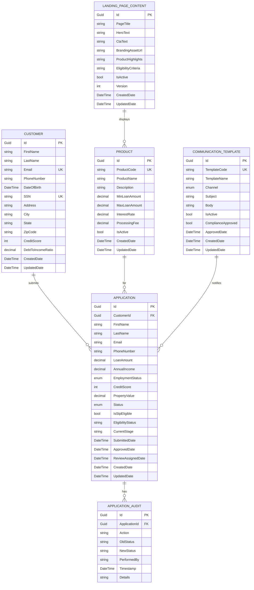

# Low Level Design Document

## JIRA Issue: VRVTEMP-390
## Title: Epic 2 - BridgeNow Finance Application Journey & Communication

---

## 1. Objective

This Low Level Design document outlines the technical implementation for the BridgeNow Finance Application Journey & Communication system. The system aims to deliver a seamless, fully digital application journey with distinct branding, Straight Through Processing (STP) capabilities, and clear communication across web, app, and advertising channels. The implementation will support automated eligibility checks, real-time application tracking, and compliance with regulatory standards while maintaining high performance and availability.

---

## 2. C-Sharp Backend Details

### 2.1 Controller Layer

#### REST API Endpoints

| Operation | Method | URL | Request Body | Response Body |
|-----------|--------|-----|--------------|---------------|
| Get Landing Page Content | GET | `/api/v1/bridgenow/landing-page` | None | `LandingPageResponse` |
| Submit Application | POST | `/api/v1/bridgenow/applications` | `ApplicationRequest` | `ApplicationResponse` |
| Check Eligibility | POST | `/api/v1/bridgenow/eligibility/check` | `EligibilityRequest` | `EligibilityResponse` |
| Get Application Status | GET | `/api/v1/bridgenow/applications/{applicationId}/status` | None | `ApplicationStatusResponse` |
| Update Application | PUT | `/api/v1/bridgenow/applications/{applicationId}` | `ApplicationUpdateRequest` | `ApplicationResponse` |
| Get Product Details | GET | `/api/v1/bridgenow/products/{productId}` | None | `ProductDetailsResponse` |
| Get Communication Templates | GET | `/api/v1/bridgenow/communications/templates` | None | `List<CommunicationTemplate>` |
| Trigger Manual Review | POST | `/api/v1/bridgenow/applications/{applicationId}/manual-review` | `ManualReviewRequest` | `ManualReviewResponse` |

#### Controller Classes

| Class Name | Responsibility | Methods |
|------------|----------------|----------|
| `BridgeNowLandingPageController` | Manages landing page content and branding | `GetLandingPageContent()`, `GetBrandingAssets()` |
| `BridgeNowApplicationController` | Handles application submission and management | `SubmitApplication()`, `UpdateApplication()`, `GetApplicationStatus()` |
| `BridgeNowEligibilityController` | Manages eligibility checks and STP routing | `CheckEligibility()`, `ValidateCustomerData()` |
| `BridgeNowProductController` | Provides product information and pricing | `GetProductDetails()`, `GetProductRules()`, `GetPricingInfo()` |
| `BridgeNowCommunicationController` | Manages communication templates and messaging | `GetCommunicationTemplates()`, `SendNotification()` |
| `BridgeNowManualReviewController` | Handles manual review workflows | `TriggerManualReview()`, `GetReviewStatus()`, `UpdateReviewDecision()` |

#### Exception Handlers

```csharp
[ApiController]
public class BridgeNowApplicationController : ControllerBase
{
    private readonly IApplicationService _applicationService;
    private readonly ILogger<BridgeNowApplicationController> _logger;

    [HttpPost]
    [Route("api/v1/bridgenow/applications")]
    public async Task<IActionResult> SubmitApplication([FromBody] ApplicationRequest request)
    {
        try
        {
            var response = await _applicationService.SubmitApplicationAsync(request);
            return Ok(response);
        }
        catch (ValidationException ex)
        {
            _logger.LogWarning(ex, "Validation failed for application submission");
            return BadRequest(new ErrorResponse { Message = ex.Message, ErrorCode = "VALIDATION_ERROR" });
        }
        catch (EligibilityException ex)
        {
            _logger.LogWarning(ex, "Eligibility check failed");
            return BadRequest(new ErrorResponse { Message = ex.Message, ErrorCode = "ELIGIBILITY_FAILED" });
        }
        catch (Exception ex)
        {
            _logger.LogError(ex, "Error submitting application");
            return StatusCode(500, new ErrorResponse { Message = "Internal server error", ErrorCode = "INTERNAL_ERROR" });
        }
    }
}
```

### 2.2 Service Layer

#### Business Logic Implementation

**ApplicationService**
```csharp
public class ApplicationService : IApplicationService
{
    private readonly IApplicationRepository _applicationRepository;
    private readonly IEligibilityService _eligibilityService;
    private readonly IWorkflowService _workflowService;
    private readonly INotificationService _notificationService;
    private readonly ILogger<ApplicationService> _logger;

    public async Task<ApplicationResponse> SubmitApplicationAsync(ApplicationRequest request)
    {
        // Validate application data
        await ValidateApplicationDataAsync(request);

        // Check eligibility
        var eligibilityResult = await _eligibilityService.CheckEligibilityAsync(request);

        // Create application entity
        var application = MapToEntity(request);
        application.EligibilityStatus = eligibilityResult.Status;
        application.IsStpEligible = eligibilityResult.IsStpEligible;
        application.Status = ApplicationStatus.Submitted;
        application.SubmittedDate = DateTime.UtcNow;

        // Save application
        await _applicationRepository.CreateAsync(application);

        // Route to appropriate workflow
        if (eligibilityResult.IsStpEligible)
        {
            await _workflowService.TriggerStpWorkflowAsync(application.Id);
        }
        else
        {
            await _workflowService.TriggerManualReviewWorkflowAsync(application.Id);
        }

        // Send confirmation notification
        await _notificationService.SendApplicationConfirmationAsync(application);

        return MapToResponse(application);
    }

    public async Task<ApplicationStatusResponse> GetApplicationStatusAsync(string applicationId)
    {
        var application = await _applicationRepository.GetByIdAsync(applicationId);
        if (application == null)
        {
            throw new NotFoundException($"Application {applicationId} not found");
        }

        return new ApplicationStatusResponse
        {
            ApplicationId = application.Id,
            Status = application.Status.ToString(),
            LastUpdated = application.UpdatedDate,
            IsStpProcessed = application.IsStpEligible,
            CurrentStage = application.CurrentStage
        };
    }
}
```

**EligibilityService**
```csharp
public class EligibilityService : IEligibilityService
{
    private readonly IEligibilityRuleEngine _ruleEngine;
    private readonly ICustomerDataService _customerDataService;
    private readonly ILogger<EligibilityService> _logger;

    public async Task<EligibilityResponse> CheckEligibilityAsync(ApplicationRequest request)
    {
        // Fetch customer data
        var customerData = await _customerDataService.GetCustomerDataAsync(request.CustomerId);

        // Apply eligibility rules
        var ruleResults = await _ruleEngine.EvaluateRulesAsync(customerData, request);

        // Determine STP eligibility
        var isStpEligible = ruleResults.All(r => r.Passed) && 
                           customerData.CreditScore >= 700 &&
                           customerData.DebtToIncomeRatio <= 0.4m;

        return new EligibilityResponse
        {
            IsEligible = ruleResults.All(r => r.Passed),
            IsStpEligible = isStpEligible,
            Status = isStpEligible ? "STP_ELIGIBLE" : "MANUAL_REVIEW_REQUIRED",
            RuleResults = ruleResults,
            EvaluatedDate = DateTime.UtcNow
        };
    }
}
```

**WorkflowService**
```csharp
public class WorkflowService : IWorkflowService
{
    private readonly IApplicationRepository _applicationRepository;
    private readonly IApprovalService _approvalService;
    private readonly IDisbursementService _disbursementService;
    private readonly ILogger<WorkflowService> _logger;

    public async Task TriggerStpWorkflowAsync(string applicationId)
    {
        var application = await _applicationRepository.GetByIdAsync(applicationId);

        // Update status to processing
        application.Status = ApplicationStatus.Processing;
        application.CurrentStage = "STP_WORKFLOW";
        await _applicationRepository.UpdateAsync(application);

        // Automated approval
        var approvalResult = await _approvalService.AutoApproveAsync(application);

        if (approvalResult.IsApproved)
        {
            application.Status = ApplicationStatus.Approved;
            application.ApprovedDate = DateTime.UtcNow;
            await _applicationRepository.UpdateAsync(application);

            // Trigger disbursement
            await _disbursementService.InitiateDisbursementAsync(application.Id);
        }
        else
        {
            // Fallback to manual review
            await TriggerManualReviewWorkflowAsync(applicationId);
        }
    }

    public async Task TriggerManualReviewWorkflowAsync(string applicationId)
    {
        var application = await _applicationRepository.GetByIdAsync(applicationId);
        application.Status = ApplicationStatus.UnderReview;
        application.CurrentStage = "MANUAL_REVIEW";
        application.ReviewAssignedDate = DateTime.UtcNow;
        await _applicationRepository.UpdateAsync(application);

        // Assign to review queue
        await AssignToReviewQueueAsync(application);
    }
}
```

#### Service Layer Architecture

```
Controllers
    ↓
Services (Business Logic)
    ├── ApplicationService
    ├── EligibilityService
    ├── WorkflowService
    ├── NotificationService
    ├── LandingPageService
    └── CommunicationService
    ↓
Repositories (Data Access)
    ├── ApplicationRepository
    ├── CustomerRepository
    ├── ProductRepository
    └── CommunicationRepository
```

#### Dependency Injection Configuration

```csharp
public class Startup
{
    public void ConfigureServices(IServiceCollection services)
    {
        // Controllers
        services.AddControllers();

        // Services
        services.AddScoped<IApplicationService, ApplicationService>();
        services.AddScoped<IEligibilityService, EligibilityService>();
        services.AddScoped<IWorkflowService, WorkflowService>();
        services.AddScoped<INotificationService, NotificationService>();
        services.AddScoped<ILandingPageService, LandingPageService>();
        services.AddScoped<ICommunicationService, CommunicationService>();

        // Repositories
        services.AddScoped<IApplicationRepository, ApplicationRepository>();
        services.AddScoped<ICustomerRepository, CustomerRepository>();
        services.AddScoped<IProductRepository, ProductRepository>();
        services.AddScoped<ICommunicationRepository, CommunicationRepository>();

        // Infrastructure
        services.AddDbContext<BridgeNowDbContext>(options =>
            options.UseSqlServer(Configuration.GetConnectionString("BridgeNowDb")));

        // Caching
        services.AddMemoryCache();
        services.AddDistributedRedisCache(options =>
        {
            options.Configuration = Configuration.GetConnectionString("Redis");
        });

        // Logging
        services.AddLogging(builder =>
        {
            builder.AddConsole();
            builder.AddDebug();
            builder.AddApplicationInsights();
        });
    }
}
```

#### Validation Rules

| Field Name | Validation | Error Message | Annotation |
|------------|------------|---------------|------------|
| CustomerId | Required, GUID format | "Customer ID is required and must be a valid GUID" | `[Required]`, `[RegularExpression]` |
| FirstName | Required, Max 50 chars, Alpha only | "First name is required and must contain only letters" | `[Required]`, `[MaxLength(50)]`, `[RegularExpression(@"^[a-zA-Z]+$")]` |
| LastName | Required, Max 50 chars, Alpha only | "Last name is required and must contain only letters" | `[Required]`, `[MaxLength(50)]`, `[RegularExpression(@"^[a-zA-Z]+$")]` |
| Email | Required, Valid email format | "Valid email address is required" | `[Required]`, `[EmailAddress]` |
| PhoneNumber | Required, Valid phone format | "Valid phone number is required" | `[Required]`, `[Phone]` |
| LoanAmount | Required, Range 10000-500000 | "Loan amount must be between $10,000 and $500,000" | `[Required]`, `[Range(10000, 500000)]` |
| AnnualIncome | Required, Positive value | "Annual income must be a positive value" | `[Required]`, `[Range(1, double.MaxValue)]` |
| EmploymentStatus | Required, Valid enum | "Valid employment status is required" | `[Required]`, `[EnumDataType(typeof(EmploymentStatus))]` |
| CreditScore | Optional, Range 300-850 | "Credit score must be between 300 and 850" | `[Range(300, 850)]` |
| PropertyValue | Required for bridge loans | "Property value is required for bridge loans" | `[RequiredIf("LoanType", "Bridge")]` |

**Custom Validation Attributes**

```csharp
public class RequiredIfAttribute : ValidationAttribute
{
    private readonly string _propertyName;
    private readonly object _desiredValue;

    public RequiredIfAttribute(string propertyName, object desiredValue)
    {
        _propertyName = propertyName;
        _desiredValue = desiredValue;
    }

    protected override ValidationResult IsValid(object value, ValidationContext validationContext)
    {
        var property = validationContext.ObjectType.GetProperty(_propertyName);
        if (property == null)
            throw new ArgumentException($"Property {_propertyName} not found");

        var propertyValue = property.GetValue(validationContext.ObjectInstance);

        if (propertyValue?.ToString() == _desiredValue?.ToString())
        {
            if (value == null || string.IsNullOrWhiteSpace(value.ToString()))
            {
                return new ValidationResult(ErrorMessage ?? $"{validationContext.DisplayName} is required");
            }
        }

        return ValidationResult.Success;
    }
}
```

### 2.3 Repository / Data Access Layer

#### Entity Models

| Entity | Fields | Constraints |
|--------|--------|-------------|
| Application | Id (Guid), CustomerId (Guid), FirstName (string), LastName (string), Email (string), PhoneNumber (string), LoanAmount (decimal), AnnualIncome (decimal), EmploymentStatus (enum), CreditScore (int?), PropertyValue (decimal?), Status (enum), IsStpEligible (bool), EligibilityStatus (string), CurrentStage (string), SubmittedDate (DateTime), ApprovedDate (DateTime?), ReviewAssignedDate (DateTime?), CreatedDate (DateTime), UpdatedDate (DateTime) | PK: Id, FK: CustomerId, Required: FirstName, LastName, Email, LoanAmount |
| Customer | Id (Guid), FirstName (string), LastName (string), Email (string), PhoneNumber (string), DateOfBirth (DateTime), SSN (string), Address (string), City (string), State (string), ZipCode (string), CreditScore (int), DebtToIncomeRatio (decimal), CreatedDate (DateTime), UpdatedDate (DateTime) | PK: Id, Unique: Email, SSN |
| Product | Id (Guid), ProductCode (string), ProductName (string), Description (string), MinLoanAmount (decimal), MaxLoanAmount (decimal), InterestRate (decimal), ProcessingFee (decimal), IsActive (bool), CreatedDate (DateTime), UpdatedDate (DateTime) | PK: Id, Unique: ProductCode |
| LandingPageContent | Id (Guid), PageTitle (string), HeroText (string), CtaText (string), BrandingAssetUrl (string), ProductHighlights (string), EligibilityCriteria (string), IsActive (bool), Version (int), CreatedDate (DateTime), UpdatedDate (DateTime) | PK: Id |
| CommunicationTemplate | Id (Guid), TemplateCode (string), TemplateName (string), Channel (enum), Subject (string), Body (string), IsActive (bool), ComplianceApproved (bool), ApprovedDate (DateTime?), CreatedDate (DateTime), UpdatedDate (DateTime) | PK: Id, Unique: TemplateCode |
| ApplicationAudit | Id (Guid), ApplicationId (Guid), Action (string), OldStatus (string), NewStatus (string), PerformedBy (string), Timestamp (DateTime), Details (string) | PK: Id, FK: ApplicationId |

**Entity Definitions**

```csharp
public class Application
{
    [Key]
    public Guid Id { get; set; }

    [Required]
    public Guid CustomerId { get; set; }

    [Required]
    [MaxLength(50)]
    public string FirstName { get; set; }

    [Required]
    [MaxLength(50)]
    public string LastName { get; set; }

    [Required]
    [EmailAddress]
    [MaxLength(100)]
    public string Email { get; set; }

    [Required]
    [Phone]
    [MaxLength(20)]
    public string PhoneNumber { get; set; }

    [Required]
    [Column(TypeName = "decimal(18,2)")]
    public decimal LoanAmount { get; set; }

    [Required]
    [Column(TypeName = "decimal(18,2)")]
    public decimal AnnualIncome { get; set; }

    [Required]
    public EmploymentStatus EmploymentStatus { get; set; }

    public int? CreditScore { get; set; }

    [Column(TypeName = "decimal(18,2)")]
    public decimal? PropertyValue { get; set; }

    [Required]
    public ApplicationStatus Status { get; set; }

    public bool IsStpEligible { get; set; }

    [MaxLength(50)]
    public string EligibilityStatus { get; set; }

    [MaxLength(50)]
    public string CurrentStage { get; set; }

    [Required]
    public DateTime SubmittedDate { get; set; }

    public DateTime? ApprovedDate { get; set; }

    public DateTime? ReviewAssignedDate { get; set; }

    [Required]
    public DateTime CreatedDate { get; set; }

    [Required]
    public DateTime UpdatedDate { get; set; }

    // Navigation properties
    [ForeignKey("CustomerId")]
    public virtual Customer Customer { get; set; }

    public virtual ICollection<ApplicationAudit> AuditTrail { get; set; }
}

public enum ApplicationStatus
{
    Submitted,
    Processing,
    UnderReview,
    Approved,
    Rejected,
    Disbursed
}

public enum EmploymentStatus
{
    Employed,
    SelfEmployed,
    Unemployed,
    Retired
}
```

#### Repository Interfaces

```csharp
public interface IApplicationRepository : IRepository<Application>
{
    Task<Application> GetByIdAsync(string applicationId);
    Task<IEnumerable<Application>> GetByCustomerIdAsync(Guid customerId);
    Task<IEnumerable<Application>> GetStpEligibleApplicationsAsync();
    Task<IEnumerable<Application>> GetApplicationsForManualReviewAsync();
    Task<int> GetStpProcessingCountAsync(DateTime startDate, DateTime endDate);
    Task<Application> CreateAsync(Application application);
    Task<Application> UpdateAsync(Application application);
}

public interface ICustomerRepository : IRepository<Customer>
{
    Task<Customer> GetByIdAsync(Guid customerId);
    Task<Customer> GetByEmailAsync(string email);
    Task<Customer> GetBySsnAsync(string ssn);
    Task<Customer> CreateAsync(Customer customer);
    Task<Customer> UpdateAsync(Customer customer);
}

public interface IProductRepository : IRepository<Product>
{
    Task<Product> GetByIdAsync(Guid productId);
    Task<Product> GetByProductCodeAsync(string productCode);
    Task<IEnumerable<Product>> GetActiveProductsAsync();
}

public interface ILandingPageContentRepository : IRepository<LandingPageContent>
{
    Task<LandingPageContent> GetActiveContentAsync();
    Task<LandingPageContent> GetByVersionAsync(int version);
}

public interface ICommunicationTemplateRepository : IRepository<CommunicationTemplate>
{
    Task<CommunicationTemplate> GetByTemplateCodeAsync(string templateCode);
    Task<IEnumerable<CommunicationTemplate>> GetByChannelAsync(CommunicationChannel channel);
    Task<IEnumerable<CommunicationTemplate>> GetApprovedTemplatesAsync();
}
```

#### Custom Queries

```csharp
public class ApplicationRepository : Repository<Application>, IApplicationRepository
{
    private readonly BridgeNowDbContext _context;

    public ApplicationRepository(BridgeNowDbContext context) : base(context)
    {
        _context = context;
    }

    public async Task<IEnumerable<Application>> GetStpEligibleApplicationsAsync()
    {
        return await _context.Applications
            .Where(a => a.IsStpEligible && a.Status == ApplicationStatus.Submitted)
            .Include(a => a.Customer)
            .OrderBy(a => a.SubmittedDate)
            .ToListAsync();
    }

    public async Task<IEnumerable<Application>> GetApplicationsForManualReviewAsync()
    {
        return await _context.Applications
            .Where(a => !a.IsStpEligible && a.Status == ApplicationStatus.UnderReview)
            .Include(a => a.Customer)
            .OrderBy(a => a.ReviewAssignedDate)
            .ToListAsync();
    }

    public async Task<int> GetStpProcessingCountAsync(DateTime startDate, DateTime endDate)
    {
        return await _context.Applications
            .Where(a => a.IsStpEligible && 
                       a.SubmittedDate >= startDate && 
                       a.SubmittedDate <= endDate)
            .CountAsync();
    }
}
```

### 2.4 Configuration

#### Application Properties (appsettings.json)

```json
{
  "ConnectionStrings": {
    "BridgeNowDb": "Server=bridgenow-db.database.windows.net;Database=BridgeNowFinance;User Id=bridgenow_admin;Password=***;Encrypt=True;TrustServerCertificate=False;",
    "Redis": "bridgenow-cache.redis.cache.windows.net:6380,password=***,ssl=True,abortConnect=False"
  },
  "Logging": {
    "LogLevel": {
      "Default": "Information",
      "Microsoft": "Warning",
      "Microsoft.Hosting.Lifetime": "Information"
    },
    "ApplicationInsights": {
      "InstrumentationKey": "***"
    }
  },
  "BridgeNowSettings": {
    "StpEligibility": {
      "MinCreditScore": 700,
      "MaxDebtToIncomeRatio": 0.4,
      "MinAnnualIncome": 50000,
      "MaxLoanToValueRatio": 0.8
    },
    "WorkflowSettings": {
      "StpProcessingTimeoutMinutes": 5,
      "ManualReviewAssignmentDelaySeconds": 30
    },
    "NotificationSettings": {
      "EmailFrom": "noreply@bridgenowfinance.com",
      "SmsProvider": "Twilio",
      "EnableRealTimeNotifications": true
    },
    "ComplianceSettings": {
      "RequireComplianceApproval": true,
      "ComplianceReviewSlaHours": 24
    }
  },
  "AllowedHosts": "*",
  "Cors": {
    "AllowedOrigins": [
      "https://bridgenowfinance.com",
      "https://app.bridgenowfinance.com"
    ]
  }
}
```

#### C-Sharp Configuration Classes

```csharp
public class BridgeNowSettings
{
    public StpEligibilitySettings StpEligibility { get; set; }
    public WorkflowSettings WorkflowSettings { get; set; }
    public NotificationSettings NotificationSettings { get; set; }
    public ComplianceSettings ComplianceSettings { get; set; }
}

public class StpEligibilitySettings
{
    public int MinCreditScore { get; set; }
    public decimal MaxDebtToIncomeRatio { get; set; }
    public decimal MinAnnualIncome { get; set; }
    public decimal MaxLoanToValueRatio { get; set; }
}

public class WorkflowSettings
{
    public int StpProcessingTimeoutMinutes { get; set; }
    public int ManualReviewAssignmentDelaySeconds { get; set; }
}

public class NotificationSettings
{
    public string EmailFrom { get; set; }
    public string SmsProvider { get; set; }
    public bool EnableRealTimeNotifications { get; set; }
}

public class ComplianceSettings
{
    public bool RequireComplianceApproval { get; set; }
    public int ComplianceReviewSlaHours { get; set; }
}
```

#### Bean Definitions (Startup Configuration)

```csharp
public class Startup
{
    public IConfiguration Configuration { get; }

    public Startup(IConfiguration configuration)
    {
        Configuration = configuration;
    }

    public void ConfigureServices(IServiceCollection services)
    {
        // Configuration binding
        services.Configure<BridgeNowSettings>(Configuration.GetSection("BridgeNowSettings"));

        // Database context
        services.AddDbContext<BridgeNowDbContext>(options =>
            options.UseSqlServer(
                Configuration.GetConnectionString("BridgeNowDb"),
                sqlOptions => sqlOptions.EnableRetryOnFailure(
                    maxRetryCount: 3,
                    maxRetryDelay: TimeSpan.FromSeconds(5),
                    errorNumbersToAdd: null)));

        // Caching
        services.AddMemoryCache();
        services.AddDistributedRedisCache(options =>
        {
            options.Configuration = Configuration.GetConnectionString("Redis");
            options.InstanceName = "BridgeNow_";
        });

        // HTTP clients
        services.AddHttpClient<IEligibilityRuleEngine, EligibilityRuleEngine>()
            .SetHandlerLifetime(TimeSpan.FromMinutes(5))
            .AddPolicyHandler(GetRetryPolicy());

        // Background services
        services.AddHostedService<StpProcessingBackgroundService>();
        services.AddHostedService<ApplicationStatusUpdateService>();

        // Health checks
        services.AddHealthChecks()
            .AddDbContextCheck<BridgeNowDbContext>()
            .AddRedis(Configuration.GetConnectionString("Redis"));

        // API versioning
        services.AddApiVersioning(options =>
        {
            options.DefaultApiVersion = new ApiVersion(1, 0);
            options.AssumeDefaultVersionWhenUnspecified = true;
            options.ReportApiVersions = true;
        });

        // Swagger
        services.AddSwaggerGen(c =>
        {
            c.SwaggerDoc("v1", new OpenApiInfo
            {
                Title = "BridgeNow Finance API",
                Version = "v1",
                Description = "API for BridgeNow Finance Application Journey"
            });
        });

        // CORS
        services.AddCors(options =>
        {
            options.AddPolicy("BridgeNowCorsPolicy", builder =>
            {
                builder.WithOrigins(Configuration.GetSection("Cors:AllowedOrigins").Get<string[]>())
                    .AllowAnyMethod()
                    .AllowAnyHeader()
                    .AllowCredentials();
            });
        });

        services.AddControllers();
    }

    public void Configure(IApplicationBuilder app, IWebHostEnvironment env)
    {
        if (env.IsDevelopment())
        {
            app.UseDeveloperExceptionPage();
            app.UseSwagger();
            app.UseSwaggerUI(c => c.SwaggerEndpoint("/swagger/v1/swagger.json", "BridgeNow Finance API v1"));
        }

        app.UseHttpsRedirection();
        app.UseRouting();
        app.UseCors("BridgeNowCorsPolicy");
        app.UseAuthentication();
        app.UseAuthorization();

        app.UseEndpoints(endpoints =>
        {
            endpoints.MapControllers();
            endpoints.MapHealthChecks("/health");
        });
    }

    private static IAsyncPolicy<HttpResponseMessage> GetRetryPolicy()
    {
        return HttpPolicyExtensions
            .HandleTransientHttpError()
            .OrResult(msg => msg.StatusCode == System.Net.HttpStatusCode.NotFound)
            .WaitAndRetryAsync(3, retryAttempt => TimeSpan.FromSeconds(Math.Pow(2, retryAttempt)));
    }
}
```

### 2.5 Security

#### Authentication Mechanism

**JWT Token-Based Authentication**

```csharp
public class Startup
{
    public void ConfigureServices(IServiceCollection services)
    {
        // JWT Authentication
        var jwtSettings = Configuration.GetSection("JwtSettings");
        var secretKey = jwtSettings["SecretKey"];

        services.AddAuthentication(options =>
        {
            options.DefaultAuthenticateScheme = JwtBearerDefaults.AuthenticationScheme;
            options.DefaultChallengeScheme = JwtBearerDefaults.AuthenticationScheme;
        })
        .AddJwtBearer(options =>
        {
            options.TokenValidationParameters = new TokenValidationParameters
            {
                ValidateIssuer = true,
                ValidateAudience = true,
                ValidateLifetime = true,
                ValidateIssuerSigningKey = true,
                ValidIssuer = jwtSettings["Issuer"],
                ValidAudience = jwtSettings["Audience"],
                IssuerSigningKey = new SymmetricSecurityKey(Encoding.UTF8.GetBytes(secretKey)),
                ClockSkew = TimeSpan.Zero
            };

            options.Events = new JwtBearerEvents
            {
                OnAuthenticationFailed = context =>
                {
                    if (context.Exception.GetType() == typeof(SecurityTokenExpiredException))
                    {
                        context.Response.Headers.Add("Token-Expired", "true");
                    }
                    return Task.CompletedTask;
                }
            };
        });
    }
}
```

#### Authorization Rules

```csharp
[Authorize(Roles = "Customer")]
[ApiController]
[Route("api/v1/bridgenow/applications")]
public class BridgeNowApplicationController : ControllerBase
{
    [HttpPost]
    [AllowAnonymous] // Allow unauthenticated users to submit applications
    public async Task<IActionResult> SubmitApplication([FromBody] ApplicationRequest request)
    {
        // Implementation
    }

    [HttpGet("{applicationId}/status")]
    [Authorize] // Requires authentication
    public async Task<IActionResult> GetApplicationStatus(string applicationId)
    {
        // Verify user owns this application
        var userId = User.FindFirst(ClaimTypes.NameIdentifier)?.Value;
        // Implementation
    }
}

[Authorize(Roles = "Admin,Reviewer")]
[ApiController]
[Route("api/v1/bridgenow/admin")]
public class BridgeNowAdminController : ControllerBase
{
    [HttpPost("applications/{applicationId}/manual-review")]
    [Authorize(Roles = "Reviewer")]
    public async Task<IActionResult> TriggerManualReview(string applicationId)
    {
        // Implementation
    }

    [HttpGet("applications/pending-review")]
    [Authorize(Roles = "Reviewer")]
    public async Task<IActionResult> GetPendingReviewApplications()
    {
        // Implementation
    }
}
```

#### JWT Token Handling

```csharp
public interface ITokenService
{
    string GenerateAccessToken(User user);
    string GenerateRefreshToken();
    ClaimsPrincipal GetPrincipalFromExpiredToken(string token);
}

public class TokenService : ITokenService
{
    private readonly IConfiguration _configuration;

    public TokenService(IConfiguration configuration)
    {
        _configuration = configuration;
    }

    public string GenerateAccessToken(User user)
    {
        var jwtSettings = _configuration.GetSection("JwtSettings");
        var secretKey = new SymmetricSecurityKey(Encoding.UTF8.GetBytes(jwtSettings["SecretKey"]));
        var signingCredentials = new SigningCredentials(secretKey, SecurityAlgorithms.HmacSha256);

        var claims = new List<Claim>
        {
            new Claim(ClaimTypes.NameIdentifier, user.Id.ToString()),
            new Claim(ClaimTypes.Email, user.Email),
            new Claim(ClaimTypes.Name, $"{user.FirstName} {user.LastName}"),
            new Claim(ClaimTypes.Role, user.Role)
        };

        var tokenOptions = new JwtSecurityToken(
            issuer: jwtSettings["Issuer"],
            audience: jwtSettings["Audience"],
            claims: claims,
            expires: DateTime.UtcNow.AddMinutes(Convert.ToDouble(jwtSettings["ExpiryMinutes"])),
            signingCredentials: signingCredentials
        );

        return new JwtSecurityTokenHandler().WriteToken(tokenOptions);
    }

    public string GenerateRefreshToken()
    {
        var randomNumber = new byte[32];
        using var rng = RandomNumberGenerator.Create();
        rng.GetBytes(randomNumber);
        return Convert.ToBase64String(randomNumber);
    }

    public ClaimsPrincipal GetPrincipalFromExpiredToken(string token)
    {
        var jwtSettings = _configuration.GetSection("JwtSettings");
        var tokenValidationParameters = new TokenValidationParameters
        {
            ValidateIssuer = true,
            ValidateAudience = true,
            ValidateLifetime = false, // Don't validate lifetime for refresh
            ValidateIssuerSigningKey = true,
            ValidIssuer = jwtSettings["Issuer"],
            ValidAudience = jwtSettings["Audience"],
            IssuerSigningKey = new SymmetricSecurityKey(Encoding.UTF8.GetBytes(jwtSettings["SecretKey"]))
        };

        var tokenHandler = new JwtSecurityTokenHandler();
        var principal = tokenHandler.ValidateToken(token, tokenValidationParameters, out SecurityToken securityToken);

        if (securityToken is not JwtSecurityToken jwtSecurityToken ||
            !jwtSecurityToken.Header.Alg.Equals(SecurityAlgorithms.HmacSha256, StringComparison.InvariantCultureIgnoreCase))
        {
            throw new SecurityTokenException("Invalid token");
        }

        return principal;
    }
}
```

### 2.6 Error Handling

#### Global Exception Handler

```csharp
public class GlobalExceptionHandlerMiddleware
{
    private readonly RequestDelegate _next;
    private readonly ILogger<GlobalExceptionHandlerMiddleware> _logger;

    public GlobalExceptionHandlerMiddleware(RequestDelegate next, ILogger<GlobalExceptionHandlerMiddleware> logger)
    {
        _next = next;
        _logger = logger;
    }

    public async Task InvokeAsync(HttpContext context)
    {
        try
        {
            await _next(context);
        }
        catch (Exception ex)
        {
            _logger.LogError(ex, "An unhandled exception occurred");
            await HandleExceptionAsync(context, ex);
        }
    }

    private static Task HandleExceptionAsync(HttpContext context, Exception exception)
    {
        context.Response.ContentType = "application/json";

        var response = exception switch
        {
            ValidationException validationEx => new ErrorResponse
            {
                StatusCode = StatusCodes.Status400BadRequest,
                Message = validationEx.Message,
                ErrorCode = "VALIDATION_ERROR",
                Details = validationEx.Errors
            },
            NotFoundException notFoundEx => new ErrorResponse
            {
                StatusCode = StatusCodes.Status404NotFound,
                Message = notFoundEx.Message,
                ErrorCode = "NOT_FOUND"
            },
            EligibilityException eligibilityEx => new ErrorResponse
            {
                StatusCode = StatusCodes.Status400BadRequest,
                Message = eligibilityEx.Message,
                ErrorCode = "ELIGIBILITY_FAILED",
                Details = eligibilityEx.FailedRules
            },
            UnauthorizedAccessException => new ErrorResponse
            {
                StatusCode = StatusCodes.Status401Unauthorized,
                Message = "Unauthorized access",
                ErrorCode = "UNAUTHORIZED"
            },
            _ => new ErrorResponse
            {
                StatusCode = StatusCodes.Status500InternalServerError,
                Message = "An internal server error occurred",
                ErrorCode = "INTERNAL_ERROR"
            }
        };

        context.Response.StatusCode = response.StatusCode;
        return context.Response.WriteAsJsonAsync(response);
    }
}

public static class GlobalExceptionHandlerMiddlewareExtensions
{
    public static IApplicationBuilder UseGlobalExceptionHandler(this IApplicationBuilder builder)
    {
        return builder.UseMiddleware<GlobalExceptionHandlerMiddleware>();
    }
}
```

#### Custom Exceptions

```csharp
public class ValidationException : Exception
{
    public IDictionary<string, string[]> Errors { get; }

    public ValidationException()
        : base("One or more validation failures have occurred.")
    {
        Errors = new Dictionary<string, string[]>();
    }

    public ValidationException(IDictionary<string, string[]> errors)
        : this()
    {
        Errors = errors;
    }
}

public class NotFoundException : Exception
{
    public NotFoundException(string message)
        : base(message)
    {
    }

    public NotFoundException(string name, object key)
        : base($"Entity \"{name}\" ({key}) was not found.")
    {
    }
}

public class EligibilityException : Exception
{
    public List<string> FailedRules { get; }

    public EligibilityException(string message, List<string> failedRules)
        : base(message)
    {
        FailedRules = failedRules;
    }
}

public class WorkflowException : Exception
{
    public WorkflowException(string message)
        : base(message)
    {
    }

    public WorkflowException(string message, Exception innerException)
        : base(message, innerException)
    {
    }
}
```

#### HTTP Status Mapping

| Exception Type | HTTP Status Code | Error Code | Description |
|----------------|------------------|------------|-------------|
| ValidationException | 400 Bad Request | VALIDATION_ERROR | Input validation failed |
| EligibilityException | 400 Bad Request | ELIGIBILITY_FAILED | Customer not eligible for STP |
| NotFoundException | 404 Not Found | NOT_FOUND | Requested resource not found |
| UnauthorizedAccessException | 401 Unauthorized | UNAUTHORIZED | Authentication required |
| ForbiddenException | 403 Forbidden | FORBIDDEN | Insufficient permissions |
| WorkflowException | 500 Internal Server Error | WORKFLOW_ERROR | Workflow processing failed |
| DbUpdateException | 500 Internal Server Error | DATABASE_ERROR | Database operation failed |
| Exception (Generic) | 500 Internal Server Error | INTERNAL_ERROR | Unhandled server error |

---

## 3. Database Design

### ER Model (Mermaid)



### Table Schema

#### CUSTOMER Table

| Column | Data Type | Constraints | Description |
|--------|-----------|-------------|-------------|
| Id | UNIQUEIDENTIFIER | PRIMARY KEY, NOT NULL | Unique customer identifier |
| FirstName | NVARCHAR(50) | NOT NULL | Customer first name |
| LastName | NVARCHAR(50) | NOT NULL | Customer last name |
| Email | NVARCHAR(100) | NOT NULL, UNIQUE | Customer email address |
| PhoneNumber | NVARCHAR(20) | NOT NULL | Customer phone number |
| DateOfBirth | DATETIME2 | NOT NULL | Customer date of birth |
| SSN | NVARCHAR(11) | NOT NULL, UNIQUE | Social Security Number |
| Address | NVARCHAR(200) | NULL | Street address |
| City | NVARCHAR(50) | NULL | City |
| State | NVARCHAR(2) | NULL | State code |
| ZipCode | NVARCHAR(10) | NULL | ZIP code |
| CreditScore | INT | NULL | Credit score (300-850) |
| DebtToIncomeRatio | DECIMAL(5,2) | NULL | Debt-to-income ratio |
| CreatedDate | DATETIME2 | NOT NULL, DEFAULT GETUTCDATE() | Record creation timestamp |
| UpdatedDate | DATETIME2 | NOT NULL, DEFAULT GETUTCDATE() | Record update timestamp |

#### APPLICATION Table

| Column | Data Type | Constraints | Description |
|--------|-----------|-------------|-------------|
| Id | UNIQUEIDENTIFIER | PRIMARY KEY, NOT NULL | Unique application identifier |
| CustomerId | UNIQUEIDENTIFIER | FOREIGN KEY, NOT NULL | Reference to CUSTOMER table |
| FirstName | NVARCHAR(50) | NOT NULL | Applicant first name |
| LastName | NVARCHAR(50) | NOT NULL | Applicant last name |
| Email | NVARCHAR(100) | NOT NULL | Applicant email |
| PhoneNumber | NVARCHAR(20) | NOT NULL | Applicant phone |
| LoanAmount | DECIMAL(18,2) | NOT NULL | Requested loan amount |
| AnnualIncome | DECIMAL(18,2) | NOT NULL | Annual income |
| EmploymentStatus | NVARCHAR(20) | NOT NULL | Employment status enum |
| CreditScore | INT | NULL | Credit score at application |
| PropertyValue | DECIMAL(18,2) | NULL | Property value for bridge loans |
| Status | NVARCHAR(20) | NOT NULL | Application status enum |
| IsStpEligible | BIT | NOT NULL, DEFAULT 0 | STP eligibility flag |
| EligibilityStatus | NVARCHAR(50) | NULL | Eligibility status description |
| CurrentStage | NVARCHAR(50) | NULL | Current workflow stage |
| SubmittedDate | DATETIME2 | NOT NULL | Application submission date |
| ApprovedDate | DATETIME2 | NULL | Approval date |
| ReviewAssignedDate | DATETIME2 | NULL | Manual review assignment date |
| CreatedDate | DATETIME2 | NOT NULL, DEFAULT GETUTCDATE() | Record creation timestamp |
| UpdatedDate | DATETIME2 | NOT NULL, DEFAULT GETUTCDATE() | Record update timestamp |

#### APPLICATION_AUDIT Table

| Column | Data Type | Constraints | Description |
|--------|-----------|-------------|-------------|
| Id | UNIQUEIDENTIFIER | PRIMARY KEY, NOT NULL | Unique audit record identifier |
| ApplicationId | UNIQUEIDENTIFIER | FOREIGN KEY, NOT NULL | Reference to APPLICATION table |
| Action | NVARCHAR(50) | NOT NULL | Action performed |
| OldStatus | NVARCHAR(20) | NULL | Previous status |
| NewStatus | NVARCHAR(20) | NULL | New status |
| PerformedBy | NVARCHAR(100) | NOT NULL | User who performed action |
| Timestamp | DATETIME2 | NOT NULL, DEFAULT GETUTCDATE() | Action timestamp |
| Details | NVARCHAR(MAX) | NULL | Additional details (JSON) |

#### PRODUCT Table

| Column | Data Type | Constraints | Description |
|--------|-----------|-------------|-------------|
| Id | UNIQUEIDENTIFIER | PRIMARY KEY, NOT NULL | Unique product identifier |
| ProductCode | NVARCHAR(20) | NOT NULL, UNIQUE | Product code |
| ProductName | NVARCHAR(100) | NOT NULL | Product name |
| Description | NVARCHAR(500) | NULL | Product description |
| MinLoanAmount | DECIMAL(18,2) | NOT NULL | Minimum loan amount |
| MaxLoanAmount | DECIMAL(18,2) | NOT NULL | Maximum loan amount |
| InterestRate | DECIMAL(5,2) | NOT NULL | Interest rate percentage |
| ProcessingFee | DECIMAL(18,2) | NOT NULL | Processing fee |
| IsActive | BIT | NOT NULL, DEFAULT 1 | Active status flag |
| CreatedDate | DATETIME2 | NOT NULL, DEFAULT GETUTCDATE() | Record creation timestamp |
| UpdatedDate | DATETIME2 | NOT NULL, DEFAULT GETUTCDATE() | Record update timestamp |

#### LANDING_PAGE_CONTENT Table

| Column | Data Type | Constraints | Description |
|--------|-----------|-------------|-------------|
| Id | UNIQUEIDENTIFIER | PRIMARY KEY, NOT NULL | Unique content identifier |
| PageTitle | NVARCHAR(100) | NOT NULL | Landing page title |
| HeroText | NVARCHAR(500) | NOT NULL | Hero section text |
| CtaText | NVARCHAR(50) | NOT NULL | Call-to-action text |
| BrandingAssetUrl | NVARCHAR(500) | NULL | URL to branding assets |
| ProductHighlights | NVARCHAR(MAX) | NULL | Product highlights (JSON) |
| EligibilityCriteria | NVARCHAR(MAX) | NULL | Eligibility criteria (JSON) |
| IsActive | BIT | NOT NULL, DEFAULT 1 | Active status flag |
| Version | INT | NOT NULL | Content version number |
| CreatedDate | DATETIME2 | NOT NULL, DEFAULT GETUTCDATE() | Record creation timestamp |
| UpdatedDate | DATETIME2 | NOT NULL, DEFAULT GETUTCDATE() | Record update timestamp |

#### COMMUNICATION_TEMPLATE Table

| Column | Data Type | Constraints | Description |
|--------|-----------|-------------|-------------|
| Id | UNIQUEIDENTIFIER | PRIMARY KEY, NOT NULL | Unique template identifier |
| TemplateCode | NVARCHAR(50) | NOT NULL, UNIQUE | Template code |
| TemplateName | NVARCHAR(100) | NOT NULL | Template name |
| Channel | NVARCHAR(20) | NOT NULL | Communication channel enum |
| Subject | NVARCHAR(200) | NULL | Email subject (for email channel) |
| Body | NVARCHAR(MAX) | NOT NULL | Template body with placeholders |
| IsActive | BIT | NOT NULL, DEFAULT 1 | Active status flag |
| ComplianceApproved | BIT | NOT NULL, DEFAULT 0 | Compliance approval flag |
| ApprovedDate | DATETIME2 | NULL | Compliance approval date |
| CreatedDate | DATETIME2 | NOT NULL, DEFAULT GETUTCDATE() | Record creation timestamp |
| UpdatedDate | DATETIME2 | NOT NULL, DEFAULT GETUTCDATE() | Record update timestamp |

### Database Validations

#### Table-Level Constraints

```sql
-- CUSTOMER table constraints
ALTER TABLE CUSTOMER
ADD CONSTRAINT CK_Customer_Email CHECK (Email LIKE '%@%.%');

ALTER TABLE CUSTOMER
ADD CONSTRAINT CK_Customer_CreditScore CHECK (CreditScore IS NULL OR (CreditScore >= 300 AND CreditScore <= 850));

ALTER TABLE CUSTOMER
ADD CONSTRAINT CK_Customer_DebtToIncomeRatio CHECK (DebtToIncomeRatio IS NULL OR (DebtToIncomeRatio >= 0 AND DebtToIncomeRatio <= 1));

-- APPLICATION table constraints
ALTER TABLE APPLICATION
ADD CONSTRAINT CK_Application_LoanAmount CHECK (LoanAmount >= 10000 AND LoanAmount <= 500000);

ALTER TABLE APPLICATION
ADD CONSTRAINT CK_Application_AnnualIncome CHECK (AnnualIncome > 0);

ALTER TABLE APPLICATION
ADD CONSTRAINT CK_Application_CreditScore CHECK (CreditScore IS NULL OR (CreditScore >= 300 AND CreditScore <= 850));

ALTER TABLE APPLICATION
ADD CONSTRAINT CK_Application_Status CHECK (Status IN ('Submitted', 'Processing', 'UnderReview', 'Approved', 'Rejected', 'Disbursed'));

ALTER TABLE APPLICATION
ADD CONSTRAINT CK_Application_EmploymentStatus CHECK (EmploymentStatus IN ('Employed', 'SelfEmployed', 'Unemployed', 'Retired'));

-- PRODUCT table constraints
ALTER TABLE PRODUCT
ADD CONSTRAINT CK_Product_LoanAmounts CHECK (MinLoanAmount < MaxLoanAmount);

ALTER TABLE PRODUCT
ADD CONSTRAINT CK_Product_InterestRate CHECK (InterestRate >= 0 AND InterestRate <= 100);

-- COMMUNICATION_TEMPLATE table constraints
ALTER TABLE COMMUNICATION_TEMPLATE
ADD CONSTRAINT CK_CommunicationTemplate_Channel CHECK (Channel IN ('Email', 'SMS', 'Push', 'InApp'));
```

#### Indexes

```sql
-- CUSTOMER indexes
CREATE UNIQUE INDEX IX_Customer_Email ON CUSTOMER(Email);
CREATE UNIQUE INDEX IX_Customer_SSN ON CUSTOMER(SSN);
CREATE INDEX IX_Customer_CreditScore ON CUSTOMER(CreditScore);

-- APPLICATION indexes
CREATE INDEX IX_Application_CustomerId ON APPLICATION(CustomerId);
CREATE INDEX IX_Application_Status ON APPLICATION(Status);
CREATE INDEX IX_Application_IsStpEligible ON APPLICATION(IsStpEligible);
CREATE INDEX IX_Application_SubmittedDate ON APPLICATION(SubmittedDate);
CREATE INDEX IX_Application_Status_IsStpEligible ON APPLICATION(Status, IsStpEligible);

-- APPLICATION_AUDIT indexes
CREATE INDEX IX_ApplicationAudit_ApplicationId ON APPLICATION_AUDIT(ApplicationId);
CREATE INDEX IX_ApplicationAudit_Timestamp ON APPLICATION_AUDIT(Timestamp);

-- PRODUCT indexes
CREATE UNIQUE INDEX IX_Product_ProductCode ON PRODUCT(ProductCode);
CREATE INDEX IX_Product_IsActive ON PRODUCT(IsActive);

-- COMMUNICATION_TEMPLATE indexes
CREATE UNIQUE INDEX IX_CommunicationTemplate_TemplateCode ON COMMUNICATION_TEMPLATE(TemplateCode);
CREATE INDEX IX_CommunicationTemplate_Channel ON COMMUNICATION_TEMPLATE(Channel);
CREATE INDEX IX_CommunicationTemplate_IsActive_ComplianceApproved ON COMMUNICATION_TEMPLATE(IsActive, ComplianceApproved);
```

---

## 4. Non-Functional Requirements

### Performance

#### Response Time Requirements

| Operation | Target Response Time | Maximum Response Time |
|-----------|---------------------|----------------------|
| Landing page load | < 1 second | < 2 seconds |
| Application submission | < 2 seconds | < 5 seconds |
| Eligibility check | < 1 second | < 3 seconds |
| Application status retrieval | < 500ms | < 1 second |
| STP workflow completion | < 3 minutes | < 5 minutes |

#### Throughput Requirements

- Support **1,000 concurrent users**
- Handle **500 application submissions per hour**
- Process **≥90% of eligible applications via STP**
- Support **10,000 API requests per minute**

#### Performance Optimization Strategies

1. **Caching**
   - Redis distributed cache for landing page content
   - In-memory cache for product details and eligibility rules
   - Cache duration: 15 minutes for dynamic content, 1 hour for static content

2. **Database Optimization**
   - Indexed queries on frequently accessed columns
   - Connection pooling with minimum 10, maximum 100 connections
   - Query timeout: 30 seconds
   - Asynchronous database operations

3. **API Optimization**
   - Response compression (gzip)
   - Pagination for list endpoints (default page size: 20)
   - Lazy loading for related entities
   - HTTP/2 support

4. **Background Processing**
   - Asynchronous STP workflow execution
   - Background jobs for notification sending
   - Scheduled jobs for application status updates

### Security

#### Authentication & Authorization

- **JWT-based authentication** with 15-minute access token expiry
- **Refresh tokens** with 7-day expiry
- **Role-based access control (RBAC)** with roles: Customer, Reviewer, Admin
- **Multi-factor authentication (MFA)** for admin users

#### Data Protection

- **Encryption at rest** using AES-256 for sensitive data (SSN, financial information)
- **Encryption in transit** using TLS 1.3
- **PII data masking** in logs and error messages
- **Secure password storage** using bcrypt with salt rounds: 12

#### API Security

- **Rate limiting**: 100 requests per minute per IP
- **CORS policy** restricting origins to approved domains
- **Input validation** and sanitization for all endpoints
- **SQL injection prevention** using parameterized queries
- **XSS protection** with content security policy headers

#### Compliance

- **GDPR compliance** for data privacy
- **PCI DSS compliance** for payment data handling
- **SOC 2 Type II** compliance for security controls
- **Regular security audits** and penetration testing

### Logging and Monitoring

#### Logging Strategy

**Log Levels**

| Level | Usage | Examples |
|-------|-------|----------|
| TRACE | Detailed diagnostic information | Method entry/exit, variable values |
| DEBUG | Development debugging | Query execution, cache hits/misses |
| INFO | General informational messages | Application startup, configuration loaded |
| WARN | Warning messages | Deprecated API usage, fallback to default |
| ERROR | Error messages | Exception caught, operation failed |
| FATAL | Critical errors | Application crash, database unavailable |

**Structured Logging**

```csharp
public class ApplicationService : IApplicationService
{
    private readonly ILogger<ApplicationService> _logger;

    public async Task<ApplicationResponse> SubmitApplicationAsync(ApplicationRequest request)
    {
        using (_logger.BeginScope(new Dictionary<string, object>
        {
            ["ApplicationId"] = Guid.NewGuid(),
            ["CustomerId"] = request.CustomerId,
            ["LoanAmount"] = request.LoanAmount
        }))
        {
            _logger.LogInformation("Starting application submission for customer {CustomerId}", request.CustomerId);

            try
            {
                // Implementation
                _logger.LogInformation("Application submitted successfully. ApplicationId: {ApplicationId}", applicationId);
            }
            catch (Exception ex)
            {
                _logger.LogError(ex, "Failed to submit application for customer {CustomerId}", request.CustomerId);
                throw;
            }
        }
    }
}
```

#### Monitoring Metrics

**Application Metrics**

- Request count and rate
- Response time (average, p50, p95, p99)
- Error rate and error types
- Active connections
- Cache hit/miss ratio

**Business Metrics**

- Application submission rate
- STP processing rate (target: ≥90%)
- Manual review rate
- Approval rate
- Average processing time
- Landing page conversion rate (target: ≥20%)

**Infrastructure Metrics**

- CPU utilization (target: <70%)
- Memory utilization (target: <80%)
- Database connection pool usage
- API response time
- Network throughput

#### Monitoring Tools

- **Application Insights** for application performance monitoring
- **Azure Monitor** for infrastructure monitoring
- **Log Analytics** for centralized log aggregation
- **Grafana dashboards** for real-time metrics visualization
- **PagerDuty** for alerting and incident management

#### Alerting Rules

| Alert | Condition | Severity | Action |
|-------|-----------|----------|--------|
| High error rate | Error rate > 5% for 5 minutes | Critical | Page on-call engineer |
| Slow response time | P95 response time > 5 seconds | High | Notify team |
| Low STP rate | STP rate < 85% for 1 hour | Medium | Create incident ticket |
| Database connection pool exhausted | Available connections < 10% | Critical | Page on-call engineer |
| High CPU usage | CPU > 80% for 10 minutes | High | Auto-scale and notify |
| Application crash | Application unavailable | Critical | Page on-call engineer |

---

## 5. Dependencies

### NuGet Packages (C-Sharp)

```xml
<Project Sdk="Microsoft.NET.Sdk.Web">
  <PropertyGroup>
    <TargetFramework>net8.0</TargetFramework>
    <Nullable>enable</Nullable>
    <ImplicitUsings>enable</ImplicitUsings>
  </PropertyGroup>

  <ItemGroup>
    <!-- ASP.NET Core -->
    <PackageReference Include="Microsoft.AspNetCore.Authentication.JwtBearer" Version="8.0.0" />
    <PackageReference Include="Microsoft.AspNetCore.Mvc.Versioning" Version="5.1.0" />
    <PackageReference Include="Microsoft.AspNetCore.Mvc.Versioning.ApiExplorer" Version="5.1.0" />

    <!-- Entity Framework Core -->
    <PackageReference Include="Microsoft.EntityFrameworkCore" Version="8.0.0" />
    <PackageReference Include="Microsoft.EntityFrameworkCore.SqlServer" Version="8.0.0" />
    <PackageReference Include="Microsoft.EntityFrameworkCore.Tools" Version="8.0.0">
      <PrivateAssets>all</PrivateAssets>
      <IncludeAssets>runtime; build; native; contentfiles; analyzers; buildtransitive</IncludeAssets>
    </PackageReference>
    <PackageReference Include="Microsoft.EntityFrameworkCore.Design" Version="8.0.0">
      <PrivateAssets>all</PrivateAssets>
      <IncludeAssets>runtime; build; native; contentfiles; analyzers; buildtransitive</IncludeAssets>
    </PackageReference>

    <!-- Caching -->
    <PackageReference Include="Microsoft.Extensions.Caching.Memory" Version="8.0.0" />
    <PackageReference Include="Microsoft.Extensions.Caching.StackExchangeRedis" Version="8.0.0" />

    <!-- Logging -->
    <PackageReference Include="Serilog.AspNetCore" Version="8.0.0" />
    <PackageReference Include="Serilog.Sinks.Console" Version="5.0.0" />
    <PackageReference Include="Serilog.Sinks.File" Version="5.0.0" />
    <PackageReference Include="Microsoft.ApplicationInsights.AspNetCore" Version="2.21.0" />

    <!-- Validation -->
    <PackageReference Include="FluentValidation.AspNetCore" Version="11.3.0" />

    <!-- HTTP Client -->
    <PackageReference Include="Microsoft.Extensions.Http.Polly" Version="8.0.0" />
    <PackageReference Include="Polly" Version="8.2.0" />

    <!-- Swagger/OpenAPI -->
    <PackageReference Include="Swashbuckle.AspNetCore" Version="6.5.0" />

    <!-- Health Checks -->
    <PackageReference Include="Microsoft.Extensions.Diagnostics.HealthChecks" Version="8.0.0" />
    <PackageReference Include="AspNetCore.HealthChecks.SqlServer" Version="8.0.0" />
    <PackageReference Include="AspNetCore.HealthChecks.Redis" Version="8.0.0" />

    <!-- Background Jobs -->
    <PackageReference Include="Hangfire.Core" Version="1.8.6" />
    <PackageReference Include="Hangfire.SqlServer" Version="1.8.6" />
    <PackageReference Include="Hangfire.AspNetCore" Version="1.8.6" />

    <!-- Utilities -->
    <PackageReference Include="AutoMapper.Extensions.Microsoft.DependencyInjection" Version="12.0.1" />
    <PackageReference Include="Newtonsoft.Json" Version="13.0.3" />
  </ItemGroup>
</Project>
```

### External Services

| Service | Purpose | Configuration |
|---------|---------|---------------|
| Azure SQL Database | Primary data store | Connection string in appsettings.json |
| Azure Redis Cache | Distributed caching | Connection string in appsettings.json |
| Azure Application Insights | Application monitoring | Instrumentation key in appsettings.json |
| Azure Key Vault | Secrets management | Managed identity authentication |
| SendGrid | Email notifications | API key in Key Vault |
| Twilio | SMS notifications | API credentials in Key Vault |
| Azure Blob Storage | Document storage | Connection string in Key Vault |

---

## 6. Assumptions

### Business Assumptions

1. **Branding Assets Availability**
   - All BridgeNow Finance branding assets (logos, colors, fonts) are available and approved by marketing.
   - Branding guidelines document is accessible to the development team.

2. **Compliance Review Completion**
   - All communication templates have been reviewed and approved by the compliance team before implementation.
   - Regulatory requirements for financial product advertising are documented and accessible.

3. **Landing Page Integration**
   - The landing page will be integrated with the existing website/app navigation.
   - Analytics tracking is already configured for conversion measurement.

4. **Eligibility Criteria Definition**
   - Clear eligibility criteria for STP processing are defined and documented.
   - Credit score thresholds and debt-to-income ratio limits are finalized.

5. **Product Rules Finalization**
   - All product rules, pricing, and terms are finalized and approved.
   - Interest rates and processing fees are confirmed.

### Technical Assumptions

1. **Infrastructure Availability**
   - Azure cloud infrastructure is provisioned and accessible.
   - Database servers, Redis cache, and storage accounts are configured.

2. **Third-Party Service Access**
   - API credentials for SendGrid (email) and Twilio (SMS) are available.
   - External credit scoring service API is accessible and documented.

3. **Authentication System**
   - Existing user authentication system can be extended for BridgeNow Finance.
   - JWT token generation and validation infrastructure is in place.

4. **Development Environment**
   - Development, staging, and production environments are configured.
   - CI/CD pipelines are set up for automated deployment.

5. **Data Migration**
   - No existing data migration is required for initial launch.
   - Database schema can be created from scratch.

### Operational Assumptions

1. **Manual Review Team**
   - A dedicated team is available to handle manual review cases.
   - Review team has access to the admin portal for application processing.

2. **Customer Support**
   - Customer support team is trained on BridgeNow Finance product details.
   - Support documentation and FAQs are prepared.

3. **Monitoring and Alerting**
   - On-call rotation is established for production support.
   - Incident response procedures are documented.

4. **Performance Testing**
   - Load testing will be conducted before production launch.
   - Performance benchmarks will be validated against requirements.

5. **Rollback Plan**
   - A rollback plan is in place in case of critical issues post-deployment.
   - Database backup and restore procedures are tested.

---

## Document Control

| Version | Date | Author | Changes |
|---------|------|--------|----------|
| 1.0 | 2026-04-15 | LLD Generation Agent | Initial document creation |

---

**End of Low Level Design Document**